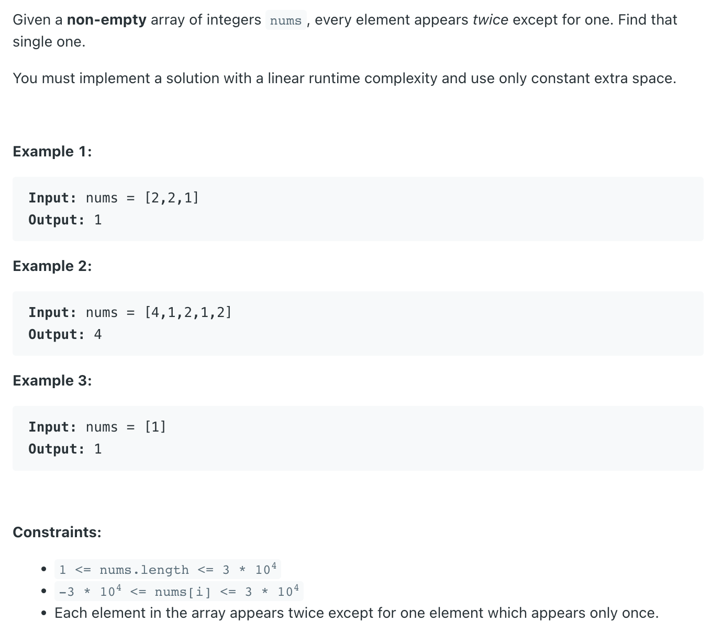
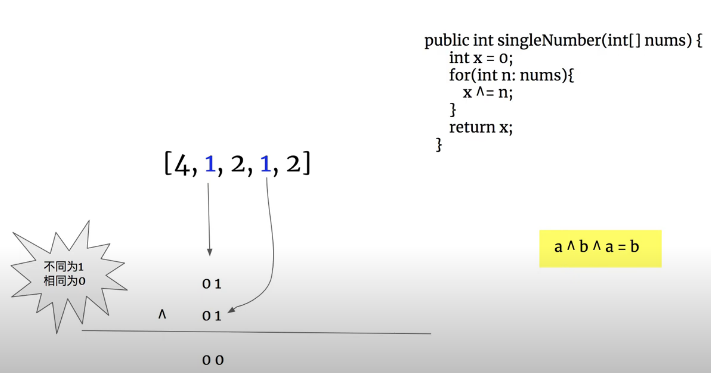

## 136. Single Number


- 之前想过用 map, set, 但是这样做 `Space = O(N)`, 我们必须维持 constant space
---


- 注意： 

```ruby
为什么初始化 x = 0?

    init x = 0
    2 = 1 0

        0 0
XOR     1 0
--------------
        1 0

所以 0 XOR 2 = 2
```
---

```java
class _136_SingleNumber {
    public int singleNumber(int[] nums) {
        int x = 0;
        for (int num : nums) {
            x ^= num;
        }
        return x;
    }

    public static void main(String[] args) {
        _136_SingleNumber singleNumber = new _136_SingleNumber();
        int[] nums = new int[]{4, 1, 2, 1, 2, 3, 3};
        int res = singleNumber.singleNumber(nums);
        System.out.println(res); // 4
    }
}
```

---

### Brute Force

```java
class Solution {
    public int singleNumber(int[] nums) {
        Map<Integer, Integer> freq = new HashMap<>();
        for (int num : nums) {
            freq.put(num, freq.getOrDefault(num, 0) + 1);
        }
        
        return freq.entrySet()
            .stream()
            .filter(e -> e.getValue() < 2)
            .findFirst()
            .map(e -> e.getKey())
            .orElse(-1);
    }
}
```