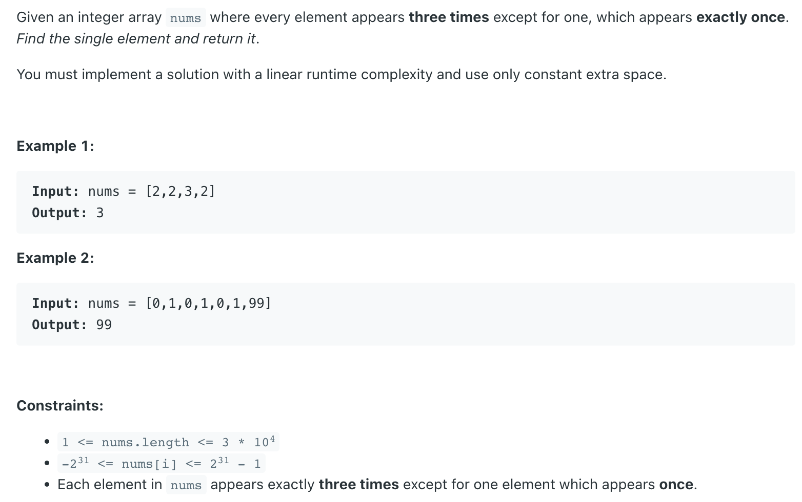

## 137. Single Number II



---

### Brute Force

```java
class Solution {
    public int singleNumber(int[] nums) {
        Map<Integer, Integer> freq = new HashMap<>();
        for (int num : nums) {
            freq.put(num, freq.getOrDefault(num, 0) + 1);
        }

        return freq.entrySet()
                .stream()
                .filter(e -> e.getValue() < 3)
                .findFirst()
                .map(entry -> entry.getKey())
                .orElse(-1);  
    }
}
```