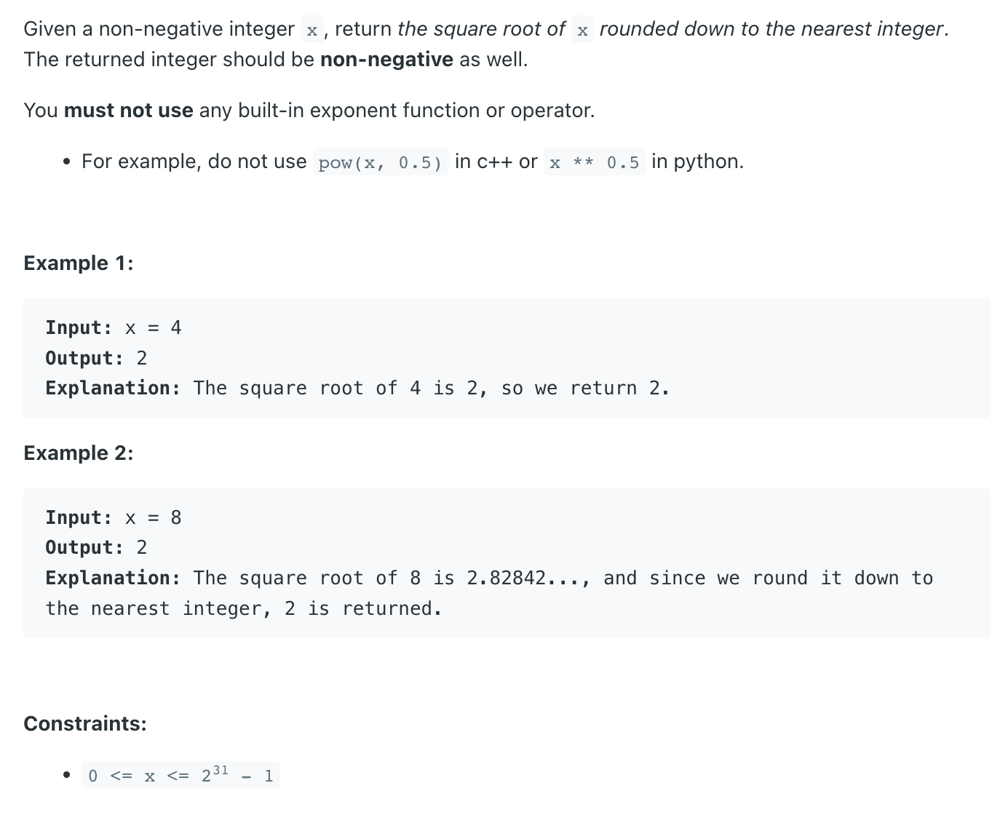
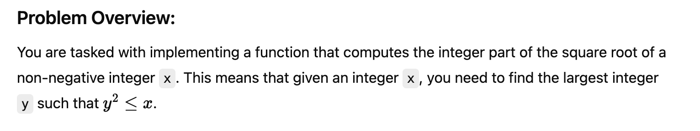
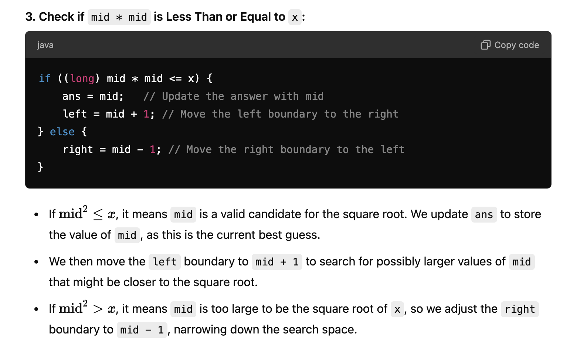
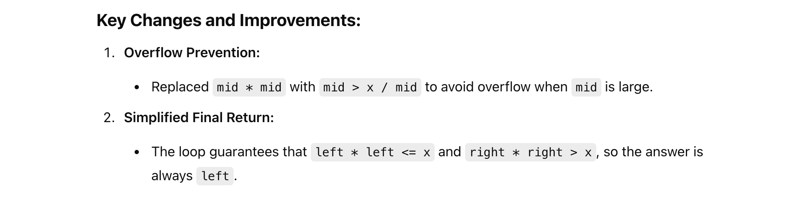

## 69. Sqrt(x)

---



---
### template.1

```java
class _69_Sqrt_x {
    public int mySqrt(int x) {
        if (x < 2) {
            return x;
        }
        int left = 0, right = x;
        int res = x;
        while (left <= right) {
            int mid = (left + right) >>> 1;
            if ((long) mid * mid == x ) {
                return mid;
            } else if ((long) mid * mid < x) {
                res = mid;
                left = mid + 1;
            } else {
                right = mid - 1;
            }
        }
        return res;
    }
}

```
---

### Use division to avoid overflow `mid > (x / mid)`

```java
class sqrt_x_t2 {
    public int mySqrt(int x) {
        if (x < 2) {
            return x;
        }

        int left = 1, right = x;
        while (left < right - 1) {
            int mid = (left + right) >>> 1;
            if (mid == x / mid) {
                return mid;
            } else if (mid < x / mid) {
                left = mid;
            } else {
                right = mid;
            }
        }
        if (left * left < x) {
            return left;
        }
        return right;
    }
}
```
---



```java
class Solution {
    public int mySqrt(int x) {
        if (x < 2) {
            return x;
        }

        int left = 1, right = x;
        while (left < right - 1) {
            int mid = left + (right - left) / 2;
            if (mid > x / mid) { // Use division to avoid overflow
                right = mid;
            } else {
                left = mid;
            }
        }
        return left;
    }
}

```
---

#### Python

```py
class Solution:
    def mySqrt(self, x: int) -> int:
        if x < 2:
            return x

        left, right = 1, x
        res = left
        while left <= right:
            mid = (left + right) >> 1
            if mid == x // mid:
                return mid
            elif mid < x // mid:
                res = mid
                left = mid + 1
            else:
                right = mid - 1
        return res
```