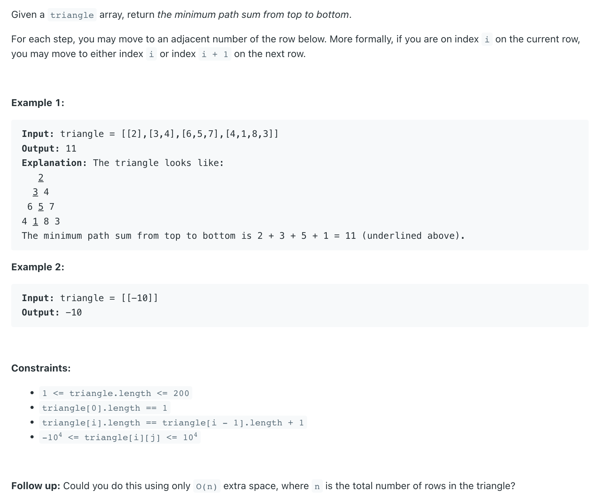

## 120. Triangle

---
- [中文教程](https://www.youtube.com/watch?v=p1LlPZYw42g&t=309s)


- 这里需要说明：刚好这是一个 `n * n` 的 matrix, 只不过有些行数，缺少列
- 一开始初始化 `dp[]`, from `bottom to top`, 最后一层 `min(dp[j], dp[j + 1])`, 刚好最开始都为 `0`
  因为最后一行的`dp[]`, 被初始化为 `4, 1, 8, 3`

---

```java
class _120_Triangle {
    public int minimumTotal(List<List<Integer>> triangle) {
        int rows = triangle.size();
        int[] dp = new int[rows + 1];
        for (int i = rows - 1; i >= 0; i--) {
            for (int j = 0; j <= i; j++) {
                dp[j] = Math.min(dp[j], dp[j + 1]) + triangle.get(i).get(j);
            }
        }
        return dp[0];
    }

    public static void main(String[] args) {
        _120_Triangle triangle = new _120_Triangle();
        int res = triangle.minimumTotal(Arrays.asList(
                Arrays.asList(2),
                Arrays.asList(3, 4),
                Arrays.asList(6, 5, 7),
                Arrays.asList(4, 1, 8, 3)
        ));
        System.out.println(res); // 11
    }
}
```
