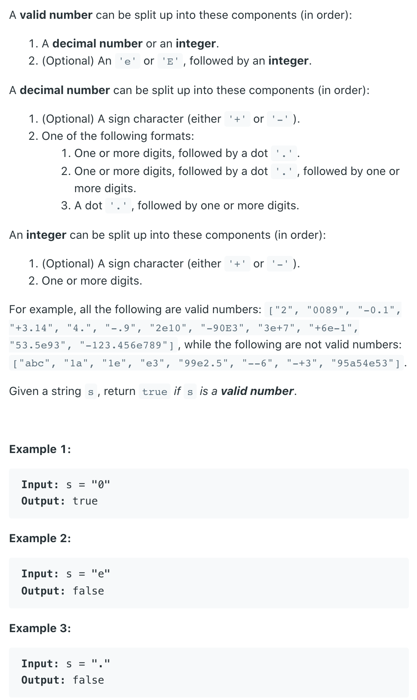
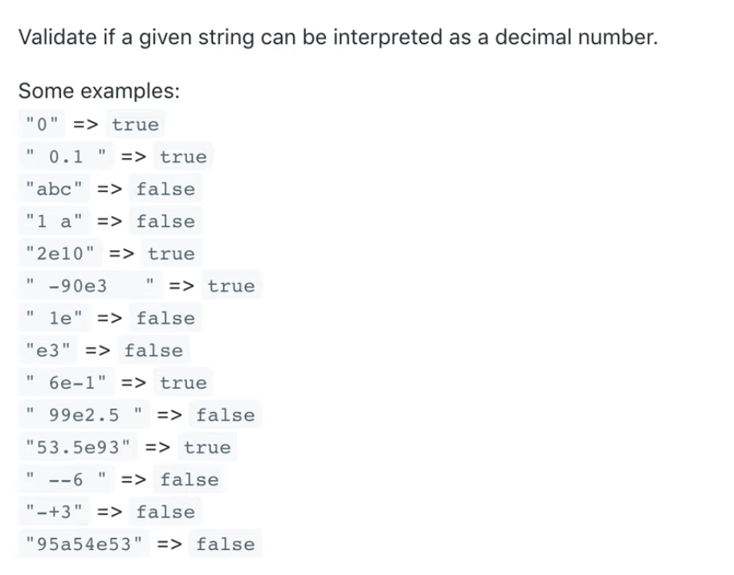

## 65. Valid Number





```java
class Solution {
    public boolean isNumber(String s) {
        if (s == null || s.length() == 0) {
            return false;
        }        
        s = s.trim();
        
        boolean numSeen = false;
        boolean eSeen = false;
        boolean pointSeen = false;
        boolean numAfterE = false;
        
        for (int i = 0; i < s.length(); i++){
            char c = s.charAt(i);
            if (c >= '0' && c <= '9') {
                numSeen = true;
                numAfterE = true;
            } else if (c == '.') {
                if (eSeen || pointSeen) {
                   return false;
                }
                pointSeen = true;
            } else if (c == 'e') {
                if (eSeen || !numSeen) {
                    return false;
                }
                eSeen = true;
                numAfterE = false;
            }else if(c == '+' || c == '-'){
                if (i != 0 && s.charAt(i - 1) != 'e') {
                    return false;
                }
            } else {
                return false;
            }
        }
        return numAfterE && numSeen;
    }
}
```