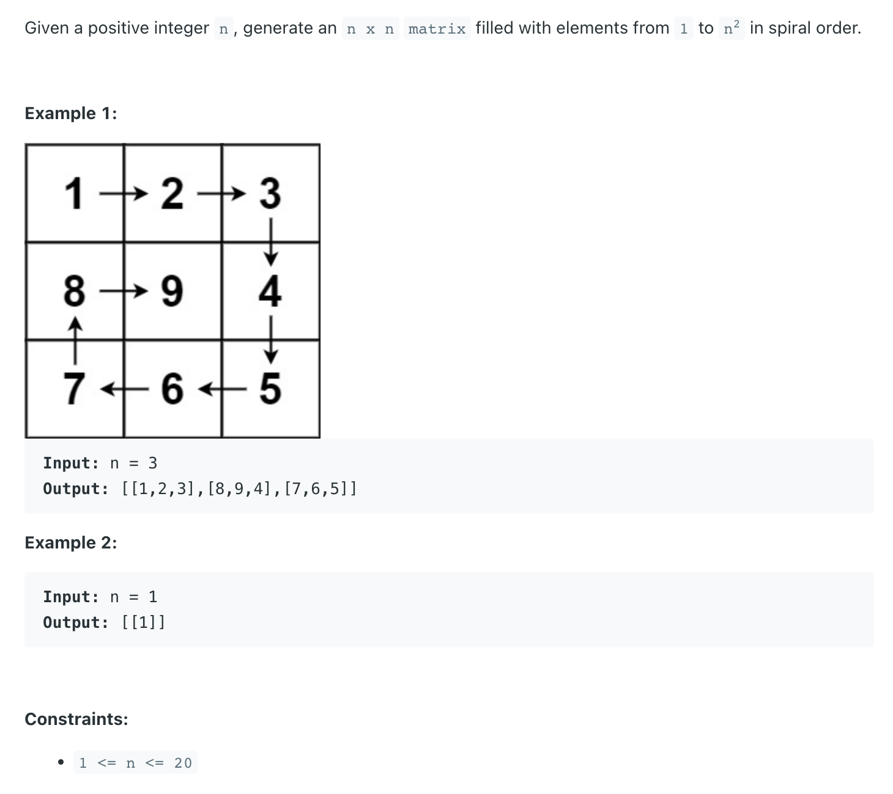

## 59. Spiral Matrix II

---

```java
class _59_SpiralMatrix_II {
    public int[][] generateMatrix(int n) {
        int[][] matrix = new int[n][n];
        if (n == 0) return matrix;

        int rowBegin = 0, rowEnd = n - 1;
        int colBegin = 0, colEnd = n - 1;
        int num = 1;

        while (rowBegin <= rowEnd && colBegin <= colEnd) {
            for (int i = colBegin; i <= colEnd; i++) {
                matrix[rowBegin][i] = num++;
            }
            rowBegin++;

            for (int i = rowBegin; i <= rowEnd; i++) {
                matrix[i][colEnd] = num++;
            }
            colEnd--;

            for (int i = colEnd; i >= colBegin; i--) {
                matrix[rowEnd][i] = num++;
            }
            rowEnd--;

            for (int i = rowEnd; i >= rowBegin; i--) {
                matrix[i][colBegin] = num++;
            }
            colBegin++;
        }
        return matrix;
    }
}
```