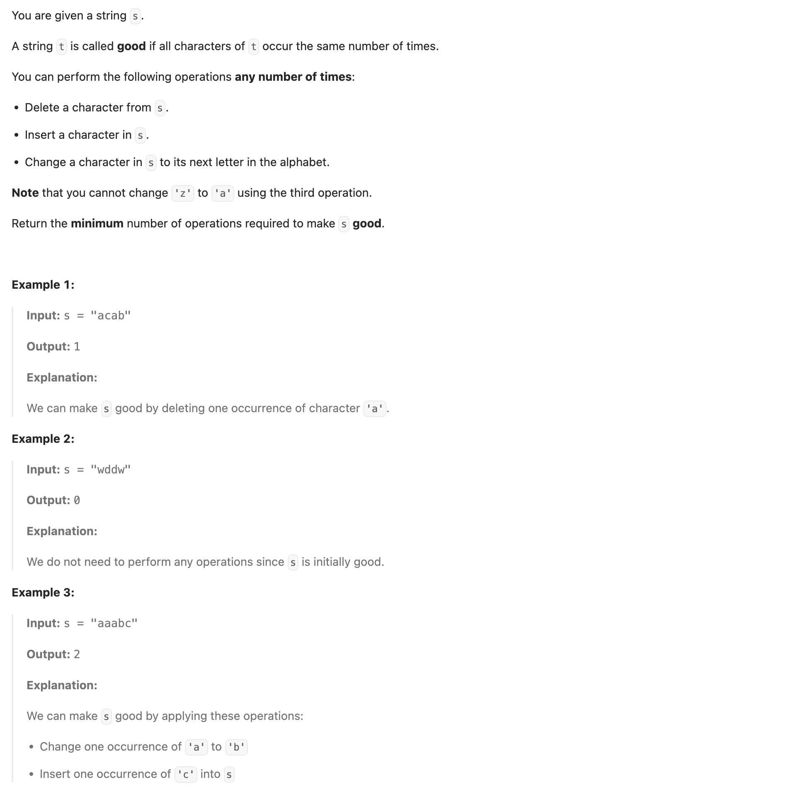
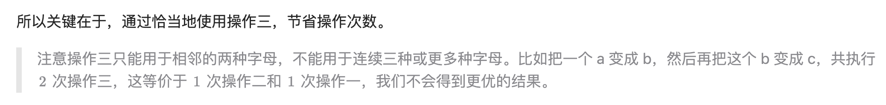
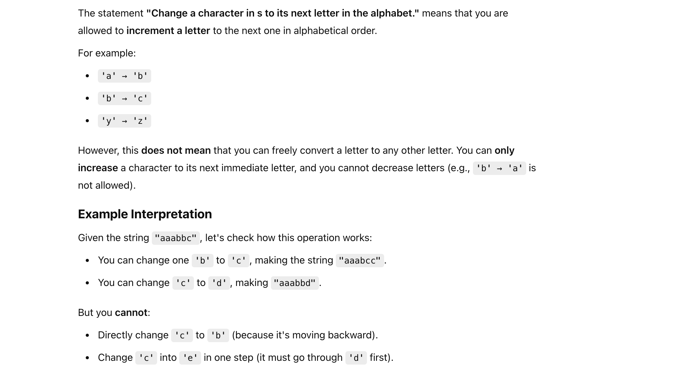
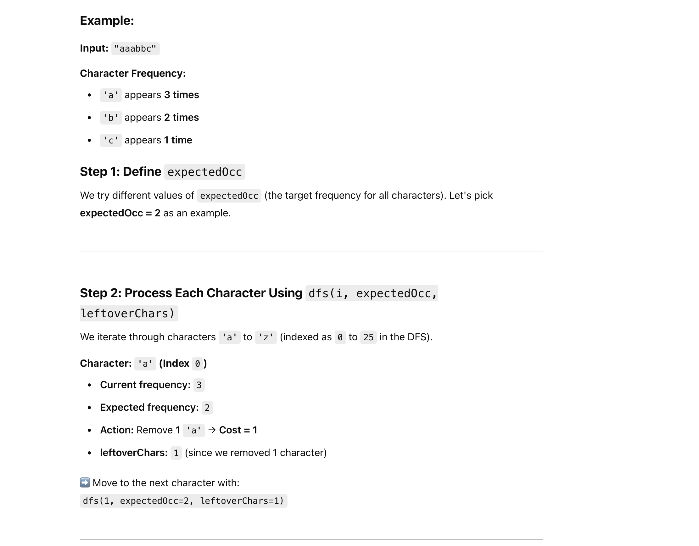
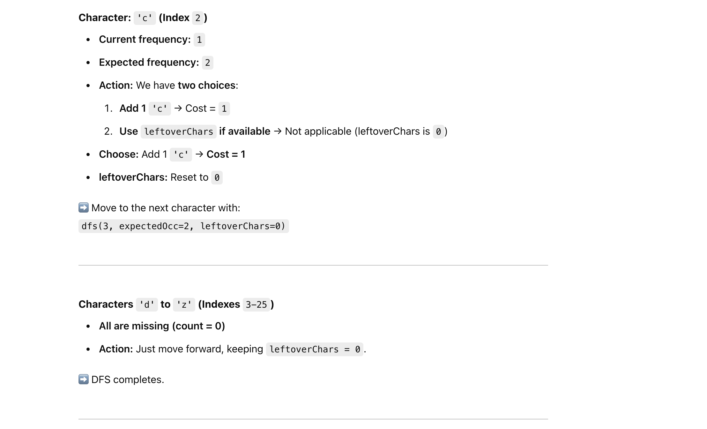
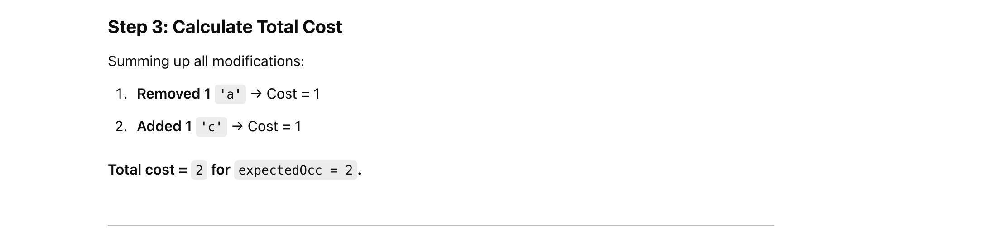
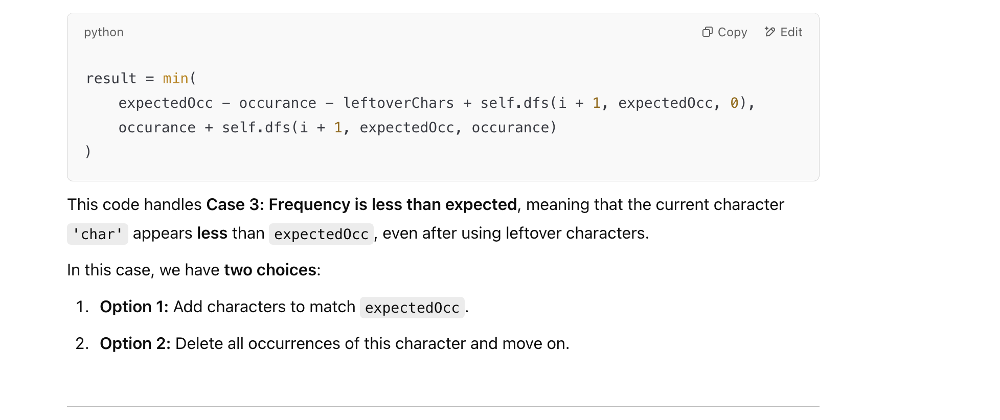
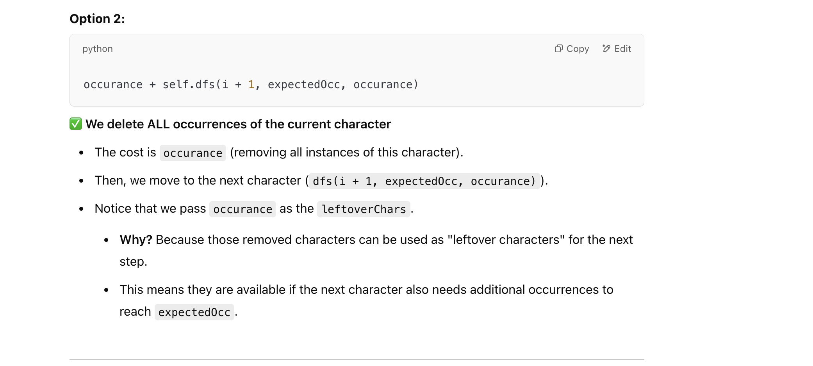
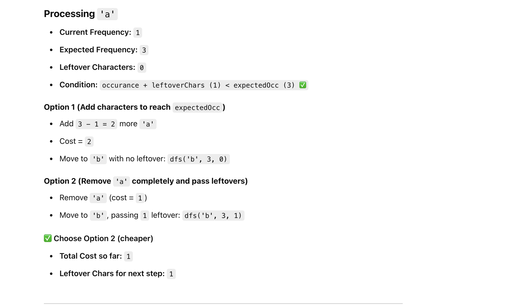
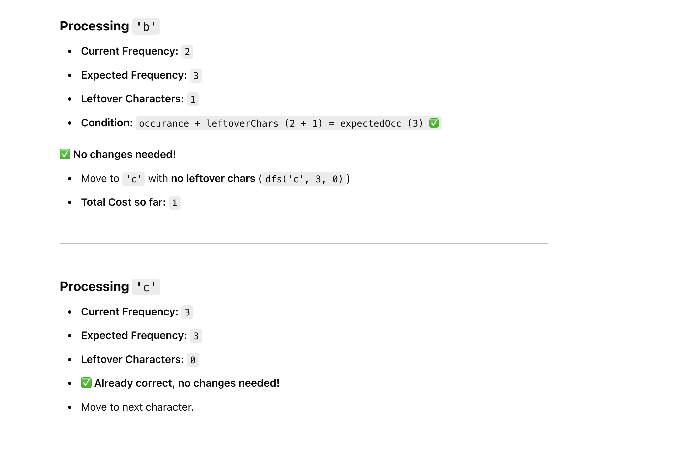

## 3389. Minimum Operations to Make Character Frequencies Equal

---

- [More explanation](https://www.youtube.com/watch?v=k5GQ0W1BQxs)

- 1. if we wanna change `a` => `c`, we need **2 operations**, **a => b => c**




- 2. We can't change `c` to `b` to make "aaabbc" to "aaabbb", cause this question **doesn't allow** us to do so.

---


- **Change a character in s to its next letter in the alphabet**.








---

#### When occurancy is less than expectedOcc





- assuming `s = "abbccc"`



- 第一步 其实就是直接转换 **a => b**



---


```py
from collections import Counter


class Solution:
    def makeStringGood(self, s: str) -> int:
        self.freq = Counter(s)
        self.memo = {}

        min_cost = float('inf')
        max_freq = max(self.freq.values(), default=0)

        for expectedOcc in range(max_freq + 1):
            cost = self.dfs(0, expectedOcc, 0)
            min_cost = min(min_cost, cost)

        return min_cost

    def dfs(self, i, expectedOcc, leftoverChars):
        # Memoization check
        if (i, expectedOcc, leftoverChars) in self.memo:
            return self.memo[(i, expectedOcc, leftoverChars)]

        # Base case: If all 26 characters have been processed
        if i == 26:
            return 0

        char = chr(i + ord('a'))
        occurance = self.freq.get(char, 0)

        # Case 1: Character not in the string
        if occurance == 0:
            result = self.dfs(i + 1, expectedOcc, 0)

        # Case 2: Frequency is greater than expected
        elif occurance > expectedOcc:
            result = occurance - expectedOcc + self.dfs(i + 1, expectedOcc, occurance - expectedOcc)

        # Case 3: Frequency is less than expected
        elif occurance + leftoverChars < expectedOcc:
            result = min(
                expectedOcc - occurance - leftoverChars + self.dfs(i + 1, expectedOcc, 0),
                occurance + self.dfs(i + 1, expectedOcc, occurance)
            )

        # Case 4: Frequency matches expected or can be balanced
        else:
            result = self.dfs(i + 1, expectedOcc, 0)

        # Store result in memo
        self.memo[(i, expectedOcc, leftoverChars)] = result
        return result
```
---

### with cache keyword

```py
class Solution:
    def makeStringGood(self, s: str) -> int:
        self.freq = Counter(s)
        self.max_freq = max(self.freq.values(), default=0)

        min_cost = float('inf')
        for expectedOcc in range(self.max_freq + 1):
            min_cost = min(min_cost, self.dfs(0, expectedOcc, 0))

        return min_cost

    @lru_cache(maxsize=None)
    def dfs(self, i, expectedOcc, leftoverChars):
        # Base case: If all 26 characters have been processed
        if i == 26:
            return 0

        char = chr(i + ord('a'))
        occurance = self.freq.get(char, 0)

        # Case 1: Character not in the string
        if occurance == 0:
            return self.dfs(i + 1, expectedOcc, 0)

        # Case 2: Frequency is greater than expected
        if occurance > expectedOcc:
            return occurance - expectedOcc + self.dfs(i + 1, expectedOcc, occurance - expectedOcc)

        # Case 3: Frequency is less than expected
        if occurance + leftoverChars < expectedOcc:
            return min(
                expectedOcc - occurance - leftoverChars + self.dfs(i + 1, expectedOcc, 0),
                occurance + self.dfs(i + 1, expectedOcc, occurance)
            )

        # Case 4: Frequency matches expected or can be balanced
        return self.dfs(i + 1, expectedOcc, 0)
```