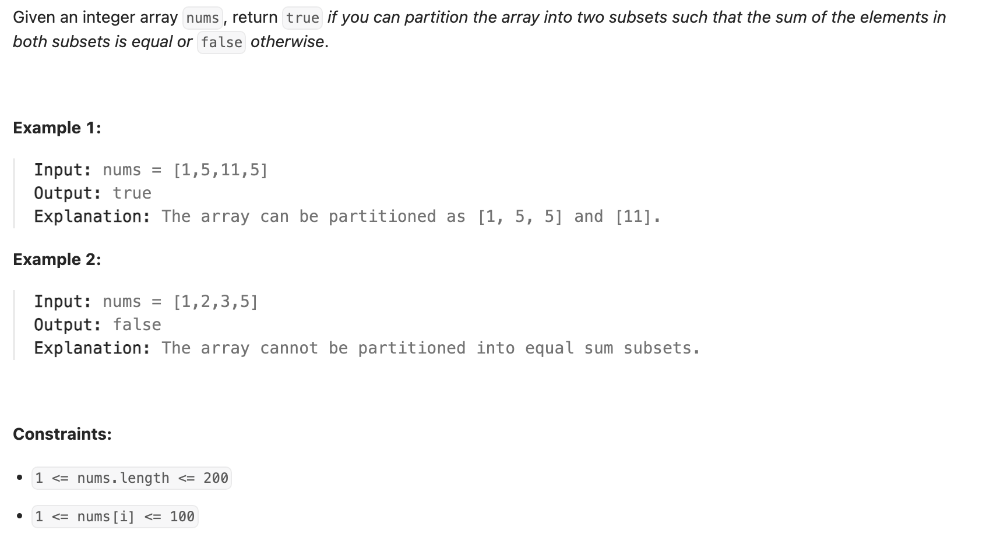
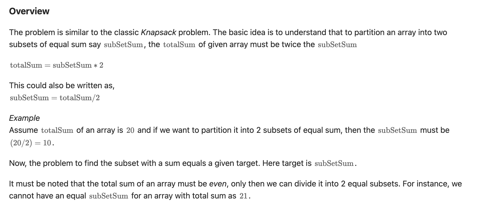
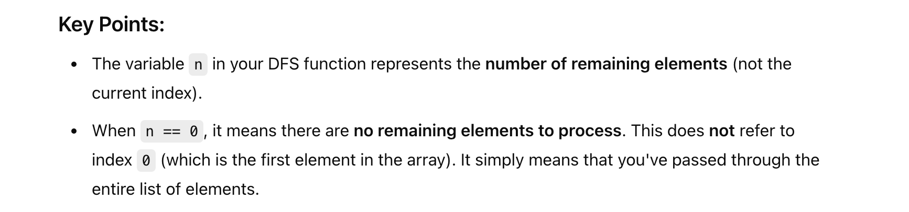
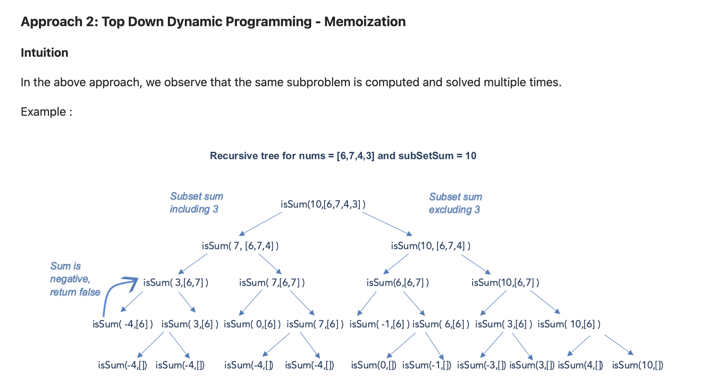

## 416. Partition Equal Subset Sum

---


---

### Brute Force



```py
class Solution:
    def canPartition(self, nums: List[int]) -> bool:
        total_sum = sum(nums)

        if total_sum % 2 != 0:
            return False

        subset_sum = total_sum // 2
        n = len(nums)
        return self.dfs(nums, subset_sum, n)

    def dfs(self, nums: List[int], subset_sum: int, n: int) -> bool:
        if subset_sum == 0:
            return True
        if n == 0:
            return False
        if subset_sum < 0:
            return False

        res = (self.dfs(nums, subset_sum - nums[n - 1], n - 1) or
               self.dfs(nums, subset_sum, n - 1) )
        return res
```

---

### Recursive Tree




#### Memorization DFS

```py
class Solution:
    def canPartition(self, nums: List[int]) -> bool:
        total_sum = sum(nums)
        if total_sum % 2 != 0:
            return False
        sub_sum = total_sum // 2
        memo = {}
        n = len(nums)
        return self.dfs(sub_sum, nums, memo, n)

    def dfs(self, sub_sum, nums, memo, n) -> bool:
        if sub_sum == 0:
            return True
        if n == 0:
            return False
        if sub_sum < 0:
            return False

        if (n, sub_sum) in memo:
            return memo[(n, sub_sum)]

        res = (self.dfs(sub_sum - nums[n - 1], nums, memo, n - 1) or
               self.dfs(sub_sum, nums, memo, n - 1))
        memo[(n, sub_sum)] = res
        return res
```