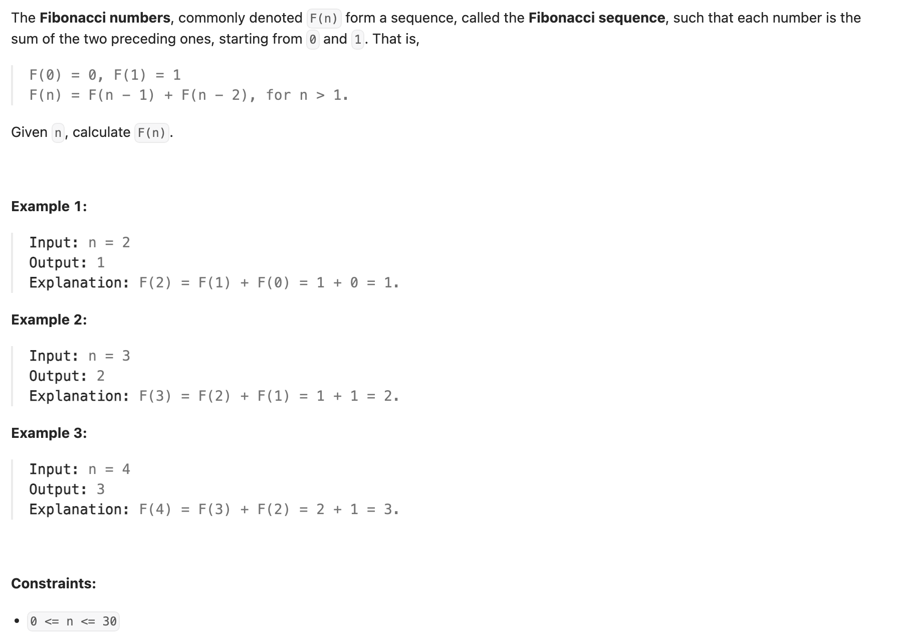

## 509. Fibonacci Number



---

```java
class Solution {
    public int fib(int n) {
        Map<Integer, Integer> memo = new HashMap<>();
        return f(n, memo); 
    }

    private int f(int n, Map<Integer, Integer> memo) {
        if (n == 0) return 0;
        if (n == 1) return 1;

        if (!memo.containsKey(n)) {
            memo.put(n, f(n - 1, memo) + f(n - 2, memo));
        }
        return memo.get(n);
    }
}
```
---


```py
class Solution:
    def fib(self, n: int) -> int:
        return self.f(n, {})
        
    def f(self, n, memo):
        if n == 0: return 0
        if n == 1: return 1

        if n not in memo:
            memo[n] = self.f(n - 1, memo) + self.f(n - 2, memo)
        return memo[n]
```