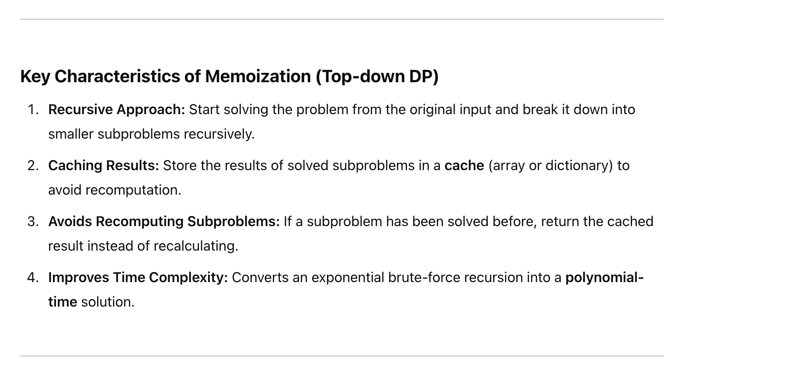
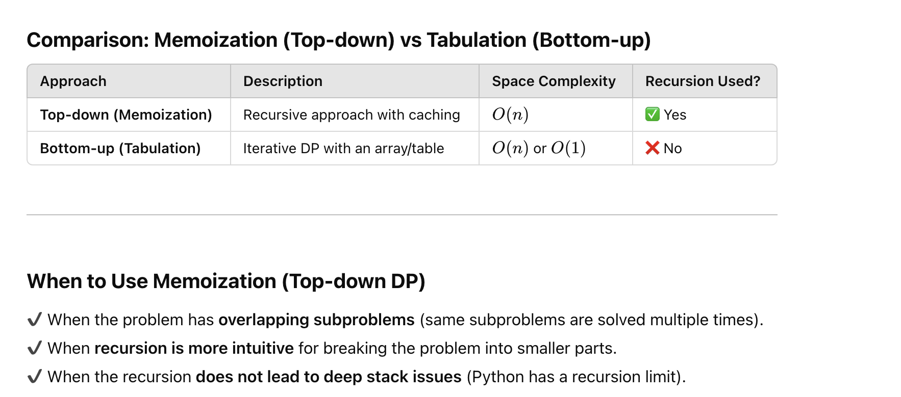
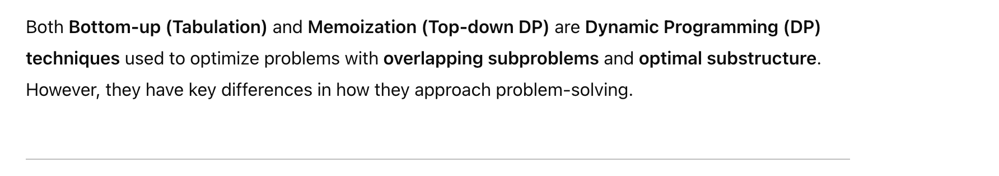
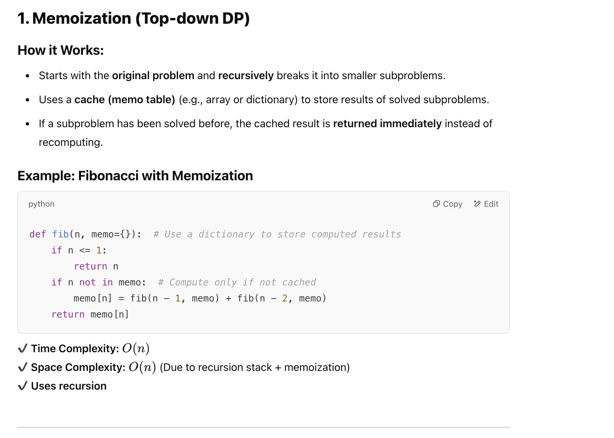
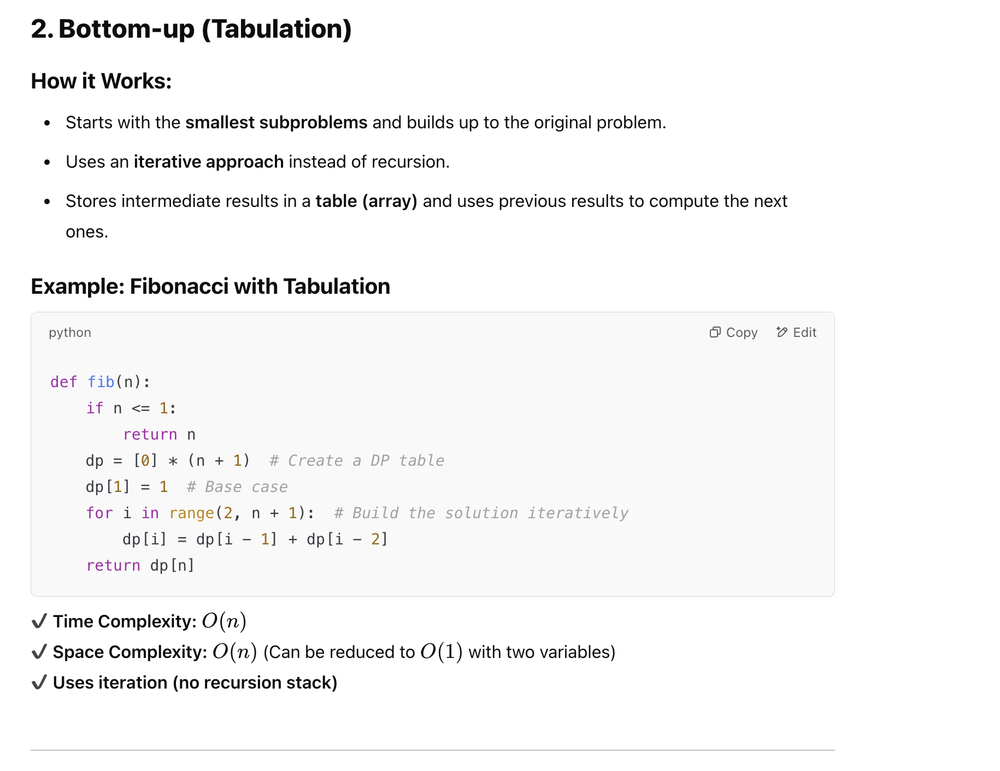
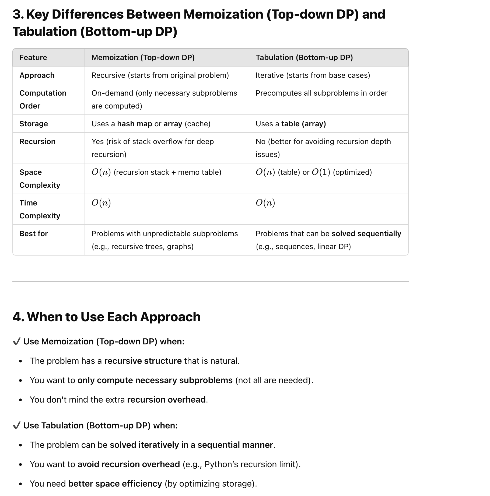
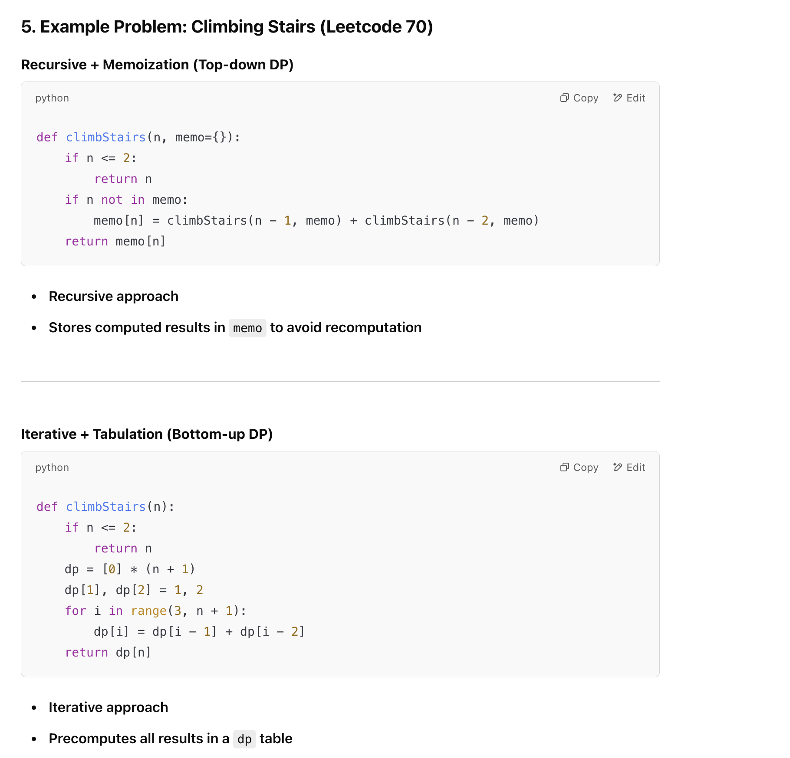

## Memoization | Top-down Dynamic Programming (DP) 

- Memoization (Top-down DP) is a technique used to optimize recursive solutions by storing the results of previously computed subproblems in a 
  data structure (typically an array or a hash map). This prevents redundant computations and improves efficiency.

---

## Bottom-up (Tabulation) vs. Memoization (Top-down DP)

