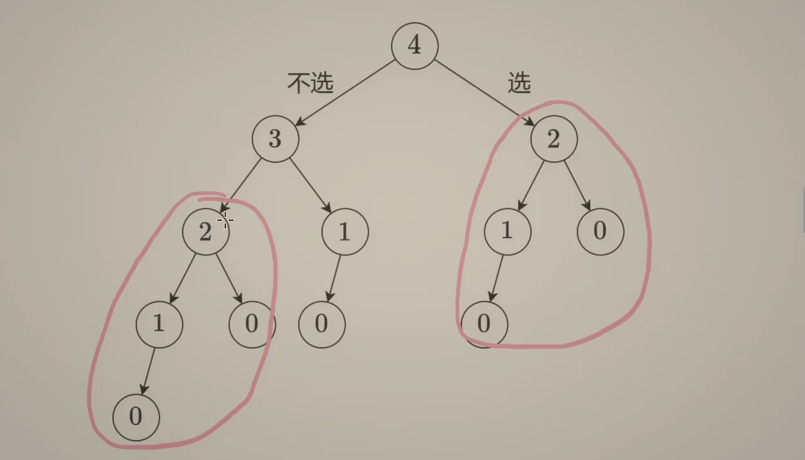
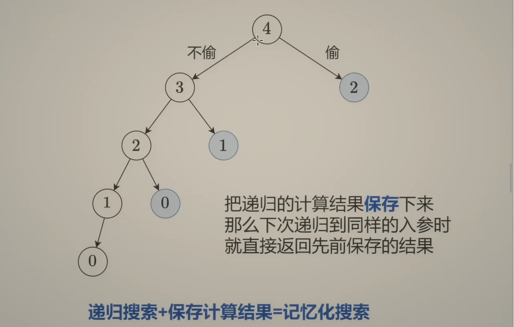
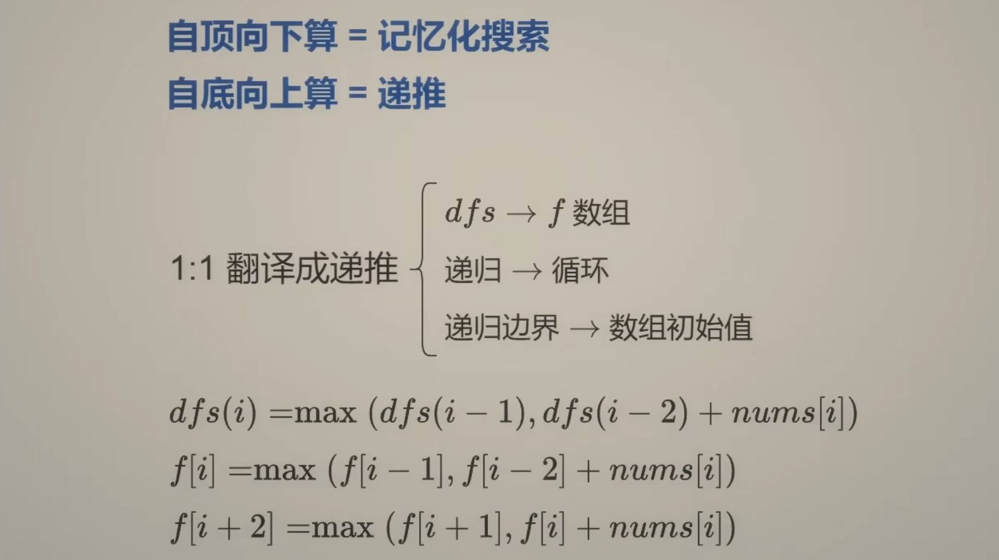
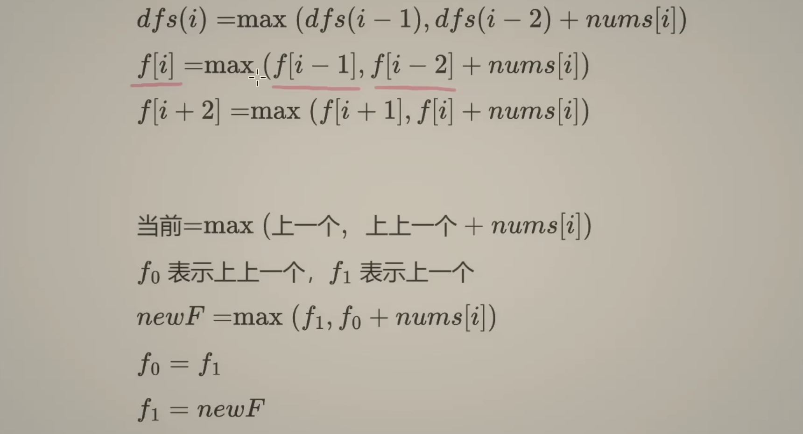

## 为什么选择记忆化搜索？ [LC 198](../DP/rob.md) 

- LC 198 代码：

```py
class Solution:
    def rob(self, nums: List[int]) -> int:
        n = len(nums)

        @cache
        def dfs(index):
            if index < 0:
                return 0
            res = max(dfs(index - 1), nums[index] + dfs(index - 2))
            return res
        return dfs(n - 1)
```


- 为什么选择记忆化搜索，因为我们可以发现有[很多subproblem 是重复计算的](https://www.bilibili.com/video/BV1Xj411K7oF?t=192.6)：


---

### 复杂度如何计算？

- TC = **状态个数 * 单个状态所需要的计算时间** = **O(N) * O(1)** = O(N)
- SC = **O(N)**
---




- 0 and 1 merge to => 2, 2 and 1 merge to => 3, 3 and 2 merge to => 4
- 既然我们已经知道从哪些点归到哪些点, 那么可以去掉递归中的递:



- 注意：由于 i - 2 可能最终导致 i 为负数，所以我们让 **i + 2** 来计算:
  - **f[i] = max(f[i - 1], f[i - 2] + nums[i])**, let **i + 2**  
  - **f[i + 2] = max(f[i + 1], f[i] + nums[i])**

- 于是代码变成：


```py
class Solution:
    def rob(self, nums: List[int]) -> int:
        n = len(nums)
        f = [0] * (n + 2)
        for index, num in enumerate(nums):
            f[index + 2] = max(f[index + 1], f[index] + num)
        return f[n + 1]
```

- 但是这个代码的: SC = **O(N)**, 如何改成 => O(1) ?



- 于是代码变成:

```py
class Solution:
    def rob(self, nums: List[int]) -> int:
        n = len(nums)
        f0 = f1 = 0
        for index, num in enumerate(nums):
            new_f = max(f1, f0 + num)
            f0 = f1
            f1 = new_f
        return f1
```


---
## Memoization | Top-down Dynamic Programming (DP) 

- Memoization (Top-down DP) is a technique used to optimize recursive solutions by storing the results of previously computed subproblems in a 
  data structure (typically an array or a hash map). This prevents redundant computations and improves efficiency.


---

## Bottom-up (Tabulation) vs. Memoization (Top-down DP)


