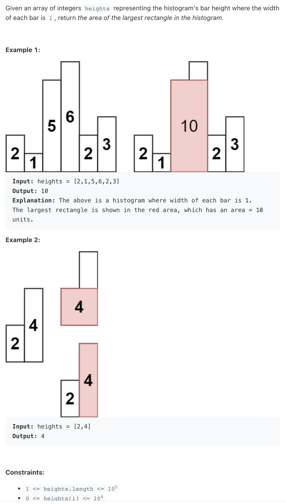
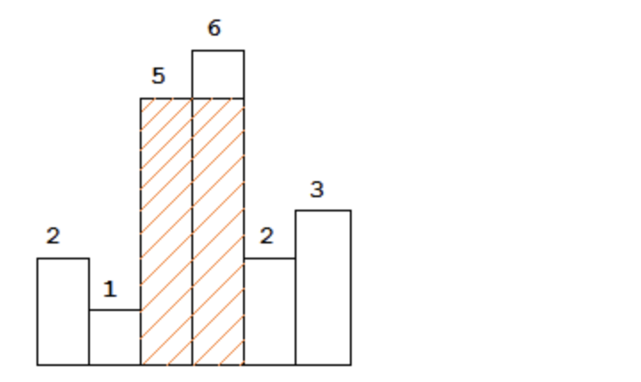

## 84. Largest Rectangle in Histogram


- [geeksforgeeks](https://www.geeksforgeeks.org/largest-rectangle-under-histogram/)



```java
class Solution {
    public int largestRectangleArea(int[] heights) {
        Stack<Integer> stk = new Stack<>();

        int area_with_top;
        int max_area = -1, i = 0;
        while (i < heights.length) {
            if (stk.isEmpty() || heights[stk.peek()] <= heights[i]) {
                stk.push(i);
                i++;
            } else {
                int temp = stk.pop();
                if (stk.isEmpty()) {
                    area_with_top = heights[temp] * i;
                } else {
                    area_with_top = heights[temp] * (i - stk.peek() - 1);
                }

                max_area = Math.max(max_area, area_with_top);
            }
        }

        while (!stk.isEmpty()) {
            int tp = stk.pop();
            if (stk.isEmpty()) {
                area_with_top = heights[tp] * i;
            } else {
                area_with_top = heights[tp] * (i - stk.peek() - 1);
            }

            max_area = Math.max(max_area, area_with_top);
        }
        return max_area;      
    }
}
```