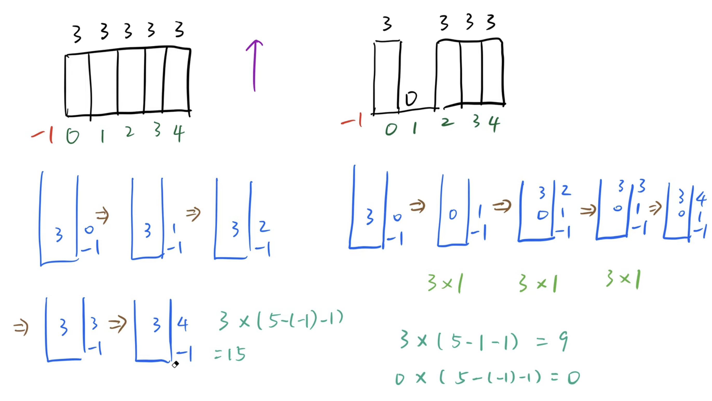

## 84. Largest Rectangle in Histogram

---

### Template

- [模版解释](https://www.youtube.com/watch?v=GYuBQacXr1A)

- 1. `stack` 存储的是 `index`
  - 因为如果你只存储高度的话，高度可能重复
- 2. `单调递增`，说的是它们所对应的高度呈现：`单调递增的趋势`

- 需要注意的是，这种算法，算到 `index-0` 的时候，`(6 - 0 - 1)`， 是算不到最左边`index-0` 的。
  所以我们给它最左边添加`-1` index => `6 - (-1) - 1` = `6`
 



- Time = O(n)
- Space = O(n)   ## 最坏情况是把所有index 都放入stack
---

```java
class largestRectangleHistogram_v0 {
    public int largestRectangleArea(int[] heights) {
        int n = heights.length;
        Stack<Integer> stk = new Stack<>();
        stk.push(-1);
        int max = 0;
        int curIndex = 0;
        while (curIndex < heights.length) {// 注意整个算法严格维护 monotonic increasing
            while (stk.peek() != -1 && heights[stk.peek()] >= heights[curIndex]) {
                max = Math.max(max, heights[stk.pop()] * (curIndex - stk.peek() - 1));
            }
            stk.push(curIndex);
            curIndex++;
        }

        while (stk.peek() != -1) {
            max = Math.max(max, heights[stk.pop()] * (curIndex - stk.peek() - 1));
        }
        return max;
    }
}

```
---
- [geeksforgeeks](https://www.geeksforgeeks.org/largest-rectangle-under-histogram/)


---
```ruby
    [2, 1, 5, 6, 2, 3]

stk: 0, 
++i => 1


stK:
i => 1
areaWithTop => height[0] * 1 = 2
maxArea => 2


stk: 1, 
++i => 2


stk: 1, 2
++i => 3


stk: 1, 2, 3
++i => 4


stk: 1, 2
i => 4
areaWithTop => height[3] * (4 - 2 -1) = 6
maxArea => 6


stk: 1, 
i => 4
areaWithTop => height[2] * (4 - 1 -1) = 10
maxArea => 10


stk: 1, 4
++i => 5


stk: 1, 4, 5
++i => 6
maxArea => 10


stk: 1, 4
i => 6
areaWithTop => height[5] * (6 - 4 - 1) = 3
maxArea => 10


stk: 1, 
i => 6
areaWithTop => height[4] * (6 - 1 - 1) = 8
maxArea => 10


stk:  
i => 6
areaWithTop => height[1] * 6 = 6
maxArea => 10
```
---
```java
class LargestRectangleHistogram {
    public int largestRectangleArea(int[] heights) {
        Stack<Integer> stk = new Stack<>();

        int areaWithTop;
        int maxArea = -1, i = 0;
        while (i < heights.length) {
            if (stk.isEmpty() || heights[stk.peek()] <= heights[i]) {
                stk.push(i);
                i++;
            } else {
                int temp = stk.pop();
                if (stk.isEmpty()) {
                    areaWithTop = heights[temp] * i;
                } else {
                    areaWithTop = heights[temp] * (i - stk.peek() - 1);
                }

                maxArea = Math.max(maxArea, areaWithTop);
            }
        }

        while (!stk.isEmpty()) {
            int tp = stk.pop();
            if (stk.isEmpty()) {
                areaWithTop = heights[tp] * i;
            } else {
                areaWithTop = heights[tp] * (i - stk.peek() - 1);
            }

            maxArea = Math.max(maxArea, areaWithTop);
        }
        return maxArea;
    }

    public static void main(String[] args) {
        int[] heights = new int[]{2, 1, 5, 6, 2, 3};
        LargestRectangleHistogram lrh = new LargestRectangleHistogram();
        int res = lrh.largestRectangleArea(heights);
        System.out.println(res);
    }
}
```