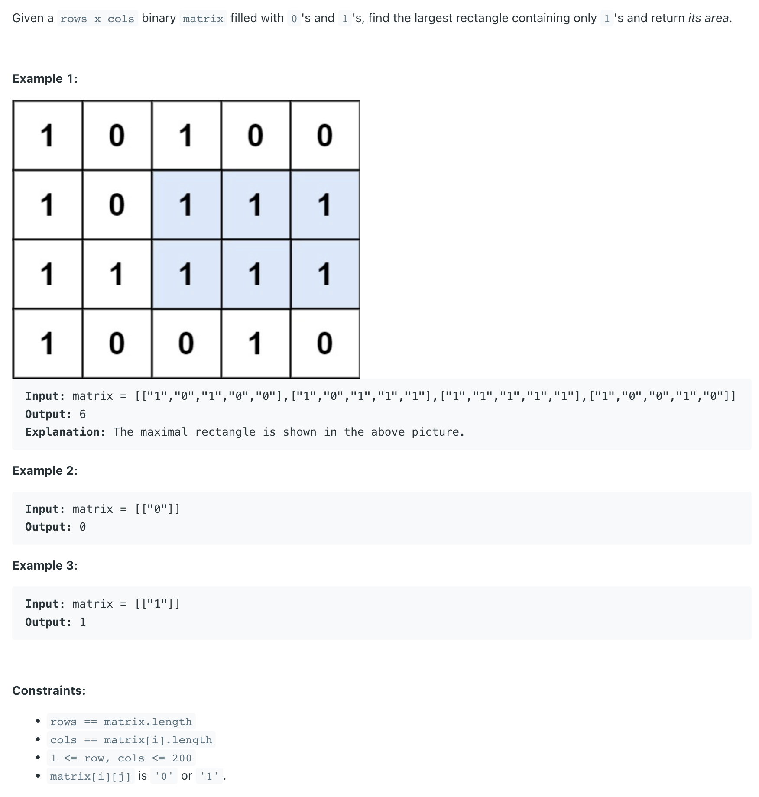
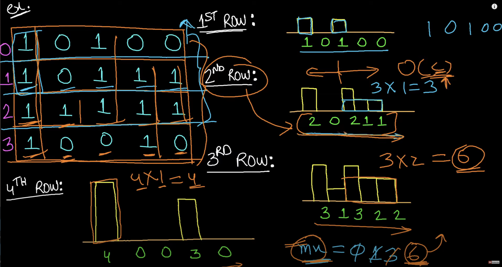

## 85. Maximal Rectangle

---

- [中文教程](https://www.youtube.com/watch?v=9NZuhGL0SlU&t=399s)
- [refer to LC 84](https://novemberfall.github.io/LeetCode-NoteBook/#/monotonic/histogram)


---

```java
class MaximalRectangle_v1 {
    public int maximalRectangle(char[][] matrix) {
        if (matrix == null || matrix.length == 0) return 0;

        int rows = matrix.length, cols = matrix[0].length;
        int[][] grid = new int[rows][cols];
        buildHistogram(matrix, grid);

        int max = 0;
        for (int i = 0; i < rows; i++) {
            max = Math.max(max, maxRec(grid, i));
        }
        return max;
    }

    private void buildHistogram(char[][] matrix, int[][] grid) {
        // 第一行特殊处理
        for (int j = 0; j < matrix[0].length; j++) {
            grid[0][j] = matrix[0][j] == '1' ? 1 : 0;
        }
        for (int i = 1; i < matrix.length; i++) {
            for (int j = 0; j < matrix[0].length; j++) {
                grid[i][j] = matrix[i][j] == '1' ? grid[i - 1][j] + 1 : 0;
            }
        }
    }

    private int maxRec(int[][] grid, int row) {
        Stack<Integer> stk = new Stack<>();
        stk.push(-1);
        int maxArea = -1;
        int curIndex = 0;
        while (curIndex < grid[row].length) {
            while (stk.peek() != -1 && grid[row][stk.peek()] >= grid[row][curIndex]) {
                maxArea = Math.max(maxArea, grid[row][stk.pop()] * (curIndex - stk.peek() - 1));
            }
            stk.push(curIndex);
            curIndex++;
        }

        while (stk.peek() != -1) {
            maxArea = Math.max(maxArea, grid[row][stk.pop()] * (curIndex - stk.peek() - 1));
        }
        return maxArea;
    }
}
```