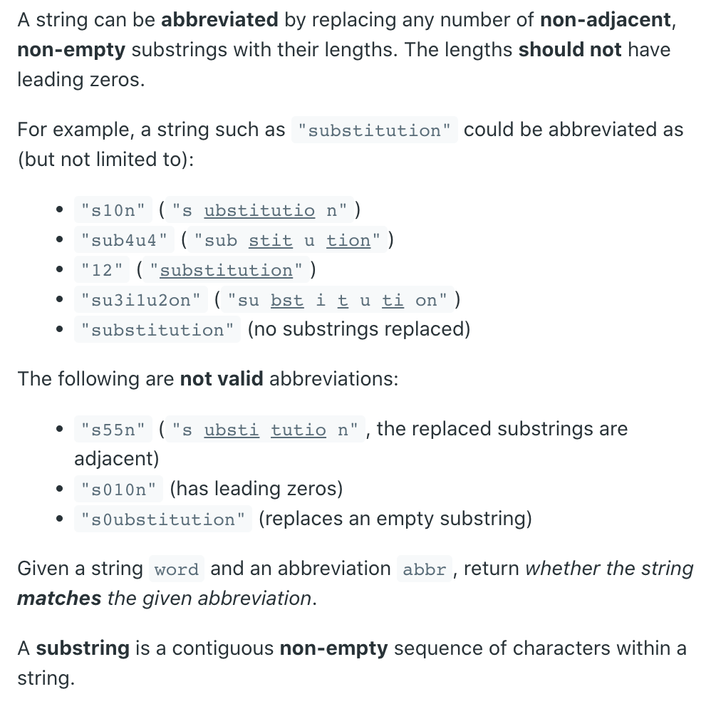
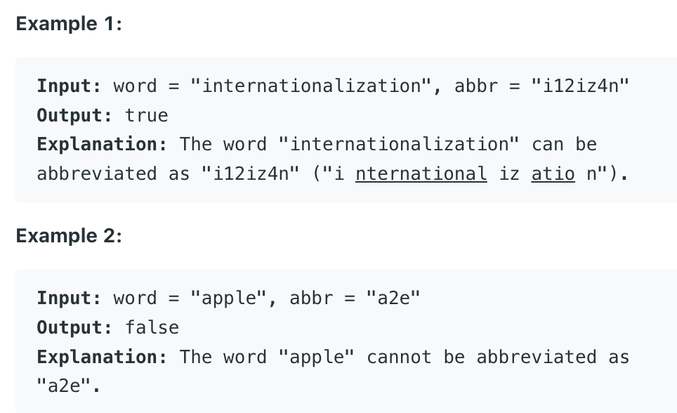

## 408. Valid Word Abbreviation



```ruby
a p p l e       a 3 e
i               j

a p p l e       a 3 e
  i               j
    
a p p l e       a 3 e
        i           j 

a p p l e       a 3 e
         i           j 
```

```java
class Solution {
    public boolean validWordAbbreviation(String word, String abbr) {
        int i = 0, j = 0;
        while (i < word.length() && j < abbr.length()) {
            if (word.charAt(i) == abbr.charAt(j)) {
                i++;
                j++;
                continue;                
            }
            if (abbr.charAt(j) <= '0' || abbr.charAt(j) > '9') {
                return false;
            }

            int num = 0;
            while (j < abbr.length() && abbr.charAt(j) >= '0' 
                                        && abbr.charAt(j) <= '9') {
                num = num * 10 + abbr.charAt(j) - '0';
                j++;
            }
            i += num;        
        }        
        return i == word.length() && j == abbr.length();
    }
}
```


```java
class Solution {
    public boolean validWordAbbreviation(String word, String abbr) {
        int i = 0, j = 0;
        while (i < word.length() && j < abbr.length()) {
            if (word.charAt(i) == abbr.charAt(j)) {
                i++;
                j++;
                continue;                
            }
            if (abbr.charAt(j) <= '0' || abbr.charAt(j) > '9') {
                return false;
            }

            int start = j;
            int num = 0;
            while (j < abbr.length() && abbr.charAt(j) >= '0' 
                                        && abbr.charAt(j) <= '9') {
                j++;
            }
            i += Integer.valueOf(abbr.substring(start, j));           
        }
        
        return i == word.length() && j == abbr.length();
    }
}
```