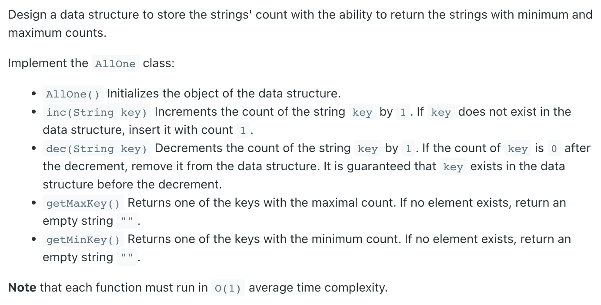
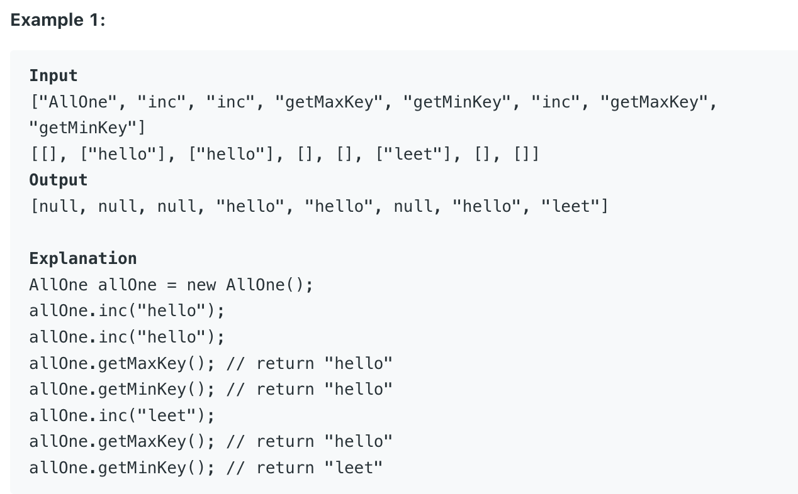

## 432. All O`one Data Structure




```java
public class AllOne {
    static class Node {
        String key;
        int val;

        public Node(String key, int val) {
            this.key = key;
            this.val = val;
        }
    }

    Map<String, Node> map;
    PriorityQueue<Node> minHeap;
    PriorityQueue<Node> maxHeap;

    public AllOne() {
        map = new HashMap<>();
        minHeap = new PriorityQueue<Node>((Node a, Node b) -> (a.val - b.val));
        maxHeap = new PriorityQueue<Node>((Node a, Node b) -> (b.val - a.val));
    }

    /** Inserts a new key <Key> with value 1. Or increments an existing key by 1. */
    public void inc(String key) {
        if (!map.containsKey(key)) {
            map.put(key, new Node(key, 1));
            Node node = map.get(key);
            minHeap.add(node);
            maxHeap.add(node);
        } else {
            Node node = map.get(key);
            minHeap.remove(node);
            maxHeap.remove(node);
            node.val++;
            map.put(key, node);
            minHeap.add(node);
            maxHeap.add(node);
        }
    }

    /* Decrements an existing key by 1. If Key's value is 1, remove it from the data structure. */
    public void dec(String key) {
        if (map.containsKey(key)) {
            Node node = map.get(key);
            if (node.val == 1) {
                map.remove(key);
                minHeap.remove(node);
                maxHeap.remove(node);
            } else {
                minHeap.remove(node);
                maxHeap.remove(node);
                node.val--;
                map.put(key, node);
                minHeap.add(node);
                maxHeap.add(node);
            }
        }
    }

    /* Returns one of the keys with maximal value. */
    public String getMaxKey() {
        if (maxHeap.isEmpty()) {
            return "";
        } else {
            return maxHeap.peek().key;
        }
    }

    /* Returns one of the keys with Minimal value. */
    public String getMinKey() {
        if (minHeap.isEmpty()) {
            return "";
        } else {
            return minHeap.peek().key;
        }
    }
}

/**
 * Your AllOne object will be instantiated and called as such:
 * AllOne obj = new AllOne();
 * obj.inc(key);
 * obj.dec(key);
 * String param_3 = obj.getMaxKey();
 * String param_4 = obj.getMinKey();
 */
```