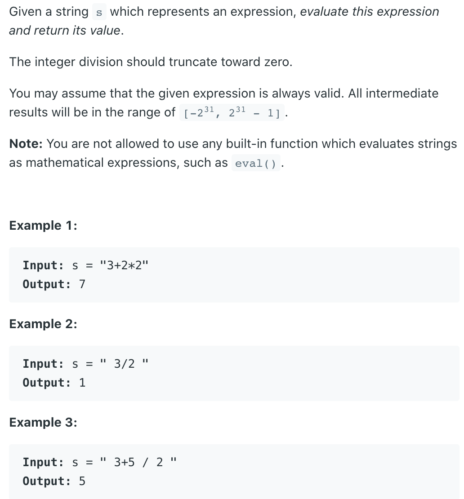

## 227. Basic Calculator II

---

```java
public class calculatorII_v2 {
    public int calculate(String s) {
        Stack<Integer> stk = new Stack<>();
        String str = s.trim();
        int len = str.length();
        int num = 0;
        char sign = '+';
        for (int i = 0; i < len; i++) {
            char c = str.charAt(i);
            if (c == ' ') {
                continue;
            }
            if (Character.isDigit(c)) {
                num = num * 10 + c - '0';
            }
            if (!Character.isDigit(c) || i == len - 1) {
                if (sign == '+') {
                    stk.push(num);
                } else if (sign == '-') {
                    stk.push(-num);
                } else if (sign == '*') {
                    stk.push(stk.pop() * num);
                } else if (sign == '/') {
                    stk.push(stk.pop() / num);
                }
                sign = c;
                num = 0;
            }
        }

        int res = 0;
        for (Integer i : stk) {
            res += i;
        }
        return res;
    }
}
```


---
```java
class Solution {
    public int calculate(String s) {
        int len = s.length(); 
        if (s == null || len == 0) return 0;
        
        Deque<Integer> stack = new ArrayDeque<>();
        char sign = '+';
        int num = 0;
        for (int i = 0; i < len; i++) {
            char c = s.charAt(i);
            if (c >= '0' && c <= '9') {
                num = num * 10 + c - '0';
            }
            if (c == ' ' && i != len - 1) {
                continue;
            }
            if ( !Character.isDigit(c) || i == len - 1) {
                if (sign == '+') {
                    stack.push(num);
                }
                if (sign == '-') {
                    stack.push(-num);
                }
                if (sign == '*') {
                    stack.push(stack.pop() * num);
                }
                if (sign == '/') {
                    stack.push(stack.pop() / num);
                }
                sign = c;
                num = 0;                
            }
        }
        int total = 0;
        for (Integer i : stack) {
            total += i;
        }
        return total;
    }
}
```