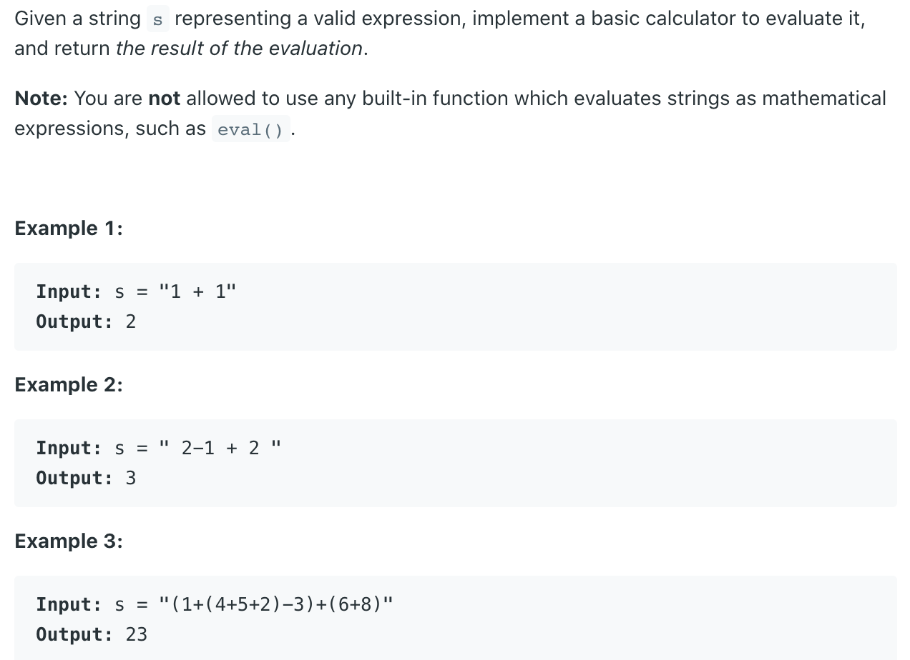

## 224. Basic Calculator

- Simple iterative solution by identifying characters one by one. 
  One important thing is that the input is valid, which means the parentheses are 
  always paired and in order. Only 5 possible input we need to pay attention:
  1. digit: it should be one digit from the current number
  2. `'+'`: number is over, we can add the previous number and start a new number
  3. `'-'`: same as above
  4. `'('`: push the previous result and the sign into the stack, set result to 0, 
  just calculate the new result within the parenthesis.
  5. `')'`: pop out the top two numbers from stack, first one is the sign before this pair of 
  parenthesis, second is the temporary result before this pair of parenthesis. We add them 
  together.

- Finally if there is only one number, from the above solution, we haven't add the number to the 
  result, so we do a check see if the number is zero.
---
```java
class calculator_v2 {
    public int calculate(String s) {
        Stack<Integer> stk = new Stack<>();
        int res = 0;
        int num = 0;
        int sign = 1;

        for (char c : s.toCharArray()) {
            if (c == ' ') {
                continue;
            } else if (Character.isDigit(c)) {
                num = num * 10 + c - '0';
            } else if (c == '+') {
                res += sign * num;
                num = 0; // reset the number
                sign = 1;
            } else if (c == '-') {
                res += sign * num;
                num = 0; // reset the number
                sign = -1;
            } else if (c == '(') {
                //we push the result first, then sign;
                stk.push(res);
                stk.push(sign);
                //reset the sign and result for the value in the parenthesis
                num = 0;
                res = 0;
                sign = 1;
            } else if (c == ')') {
                res += sign * num;
                num = 0;
                res *= stk.pop(); // stack.pop() is the sign before the parenthesis
                res += stk.pop(); // /stack.pop() now is the result calculated before the parenthesis
            }
        }

        //Dont' forget the last number   i.g  "1 + 5"
        res += sign * num;
        return res;
    }
}
```


---
```java
public class _224_calculator {
    public int calculate(String s) {
        int len = s.length();
        if (s == null || len == 0) return 0;

        Stack<Integer> stack = new Stack<>();
        char[] chars = s.toCharArray();
        int res = 0;
        int sign = 1;
        for (int i = 0; i < len; i++) {
            if (Character.isDigit(chars[i])) {
                int num = chars[i] - '0';
                while (i < len - 1 && Character.isDigit(chars[i + 1])) {
                    num = num * 10 + (chars[++i] - '0');
                }
                res += sign * num;
            } else if (chars[i] == '+') {
                sign = 1;
            } else if (chars[i] == '-') {
                sign = -1;
            } else if (chars[i] == '(') {
                //we push the result first, then sign;
                stack.push(res);
                stack.push(sign);
                //reset the sign and result for the value in the parenthesis
                res = 0;
                sign = 1;
            } else if (chars[i] == ')') {
                res *= stack.pop();
                res += stack.pop();
            }
        }

        return res;
    }

    public static void main(String[] args) {
        _224_calculator calculator = new _224_calculator();
        String s = " 2-1 + 2 ";
        System.out.println(calculator.calculate(s)); // 3
        String s2 = "(1+(4+5+2)-3)+(6+8)";
        System.out.println(calculator.calculate(s2)); // 23
        String s3 = "15 + 35 + (5 - 4)";
        System.out.println(calculator.calculate(s3)); // 51
        String s4 = "-45 + 45 + (10 - 5)";
        System.out.println(calculator.calculate(s4)); // 5
    }
}
```

