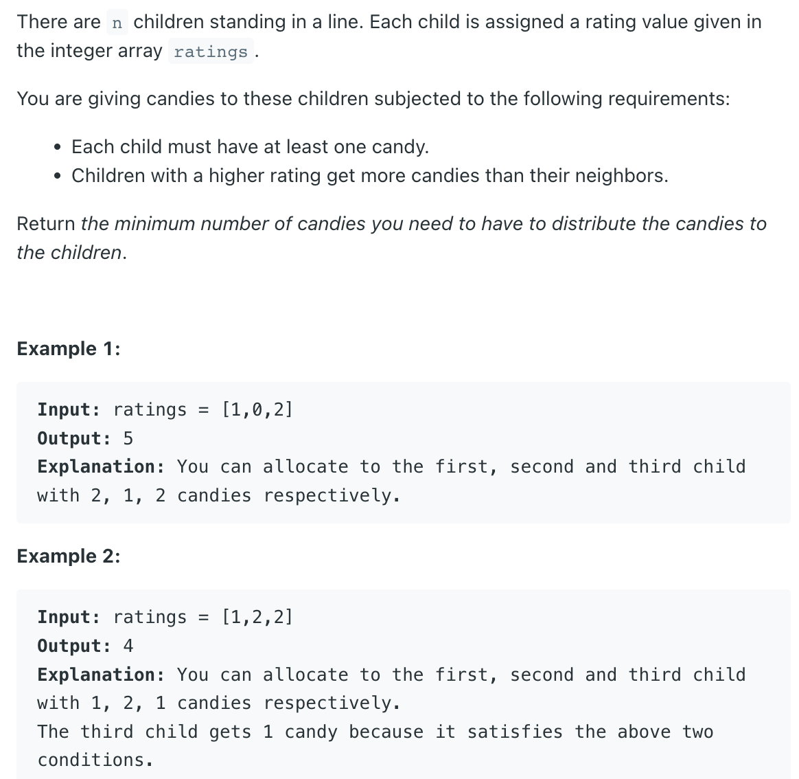
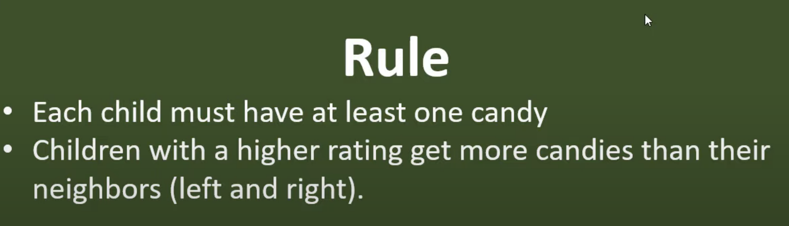
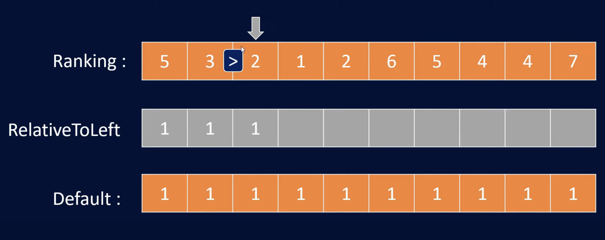
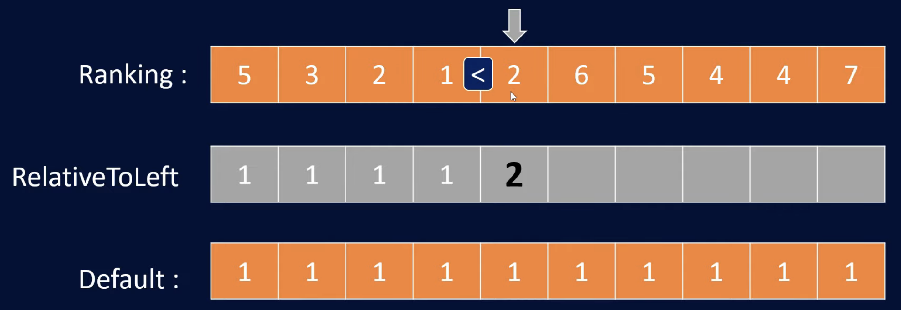
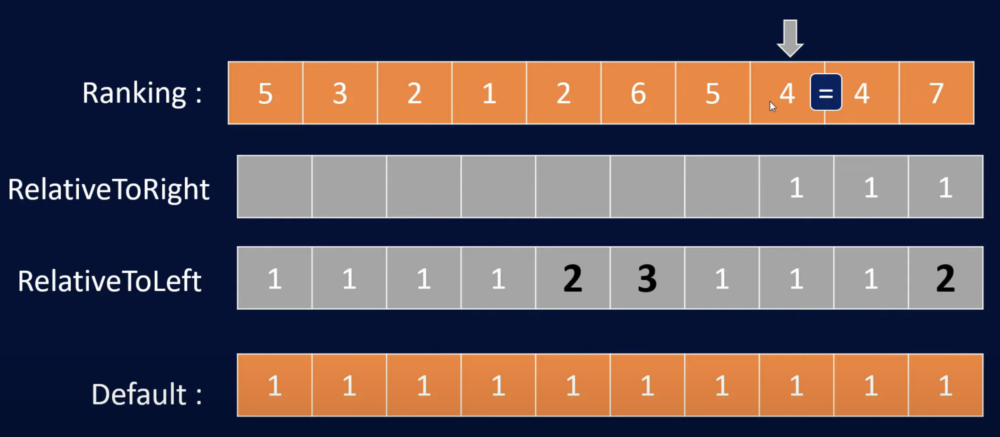
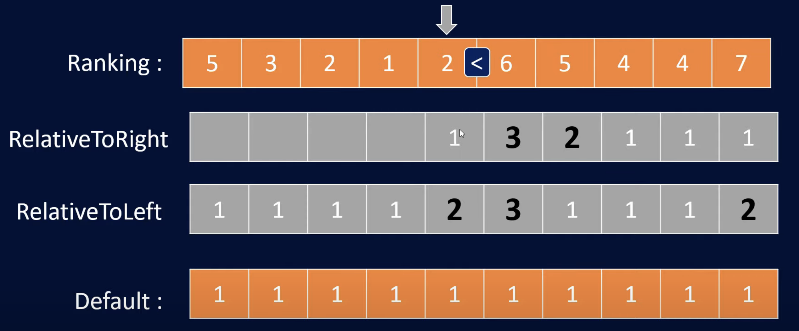

## 135. Candy

- [Very Simple Java Solution with detail explanation](https://www.youtube.com/watch?v=Ya-LfQ0OBkU&t=639s)
- [leetcode with simple java solution](https://leetcode.com/problems/candy/discuss/42774/Very-Simple-Java-Solution-with-detail-explanation)
---
### Greedy




- `左边 > 右边` 不需要 `add 1`, 反之需要:



- 从右至左：



---
```java
public class _135_Candy {
    public static int candy(int[] ratings) {
        if (ratings == null || ratings.length == 0) return 0;

        int candies = 0, n = ratings.length;
        int[] right = new int[n];
        int[] left = new int[n];
        Arrays.fill(left, 1);
        Arrays.fill(right, 1);
        for (int i = 1; i < n; i++) {
            if (ratings[i - 1] < ratings[i]) {
                left[i] = left[i - 1] + 1;
            }
        }
        for (int i = n - 2; i >= 0; i--) {
            if (ratings[i] > ratings[i + 1]) {
                right[i] = right[i + 1] + 1;
            }
        }
        for (int i = 0; i < n; i++) {
            candies += Math.max(left[i], right[i]);
        }
        return candies;
    }

    public static void main(String[] args) {
        int [] arr = new int[]{5, 6, 2, 2, 4, 8, 9, 5, 4, 0, 5, 1};
        int res = candy(arr);
        // Total minimum candies: 23
        System.out.println(res);
    }
}
```