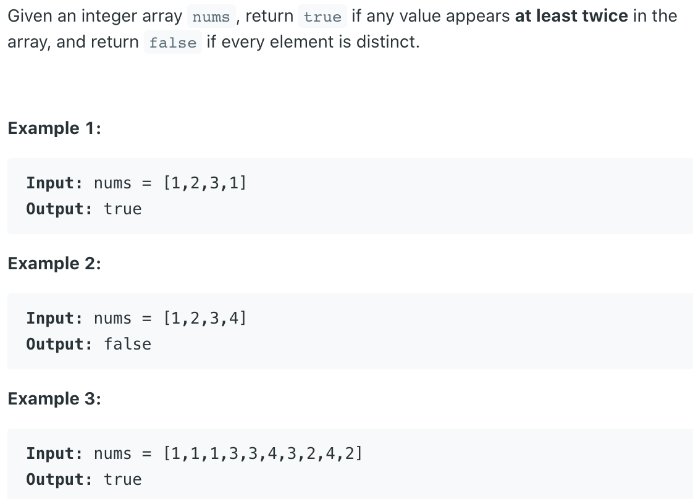

## 217. Contains Duplicate


```java
class Solution {
    public boolean containsDuplicate(int[] nums) {
        Set<Integer> set = new HashSet<>();
        for (int num : nums) {
            if (!set.add(num)) {
                return true;
            }
        }
        return false;
    }
}
```