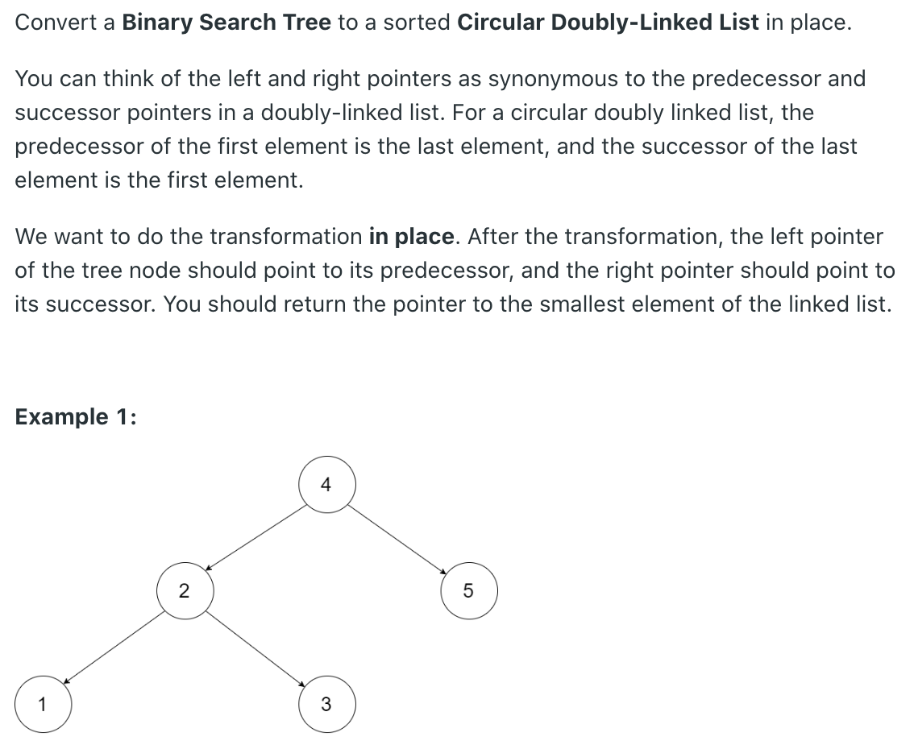
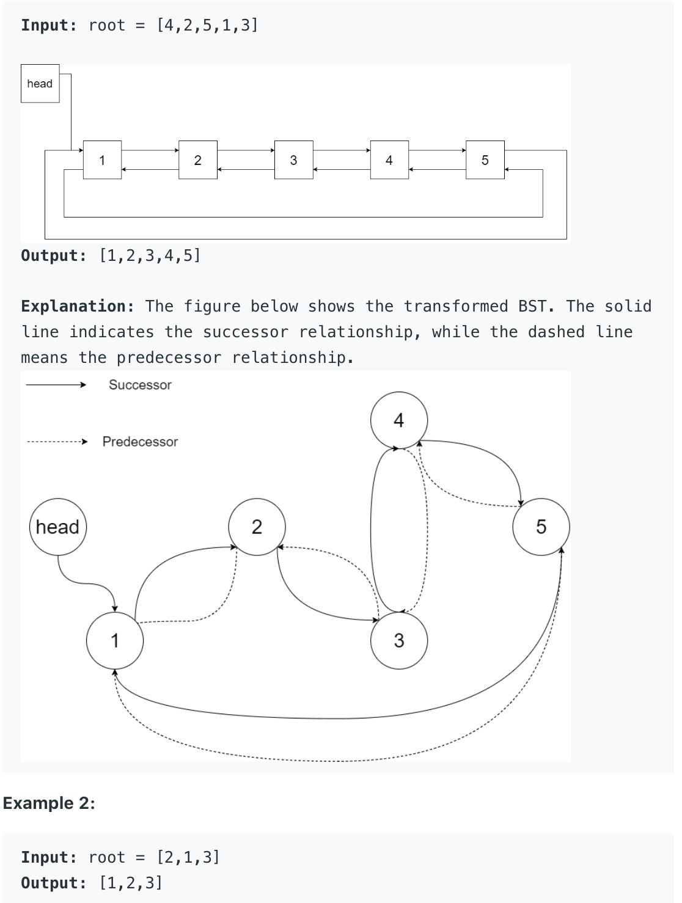
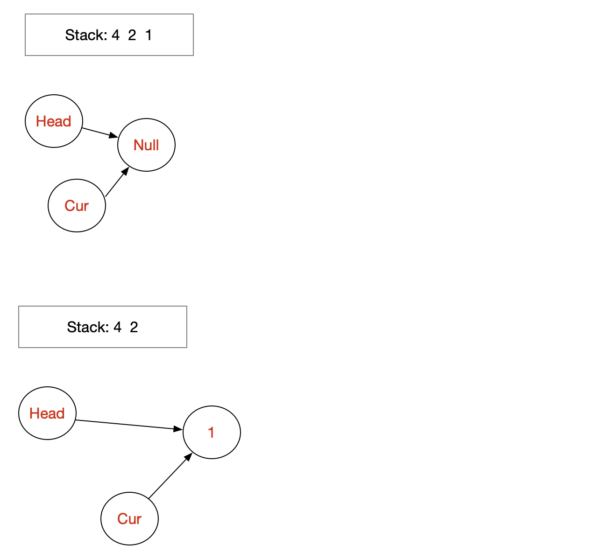
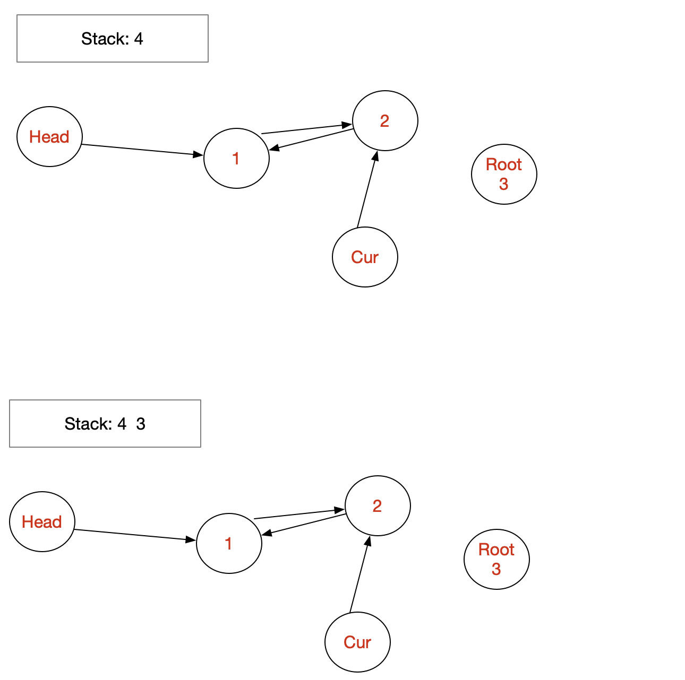
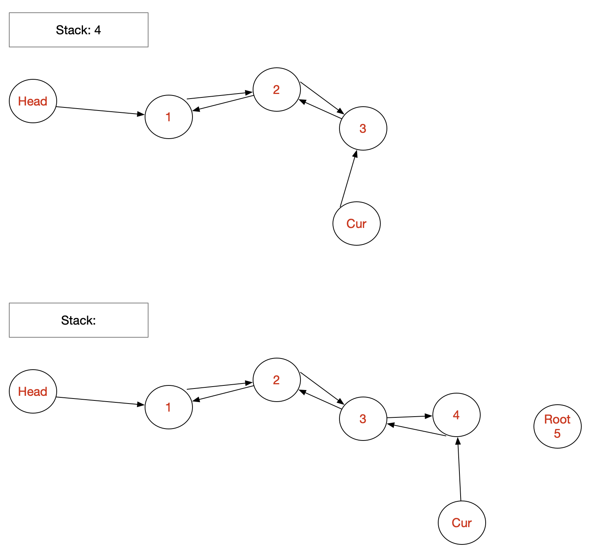
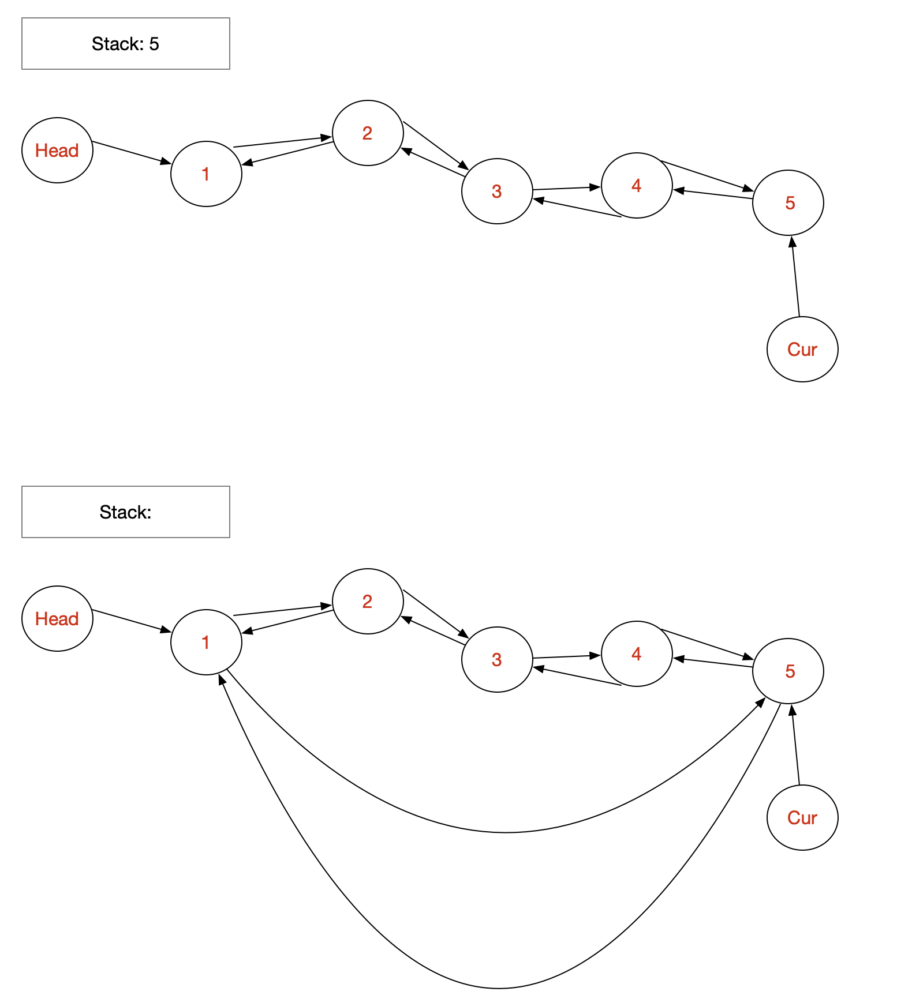

## 426. Convert Binary Search Tree to Sorted Doubly Linked List









```java
public Node treeToDoublyList(Node root) {
        if(root==null) return null;
        Node sentinel = new Node();
        //sentinel.right = root; //no need to do this here, it's handled by while loop
        Node pre = sentinel;
        
        Node cur = root;
        Stack<Node> st = new Stack<>();
        while(cur!=null||!st.isEmpty())
        {
            while(cur!=null)
            {
                st.push(cur);
                cur = cur.left;
            }
            Node node = st.pop();
            cur = node.right; //putting this at the end of while loop is fine, as node.right won't be changed
            
            node.left = pre;
            pre.right = node;
            pre = node;
        }
        //at the end of the loop,pre will point to the tail
        Node head = sentinel.right;
        pre.right = head; //!!don't do pre.right = root; as root is not the head.
        head.left = pre;
        
        return head;
}
```

---

```java
/*
// Definition for a Node.
class Node {
    public int val;
    public Node left;
    public Node right;

    public Node() {}

    public Node(int _val) {
        val = _val;
    }

    public Node(int _val,Node _left,Node _right) {
        val = _val;
        left = _left;
        right = _right;
    }
};
*/

class Solution {
    public Node treeToDoublyList(Node root) {
        if (root == null) return root;
        
        Node head = new Node(0);
        Node cur = head;
        Deque<Node> stack = new ArrayDeque<>();
        while (root != null || !stack.isEmpty()) {
            while (root != null) {
                stack.push(root);
                root = root.left;
            }
            root = stack.pop();
            cur.right = root;
            root.left = cur;
            cur = cur.right;
            root = root.right;
        }
        cur.right = head.right;
        head.right.left = cur;
        return head.right;
    }
}
```