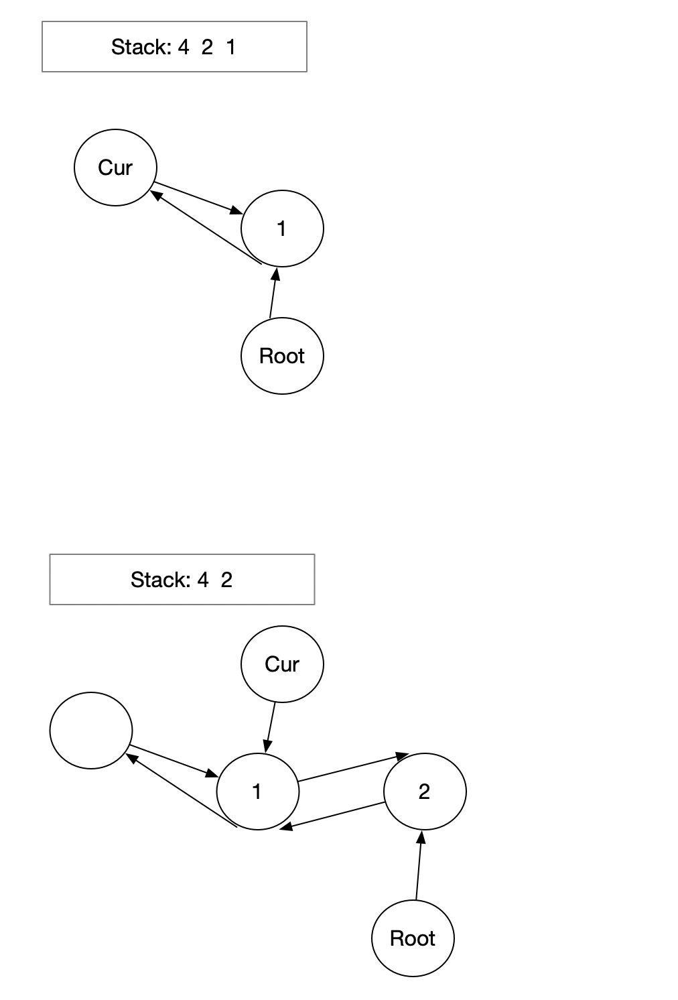
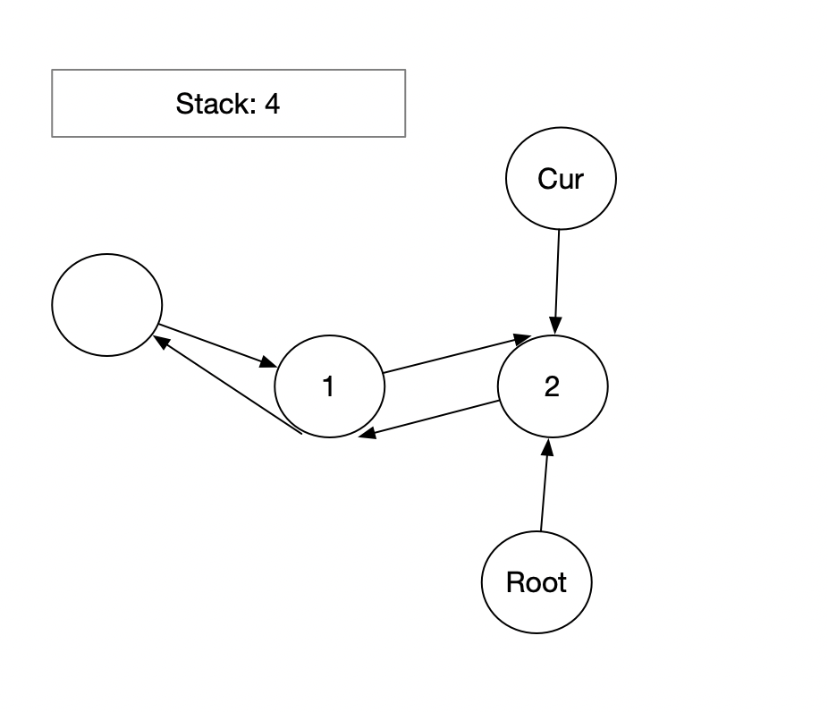

## 426. Convert Binary Search Tree to Sorted Doubly Linked List





```java
/*
// Definition for a Node.
class Node {
    public int val;
    public Node left;
    public Node right;

    public Node() {}

    public Node(int _val) {
        val = _val;
    }

    public Node(int _val,Node _left,Node _right) {
        val = _val;
        left = _left;
        right = _right;
    }
};
*/

class Solution {
    public Node treeToDoublyList(Node root) {
        if (root == null) return root;
        
        Node head = new Node(0);
        Node cur = head;
        Deque<Node> stack = new ArrayDeque<>();
        while (root != null || !stack.isEmpty()) {
            while (root != null) {
                stack.push(root);
                root = root.left;
            }
            root = stack.pop();
            cur.right = root;
            root.left = cur;
            cur = cur.right;
            root = root.right;
        }
        cur.right = head.right;
        head.right.left = cur;
        return head.right;
    }
}
```