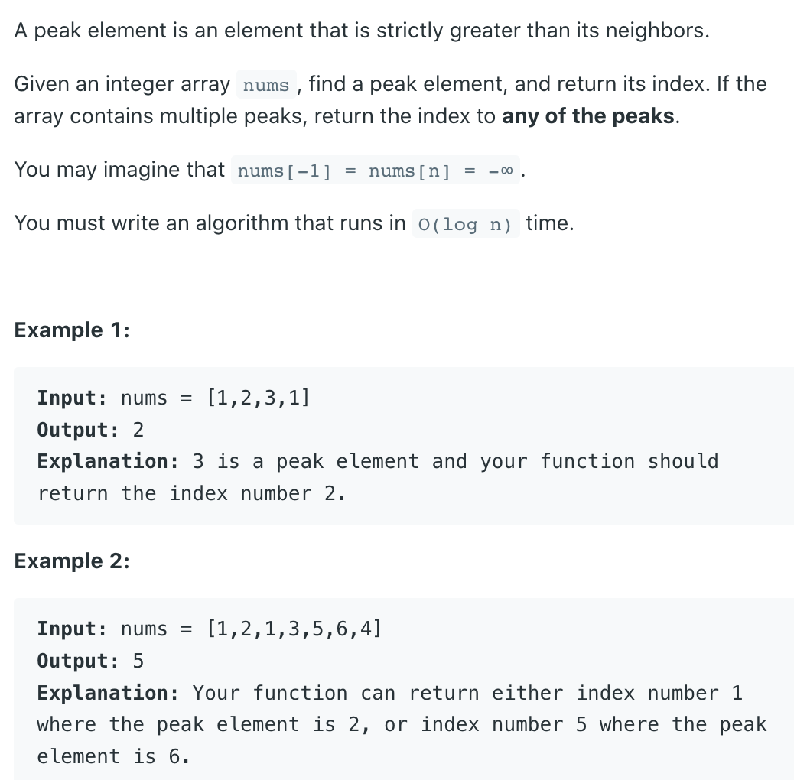

## 162. Find Peak Element


- [youtube video](https://youtu.be/kMzJy9es7Hc?t=490)

---
```java
class findPeakElement_v1 {
    public int findPeakElement(int[] nums) {
        int n = nums.length;
        int left = 0, right = n - 1;
        while (left <= right) {
            int mid = left + (right - left) / 2;

            // left neighour greater
            if (mid > 0 && nums[mid - 1] > nums[mid]) {
                right = mid - 1;
            } else if (mid < n - 1 && nums[mid] < nums[mid + 1]) {
                left = mid + 1;
            } else  {
                return mid;
            }
        }
        return -1;
    }
}
```