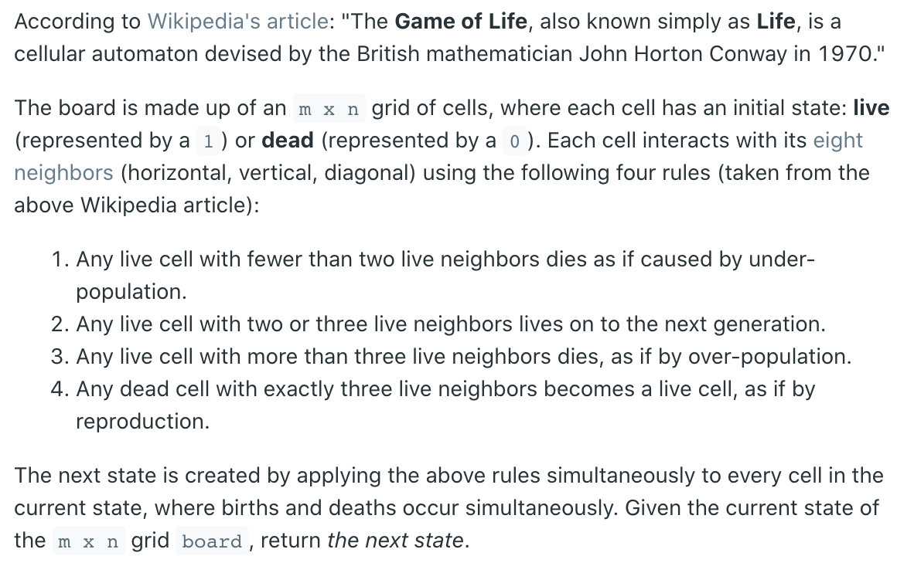
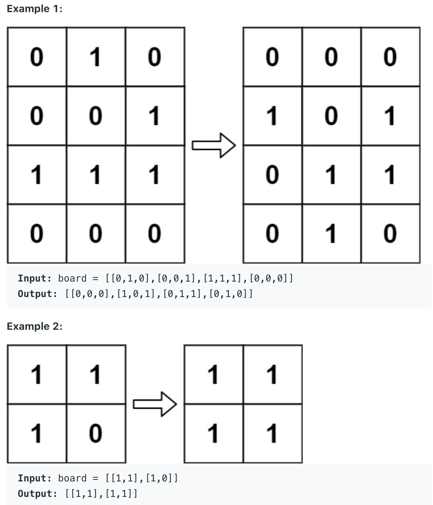

## 289. Game of Life

- Each cell interacts with its eight neighbors (horizontal, vertical, diagonal) 
  using the following four rules

- `1 - live` if `2, 3` else die
- `0 - live` if 3 else die
- For each cell's 1st bit, check the 8 pixels around itself, and set the cell's 
  2nd bit.
  - Transition `01 -> 11`: when `board == 1` and `lives >= 2 && lives <= 3`.
  - Transition `00 -> 10`: when `board == 0 and lives == 3`.

