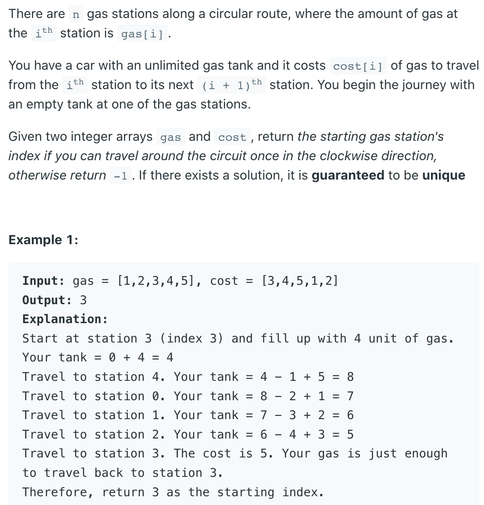

## 134. Gas Station


---
- 1, if sum of gas is more than sum of cost, then there must be a solution. 
  And the question guaranteed that the solution is unique
  (The first one I found is the right one).
- 2, The tank should never be negative, so restart whenever 
  there is a negative number.

- 3. **Note**:  `Sum(gas) > Sum(cost)`

```ruby
- if from index-0:

    gas  [1   2   3   4   5]
    cost [3   4   5   1   2]
    diff [-2  -2  -2  3   3]


```
---
```java
class Solution {
    public int canCompleteCircuit(int[] gas, int[] cost) {
        //determine if we have a solution
        int total = 0;
        for (int i = 0; i < gas.length; i++) {
            total += gas[i] - cost[i];
        }
        if (total < 0) {
            return -1;
        }
   
        // find out where to start
        int tank = 0;
        int start = 0;
        for (int i = 0; i < gas.length;i++) {
            tank += gas[i] - cost[i];
            if (tank < 0) {
                start = i + 1;
                tank = 0;
            }
        }
        return start;
    }
}
```

---

### Brute Force

```ruby
- if from index-0:
         
  index:  0   1   2   3   4
    gas  [1   2   3   4   5]
    cost [3   4   5   1   2]
    diff [-2  -2  -2  3   3]   
```

- 假设从 `index-3` 往后travel, 要想测试下一个index, 我们不能单纯的 `++1`, 因为这样无法跑回 `index-0` ， 
- 所以应该用 `(index + 1) % n`


```java
class GasStation_bruteForce {
    public int canCompleteCircuit(int[] gas, int[] cost) {
        int n = gas.length;
        for (int i = 0; i < n; i++) {
            if (gas[i] < cost[i]) {
                continue;
            }
            if (helper(i, n, gas, cost) == i) {
                return i;
            }
        }
        return -1;
    }

    private int helper(int start, int n, int[] gas, int[] cost) {
        int j = (start + 1) % n;
        int curGas = gas[start] - cost[start];
        while (j != start) {
            curGas = curGas + gas[j] - cost[j];
            if (curGas < 0) {
                break;
            }
            j = (j + 1) % n;
        }
        return j == start ? start : -1;
    }
}
```