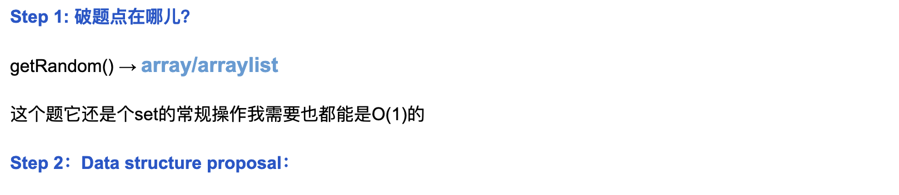
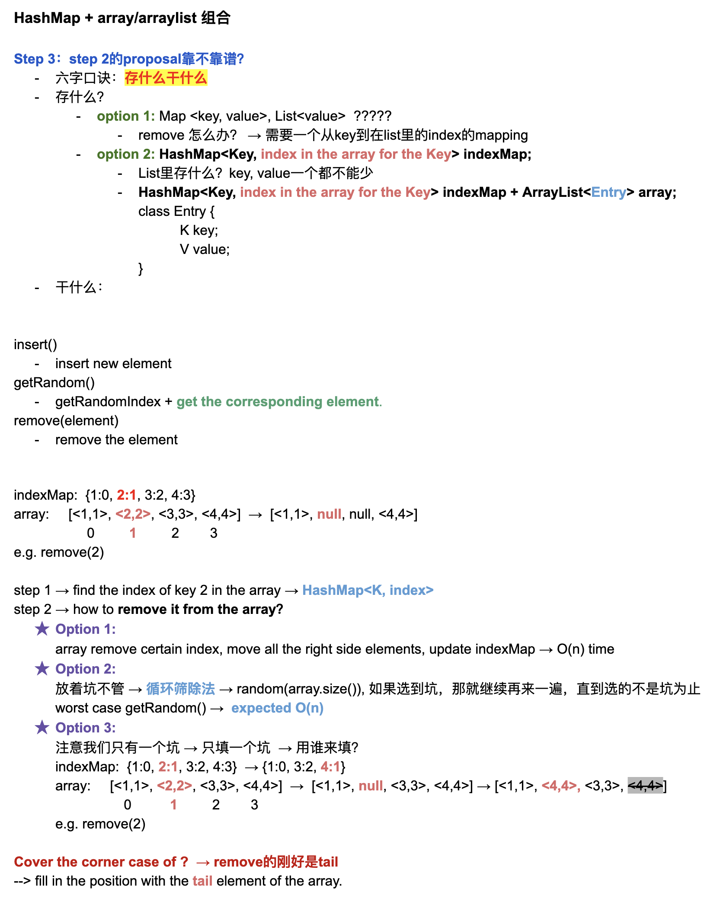

## 380. Insert Delete GetRandom O(1)


- Why we need `HashMap` to solve this problem?
  - because we need to maintain `O(1)` to handle `insert`, `remove`

```ruby
remove(4):
   0  1  2  3
  [5  4  9  6]

   0  1  2  3   
  [5  4  9  6]  # instead of 4 by 6

   0  1  2  3   
  [5  6  9]  # instead of 4 by 6

# why we need to replace 4 by 6?
# because we need to get a random value by index
# and hashmap itself hardly get index
```
---



---
```java
class RandomizedSet {
    private Map<Integer, Integer> indexMap;
    private List<Integer> list;
    private Random random;

    public RandomizedSet() {
        indexMap = new HashMap<>();
        list = new ArrayList<>();
        random = new Random();
    }

    /*  Inserts an item val into the set if not present. Returns true if the item was not present,
    false otherwise. */
    public boolean insert(int val) {
        if (indexMap.containsKey(val)) {
            return false;
        }
        indexMap.put(val, list.size());
        list.add(val);
        return true;
    }

    /*  Removes an item val from the set if present. Returns true if the item was present,
    false otherwise. */
    public boolean remove(int val) {
        Integer index = indexMap.get(val);
        if (index == null) {
            return false;
        }
        int toDelete = list.get(index);
        if (index != list.size() - 1) {
            swap(list, index, list.size() - 1);
            indexMap.put(list.get(index), index);
        }
        indexMap.remove(toDelete);
        list.remove(list.size() - 1);
        return true;
    }

    private void swap(List<Integer> list, Integer i, int j) {
        int temp = list.get(i);
        list.set(i, list.get(j));
        list.set(j, temp);
    }

    /* Returns a random element from the current set of elements */
    public int getRandom() {
        int randomIndex = random.nextInt(list.size());
        return list.get(randomIndex);
    }
}

/**
 * Your RandomizedSet object will be instantiated and called as such:
 * RandomizedSet obj = new RandomizedSet();
 * boolean param_1 = obj.insert(val);
 * boolean param_2 = obj.remove(val);
 * int param_3 = obj.getRandom();
 */
```