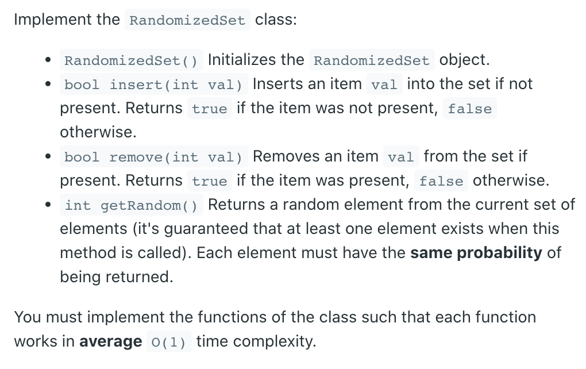
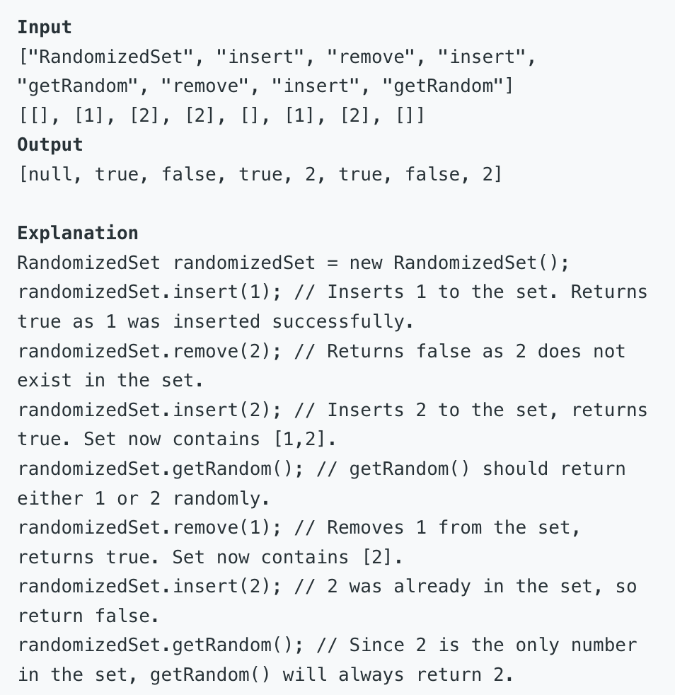

## 380. Insert Delete GetRandom O(1)



- Why we need `HashMap` to solve this problem?
  - because we need to maintain `O(1)` to handle `insert`, `remove`

```ruby
remove(4):
   0  1  2  3
  [5  4  9  6]

   0  1  2  3   
  [5  4  9  6]  # instead of 4 by 6

   0  1  2  3   
  [5  6  9]  # instead of 4 by 6

# why we need to replay 4 by 6?
# because we need to get a random value by index
# and hashmap itself hardly get index
```

```java
class RandomizedSet {
    Random random;
    Map<Integer, Integer> idx;
    List<Integer> nums;

    public RandomizedSet() {
        idx = new HashMap<>();
        nums = new ArrayList<>();
        random = new Random();
    }
    
    public boolean insert(int val) {
        if (idx.containsKey(val)) {
            return false;
        }
        idx.put(val, nums.size());
        nums.add(val);
        return true;
    }
    
    public boolean remove(int val) {
        if (!idx.containsKey(val)) {
            return false;
        }
        Integer index = idx.get(val);
        if (index < nums.size() - 1) { 
            int lastone = nums.get(nums.size() - 1);
            nums.set(index, lastone);
            idx.put(lastone, index);
        }
        idx.remove(val);
        nums.remove(nums.size() - 1);
        return true;
    }
    
    public int getRandom() {
        int i = random.nextInt(nums.size());
        return nums.get(i);
    }
}

/**
 * Your RandomizedSet object will be instantiated and called as such:
 * RandomizedSet obj = new RandomizedSet();
 * boolean param_1 = obj.insert(val);
 * boolean param_2 = obj.remove(val);
 * int param_3 = obj.getRandom();
 */
```