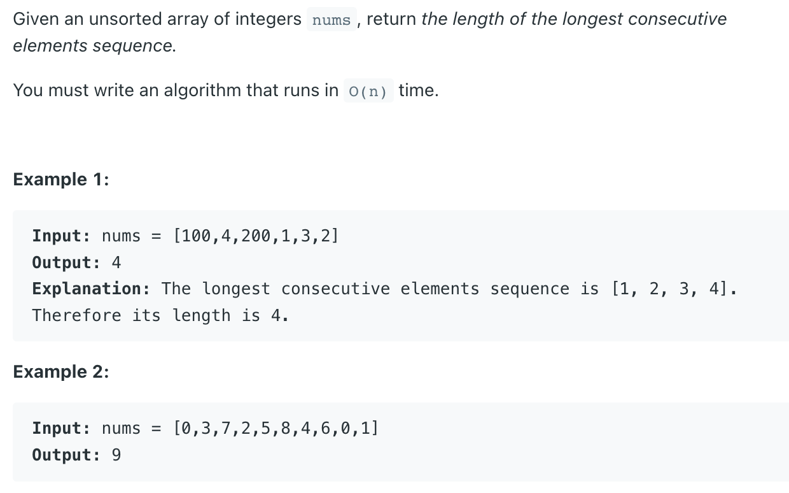
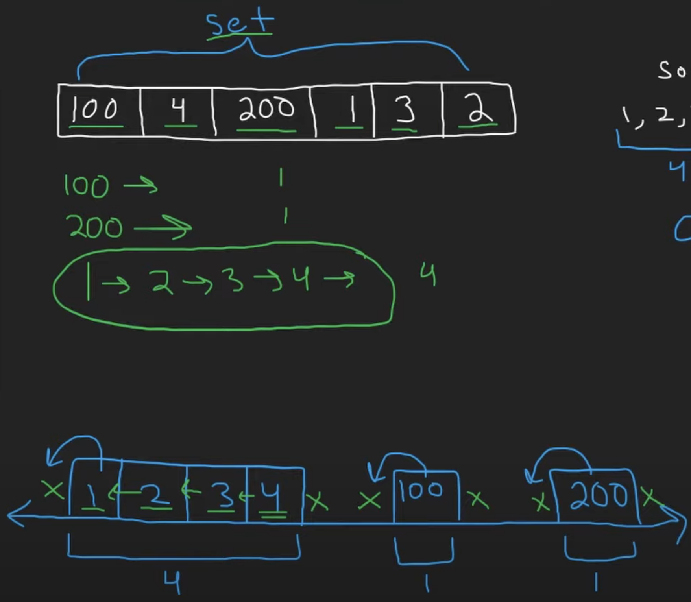

## 128. Longest Consecutive Sequence


---

- we have `3` distinct sequences:
  - each sequence has a start value
  
---


- first sequence has no `left neighbour`
  - the first value `1` has no `left neighbour`
- look at the second range `100` it doesn't have a `left neighbour`
- look at the third range `200` it doesn't have a `left neighbour`

---

```java
class Solution {
    public int longestConsecutive(int[] nums) {
        if (nums == null || nums.length == 0) return 0;
        
        Set<Integer> set = new HashSet<>();
        for (int e : nums) {
            set.add(e);
        }
        
        int longest = 0;
        for (int n : nums) {
            // check if its the start of a sequence
            if (!set.contains(n - 1)) {
                int length = 0;
                while (set.contains(n + length)) {
                    length++;
                }
                longest = Math.max(longest, length);
            }
        }
        return longest;
    }
}
```