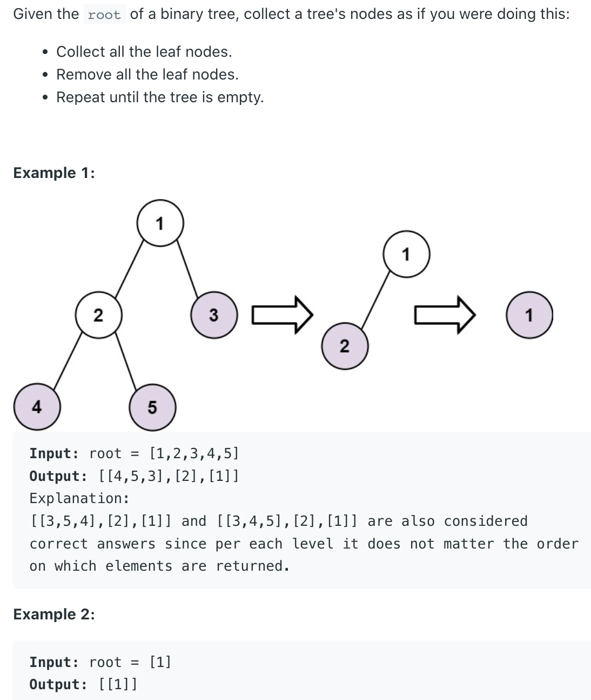

## 366. Find Leaves of Binary Tree


- each while loop reduce the leaf and return the truncated tree, so if height is 
  `logn`, then the while loop runs `logn` times, each backtrack call takes `o(n)`, 
  because it basically traverse every node once, so the run time would be: 
  `O(logn * n)`

```java
/**
 * Definition for a binary tree node.
 * public class TreeNode {
 *     int val;
 *     TreeNode left;
 *     TreeNode right;
 *     TreeNode() {}
 *     TreeNode(int val) { this.val = val; }
 *     TreeNode(int val, TreeNode left, TreeNode right) {
 *         this.val = val;
 *         this.left = left;
 *         this.right = right;
 *     }
 * }
 */
class Solution {
    public List<List<Integer>> findLeaves(TreeNode root) {
        List<List<Integer>> res = new ArrayList<>();
        while (root != null) {
            List<Integer> list = new ArrayList<>();
            root = backtrack(list, root);
            res.add(list);
        }
        return res;
    }
    
    private TreeNode backtrack(List<Integer> list, TreeNode root) {
        if (root == null) return null;        

        TreeNode left = backtrack(list, root.left);
        TreeNode right = backtrack(list, root.right);        
        
        if (root.left == null && root.right == null) {
            list.add(root.val);
            return null;
        }    
        
        root.left = left;
        root.right = right;
        return root;
    }
}
```