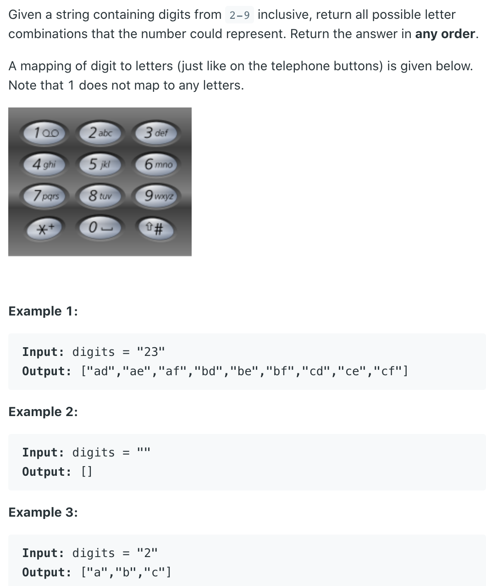

## 17. Letter Combinations of a Phone Number


```java
class Solution {
    public List<String> letterCombinations(String digits) {
        List<String> res = new ArrayList<>();
        if (digits == null || digits.length() == 0) return res;
        
        char [][] map = {{}, {}, {'a', 'b', 'c'}, 
        {'d','e','f'}, {'g','h','i'}, {'j','k','l'}, 
        {'m','n','o'}, {'p','q','r','s'}, {'t', 'u', 'v'},
                             {'w','x','y','z'}
        };
        
        dfs(digits, res, map, new StringBuilder(), 0);
        return res;
    }
    
    private void dfs(String digits, List<String> res, char[][]map,
                    StringBuilder sb, int start) {
        if (start == digits.length()) {
            res.add(new String(sb));
            return;
        }
        int num = digits.charAt(start) - '0';
        for (int i = 0; i < map[num].length; i++) {
            sb.append(map[num][i]);
            dfs(digits, res, map, sb, start+1);
            sb.deleteCharAt(sb.length() - 1);
        }
    }
}
```