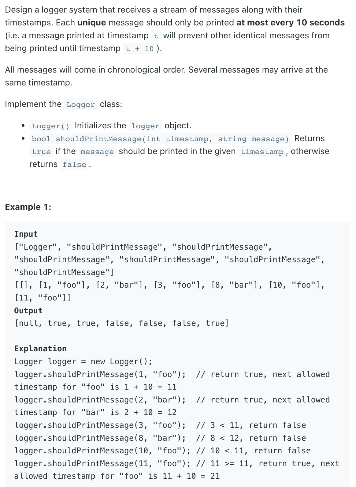

## 359. Logger Rate Limiter



```java
class Logger {
    Map<String, Integer> map;

    public Logger() {
        map = new HashMap<>();
    }
    
    public boolean shouldPrintMessage(int timestamp, String message) {
        int ok = map.getOrDefault(message, 0);
        if (timestamp < ok) {
            return false;
        }
        map.put(message, timestamp + 10);
        return true;
    }
}
```

---

- [Concurency / Thread safety](https://leetcode.com/problems/logger-rate-limiter/discuss/391558/Review-of-four-different-solutions%3A-HashMap-Two-Sets-Queue-with-Set-Radix-buckets-(Java-centric))

```java
class Logger {
    Map<String, Integer> map;
    
    public Logger() {
        map = new HashMap<>();
    }
    
    public boolean shouldPrintMessage(int timestamp, String message) {
        Integer ok = map.get(message);
        if (ok == null || timestamp - ok >= 10) {
            synchronized(this) {
                Integer ts = map.get(message);
                if (ts == null || timestamp - ok >= 10) {
                    map.put(message, timestamp);
                    return true;
                }
            }
        }
        return false;
    }
}
```