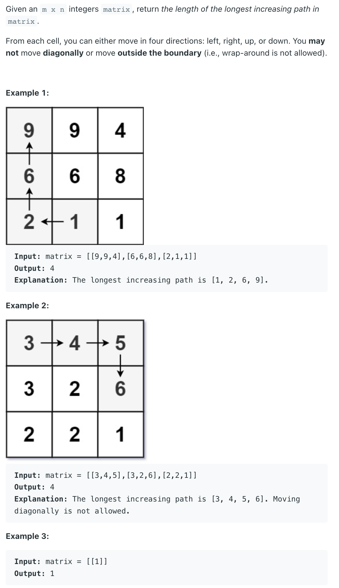

## 329. Longest Increasing Path in a Matrix


- [Topological sort ](https://leetcode.com/problems/longest-increasing-path-in-a-matrix/discuss/288520/Longest-Path-in-DAG)

```java
class Solution {
    int[][] dirs = new int[][]{{-1, 0}, {1, 0}, {0, -1}, {0, 1}};
    public int longestIncreasingPath(int[][] matrix) {
        if (matrix == null || matrix.length == 0) return 0;
        
        int m = matrix.length, n = matrix[0].length;
        int[][] indegrees = new int[m][n];
        buildGraph(m, n, matrix, indegrees);
        return bfs(m, n, matrix, indegrees);
    }
    
    private void buildGraph(int m, int n, int[][] matrix, int[][] indegrees) {
        for (int i = 0; i < m; i++) {
            for (int j = 0; j < n; j++) {
                for (int[] dir : dirs) {
                    int x = i + dir[0];
                    int y = j + dir[1];
                    if (x >= 0 && x < m && y >= 0 && y < n && matrix[i][j] < matrix[x][y]) {
                        indegrees[x][y]++;
                    }
                }
            }
        }
    }
    
    private int bfs(int m, int n, int[][] matrix, int[][] indegrees) {
        Queue<int[]> queue = new ArrayDeque<>();
        for (int i = 0; i < m; i++) {
            for (int j = 0; j < n; j++) {
                if (indegrees[i][j] == 0) {
                    queue.offer(new int[]{i, j});
                }
            }
        }
        
        int len = 0;
        while (!queue.isEmpty()) {
            int size = queue.size();
            for (int i = 0; i < size; i++) {
                int[] node = queue.poll();
                for (int[] dir : dirs) {
                    int x = node[0];
                    int y = node[1];
                    int nx = x + dir[0];
                    int ny = y + dir[1];
                    if (nx >= 0 && nx < m && ny >= 0 && ny < n && matrix[x][y] < matrix[nx][ny]) {
                        indegrees[nx][ny]--;
                        if (indegrees[nx][ny] == 0) {
                            queue.offer(new int[]{nx, ny});
                        }
                    }
                }
            }
            len++;
        }
        return len;
    }
}
```