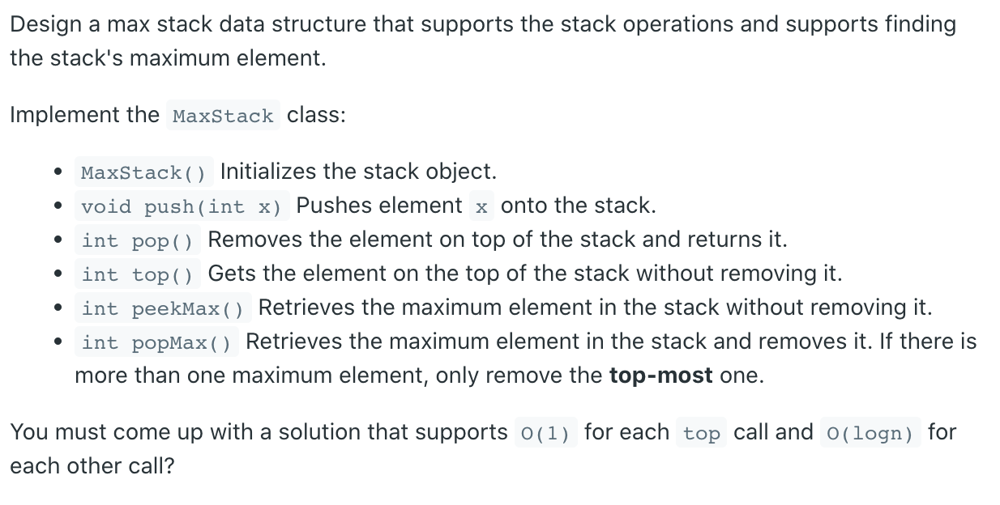
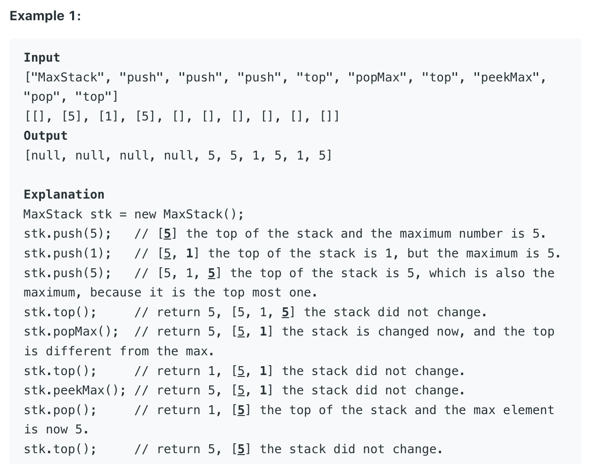

## 716. Max Stack



- [Java simple solution with strict O(logN) push()/popMax()/pop()](https://leetcode.com/problems/max-stack/discuss/129922/Java-simple-solution-with-strict-O(logN)-push()popMax()pop())

```java
class MaxStack {
    
    private static class ListNode {
        public ListNode prev, next;
        public int value;
        
        public ListNode(int val) {
            this.value = val;
        }
    }
    
    private final ListNode head;
    private final TreeMap<Integer, LinkedList<ListNode>> map = new TreeMap<>(); 

    /** initialize your data structure here. */
    public MaxStack() {
        head = new ListNode(0);
        head.next = head.prev = head;
    }
    
    public void push(int x) {
        ListNode node = new ListNode(x);
        node.next = head;
        node.prev = head.prev;
        head.prev.next = node;
        head.prev = node;
        map.computeIfAbsent(x, k -> new LinkedList<>()).add(node);
    }
    
    public int pop() {
        ListNode tail = head.prev;
        if (tail == head) {
            return 0;   // no element exist
        }
        deleteNode(tail);
        // since it's pop(), we are always sure that the last element in the map's value list will be the tail
        map.get(tail.value).removeLast();
        if (map.get(tail.value).isEmpty()) {
            map.remove(tail.value);
        }
        return tail.value;
    }
    
    public int top() {
        return head.prev.value;
    }
    
    public int peekMax() {
        return map.lastKey();
    }
    
    public int popMax() {
        int max = peekMax();
        ListNode node = map.get(max).removeLast();
        deleteNode(node);
        if (map.get(max).isEmpty()) {
            map.remove(max);
        }
        return max;
    }
    
    private void deleteNode(ListNode node) {
        node.prev.next = node.next;
        node.next.prev = node.prev;
    }
}
```

---

```java
class MaxStack {
    Deque<Integer> deStack;
    PriorityQueue<Integer> maxHeap;

    public MaxStack() {
        deStack = new ArrayDeque<>();
        maxHeap = new PriorityQueue<>((a, b) -> (b - a));
    }
    
    public void push(int x) {
        maxHeap.offer(x);
        deStack.offerLast(x);
    }
    
    public int pop() {
        int deleted = deStack.pollLast();
        maxHeap.remove(deleted);
        return deleted;
    }
    
    public int top() {
        return deStack.peekLast();
    }
    
    public int peekMax() {
        return maxHeap.peek();
    }
    
    public int popMax() {
        int deleted = maxHeap.poll();
        deStack.removeLastOccurrence(deleted);
        return deleted;
    }
}

/**
 * Your MaxStack object will be instantiated and called as such:
 * MaxStack obj = new MaxStack();
 * obj.push(x);
 * int param_2 = obj.pop();
 * int param_3 = obj.top();
 * int param_4 = obj.peekMax();
 * int param_5 = obj.popMax();
 */
```