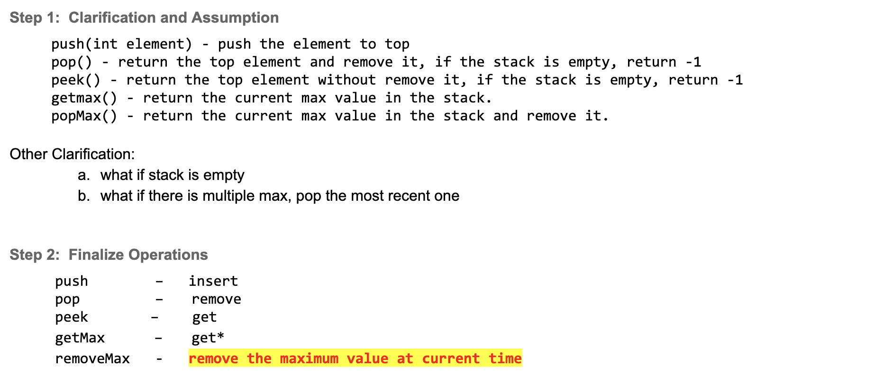
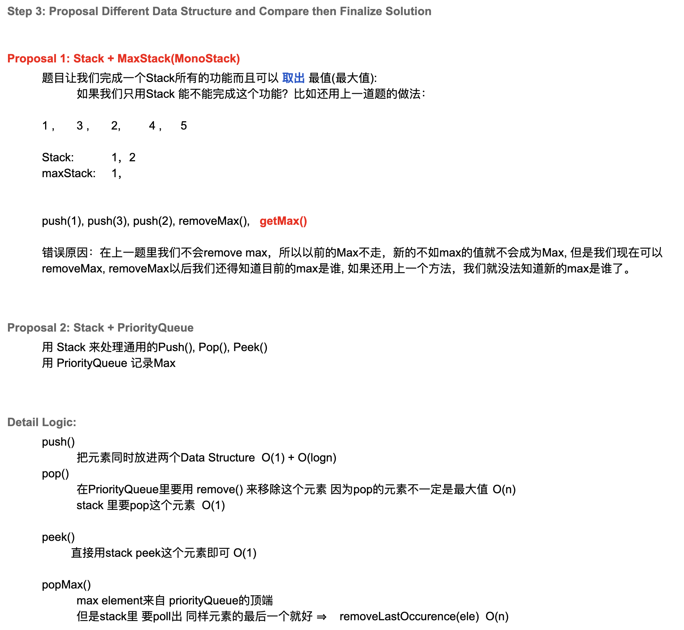
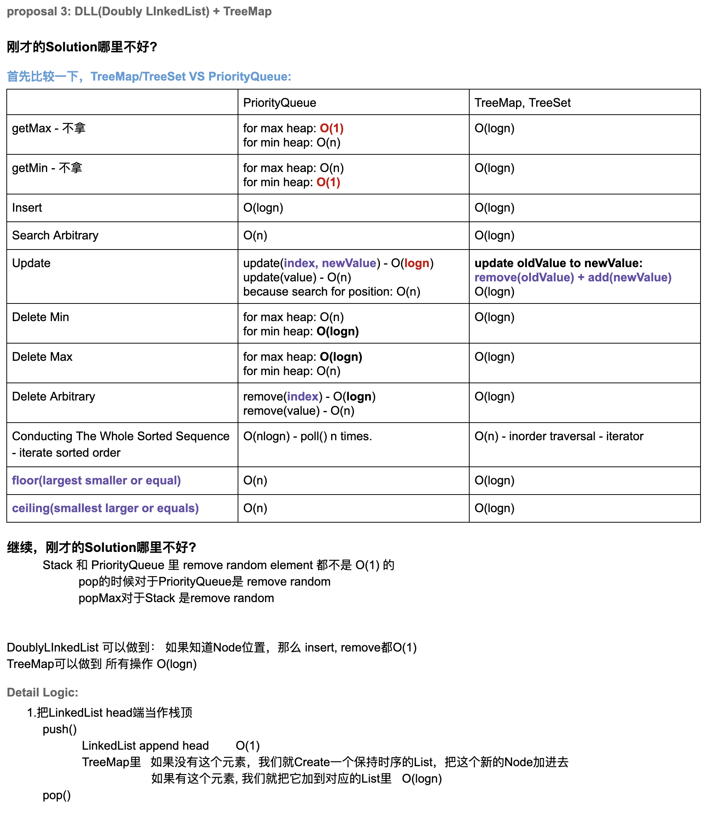
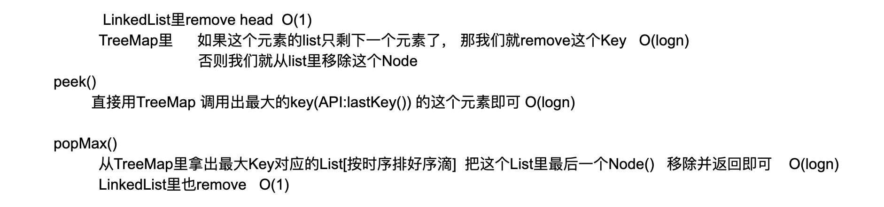

## 716. Max Stack


- [Java simple solution with strict O(logN) push()/popMax()/pop()](https://leetcode.com/problems/max-stack/discuss/129922/Java-simple-solution-with-strict-O(logN)-push()popMax()pop())

---




```java
class MaxStack {
    Deque<Integer> deStack;
    PriorityQueue<Integer> maxHeap;

    public MaxStack() {
        deStack = new ArrayDeque<>();
        maxHeap = new PriorityQueue<>((a, b) -> (b - a));
    }
    
    public void push(int x) {
        maxHeap.offer(x);
        deStack.offerLast(x);
    }
    
    public int pop() {
        int deleted = deStack.pollLast();
        maxHeap.remove(deleted);
        return deleted;
    }
    
    public int top() {
        return deStack.peekLast();
    }
    
    public int peekMax() {
        return maxHeap.peek();
    }
    
    public int popMax() {
        int deleted = maxHeap.poll();
        deStack.removeLastOccurrence(deleted);
        return deleted;
    }
}

/**
 * Your MaxStack object will be instantiated and called as such:
 * MaxStack obj = new MaxStack();
 * obj.push(x);
 * int param_2 = obj.pop();
 * int param_3 = obj.top();
 * int param_4 = obj.peekMax();
 * int param_5 = obj.popMax();
 */
```

---




```java
class MaxStack_Optimal_V3 {
    static class Node {
        Node prev;
        Node next;
        int val;

        public Node(int x) {
            this.val = x;
            this.prev = null;
            this.next = null;
        }
    }

    private Node head;
    private Node tail;
    private TreeMap<Integer, List<Node>> map;

    public MaxStack_Optimal_V3() {
        head = new Node(0);
        tail = new Node(0);
        head.next = tail;
        tail.prev = head;
        this.map = new TreeMap<>();
    }

    public void push(int x) {
        Node newNode = new Node(x);
        append(newNode);
        map.putIfAbsent(x, new ArrayList<>());
        map.get(x).add(newNode);
    }

    public int pop() {
        int removed = head.next.val;
        removeNode(head.next);
        int listSize = map.get(removed).size();
        map.get(removed).remove(listSize - 1);
        if (listSize == 1) {
            map.remove(removed);
        }
        return removed;
    }

    public int top() {
        return head.next.val;
    }

    public int peekMax() {
        return map.lastKey();
    }

    public int popMax() {
        int removedMaxVal = map.lastKey();
        int listSize = map.get(removedMaxVal).size();
        Node node = map.get(removedMaxVal).remove(listSize - 1);
        removeNode(node);
        if (listSize == 1) {
            map.remove(removedMaxVal);
        }
        return removedMaxVal;
    }

    private void removeNode(Node n) {
        Node prevNode = n.prev;
        Node nextNode = n.next;
        prevNode.next = nextNode;
        nextNode.prev = prevNode;
    }

    private void append(Node newNode) {
        newNode.next = head.next;
        head.next.prev = newNode;
        newNode.prev = head;
        head.next = newNode;
    }
}

```
