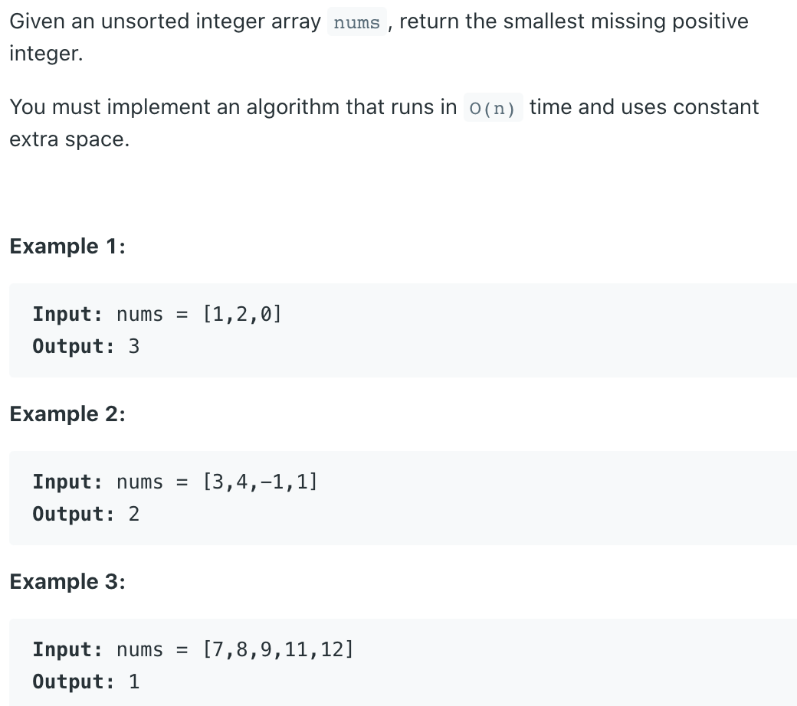

## 41. First Missing Positive


- O(N) space time, but it is not in constant extra space:

```java
class Solution {
    public int firstMissingPositive(int[] nums) {
        int n = nums.length + 1;
        HashSet<Integer> set = new HashSet<>();
        for(Integer num : nums){
          set.add(num);
        }
        for(int i = 1; i < n; i++){
          if(!set.contains(i)){
            return i;
          }
        }
        return n;        
    }
}
```

---

- **O(1) space Java Solution**

- use swap to put `nums[i]` to position `i - 1`, for example put `1` to position `0`.
- using a while in case the new `nums[i]` is not `i - 1`, continue put it to right 
  location.
- check `nums[nums[i] - 1] != nums[i]` in case they are same number falling to 
  forever loop.


```java
/*
    0  1  2  3
   [3  4 -1  1]
    i
    
    0  1  2  3
   [-1 4  3  1]
    i 
    
    0  1  2  3
   [-1 4  3  1]
       i

    0  1  2  3
   [-1 1  3  4]
       i

    0  1  2  3
   [1 -1  3  4]
       i
*/
class Solution {
    public int firstMissingPositive(int[] nums) {
        if (nums == null || nums.length == 0) return 1;
        
        int n = nums.length;
        for (int i = 0; i < n; i++) {
            while (nums[i] > 0 && nums[i] <= n && nums[nums[i] - 1] != nums[i]) {
                swap(nums, i, nums[i] - 1);
            }
        }
        
        for (int i = 0; i < n; i++) {
            if (nums[i] != i + 1) {
                return i + 1;
            }
        }
        return n + 1;
    }
    
    private void swap(int [] nums, int i, int j) {
        int tmp = nums[i];
        nums[i] = nums[j];
        nums[j] = tmp;
    }
}
```
