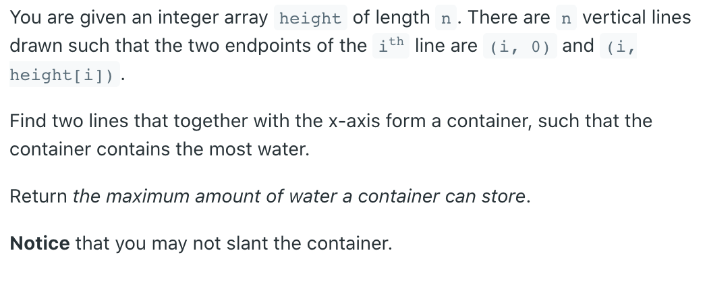
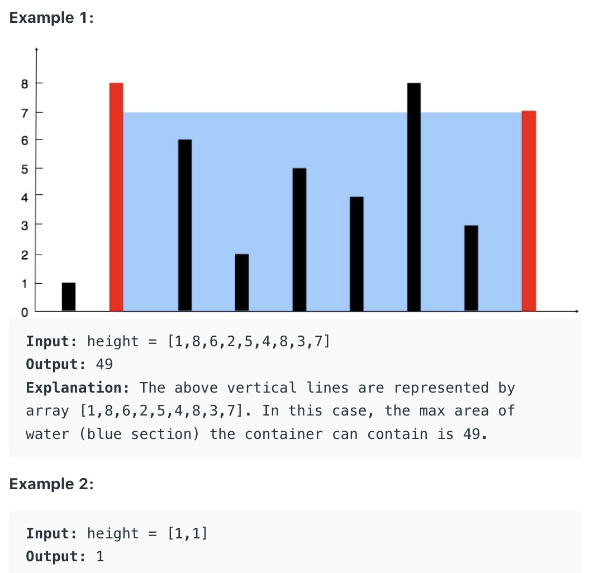

## 11. Container With Most Water




- **Idea / Proof**:
  - 1. The widest container (using first and last line) is a good candidate, 
    because of its width. Its water level is the height of the smaller one of first 
    and last line.
  - 2. All other containers are less wide and thus would need a higher water level in 
    order to hold more water.  
  - 3. The smaller one of first and last line doesn't support a higher water level 
    and can thus be safely removed from further consideration.

- **Further explanation:**
  - Variables `i` and `j` define the container under consideration. We initialize 
    them to first and last line, meaning the widest container. Variable `water` will 
    keep track of the highest amount of water we managed so far. We compute `j - i`, 
    the width of the current container, and `min(height[i], height[j])`, the water 
    level that this container can support. Multiply them to get how much water this 
    container can hold, and update `water` accordingly. Next remove the smaller one 
    of the two lines from consideration, as justified above in "Idea / Proof". 
    Continue until there is nothing left to consider, then return the result.


```java
class Solution {
    public int maxArea(int[] height) {
        if (height == null || height.length == 0) return 0;
        
        int left = 0, right = height.length - 1;
        int water = 0;
        while (left < right) {
            water = Math.max(water, 
            (right-left) * Math.min(height[left], height[right]));
            if (height[left] < height[right]) {
                left++;
            } else {
                right--;
            }
        }
        return water;
    }
}
```