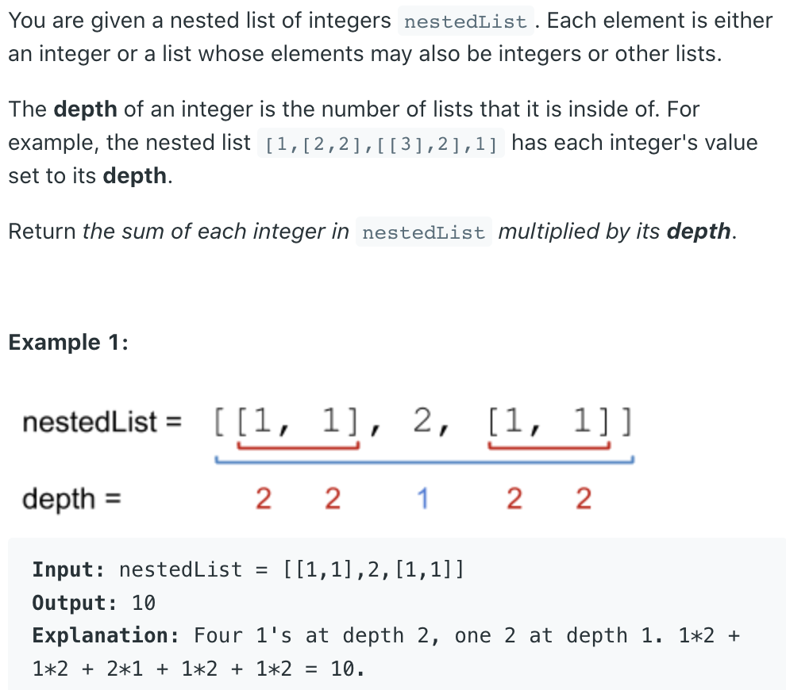
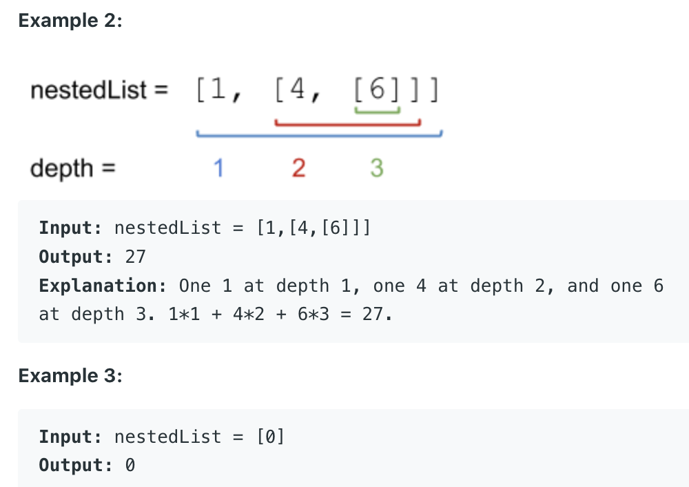

## 339. Nested List Weight Sum




- BFS

```java
/**
 * // This is the interface that allows for creating nested lists.
 * // You should not implement it, or speculate about its implementation
 * public interface NestedInteger {
 *     // Constructor initializes an empty nested list.
 *     public NestedInteger();
 *
 *     // Constructor initializes a single integer.
 *     public NestedInteger(int value);
 *
 *     // @return true if this NestedInteger holds a single integer, 
       //rather than a nested list.
 *     public boolean isInteger();
 *
 *     // @return the single integer that this NestedInteger holds, 
       // if it holds a single integer
 *     // Return null if this NestedInteger holds a nested list
 *     public Integer getInteger();
 *
 *     // Set this NestedInteger to hold a single integer.
 *     public void setInteger(int value);
 *
 *     // Set this NestedInteger to hold a nested list and 
       //adds a nested integer to it.
 *     public void add(NestedInteger ni);
 *
 *     // @return the nested list that this NestedInteger holds, 
       // if it holds a nested list
 *     // Return empty list if this NestedInteger holds a single integer
 *     public List<NestedInteger> getList();
 * }
 */
class Solution {
    public int depthSum(List<NestedInteger> nestedList) {
        if (nestedList == null || nestedList.size() == 0) 
            return 0;
        
        int level = 1;
        int count = 0;
        Queue<NestedInteger> queue = new ArrayDeque<>();
        for (NestedInteger e : nestedList) {
            queue.offer(e);
        }
        
        while (!queue.isEmpty()) {
            int size = queue.size();
            for (int i = 0; i < size; i++) {
                NestedInteger n = queue.poll();
                if (n.isInteger()) {
                    count += n.getInteger() * level;
                } else {
                    for (NestedInteger e : n.getList()) {
                        queue.offer(e);
                    }
                }
            }
            level++;
        }
        return count;
    }
}
```
