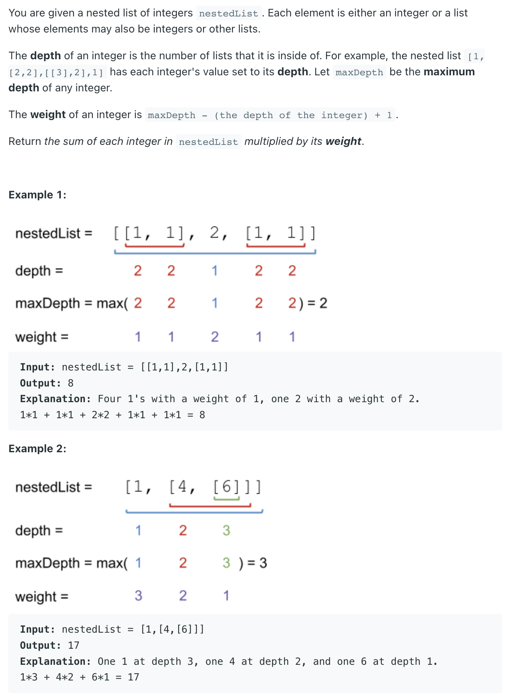

## 364. Nested List Weight Sum II

- Different from `339. Nested List Weight Sum`, where weight is increasing from root to leaf, now(LC 364) the weight 
  is difined from bottom up. i.e, the leaf level integers have weight `1`, and the root level integers have the 
  largest weight.