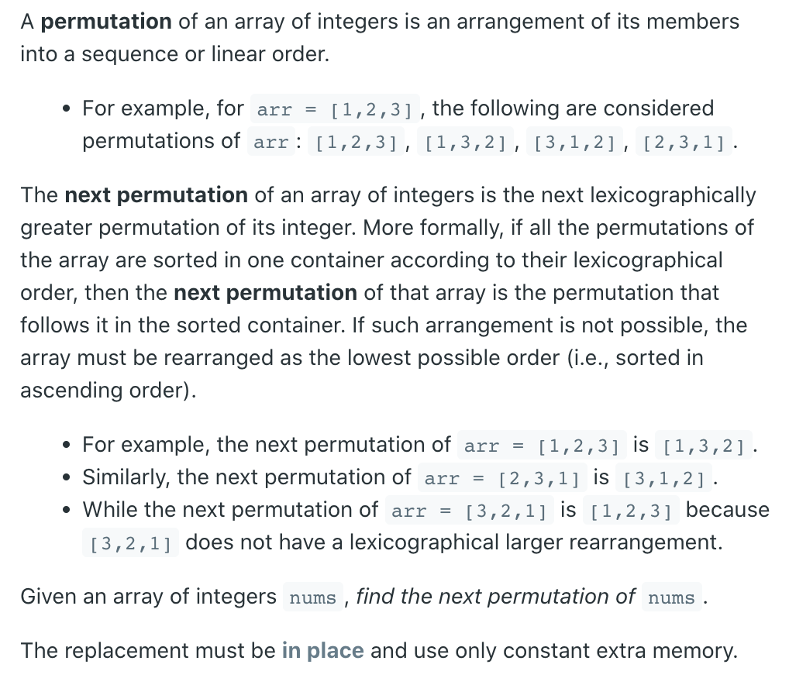
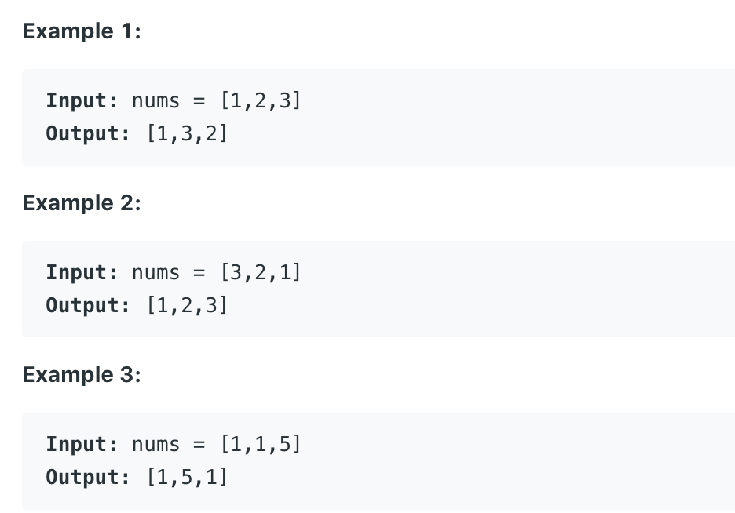

## 31. Next Permutation



- I don't think any one can understand this solution without seeing an example, 
  here is an example: `2,3,6,5,4,1`
  Solution:
  - Step1, from right to left, find the first number 
    which not increase in a ascending order. In this case which is `3`.
  - Step2, here we can have two situations:
    - 1. We cannot find the number, all the numbers increasing in a ascending order. 
      This means this permutation is the last permutation, we need to `rotate back` 
      to the `first permutation`. So we reverse the whole array, 
      for example, `6,5,4,3,2,1` we turn it to `1,2,3,4,5,6`.
    - 2. We can find the number, then the next step, we will start from right most to 
      leftward, try to find the first number which is `larger than 3`, in this case 
      it is `4`. Then we `swap 3 and 4`, the list turn to `2,4,6,5,3,1`. Last, we 
      reverse numbers on the right of `4`, we finally get `2,4,1,3,5,6`.

- Time complexity is: O(3*n) = `O(n)`.

```java
/*
  2   3   6   5   4   2  1
  
  2   4   6   5   3   2  1
*/
class Solution {
    public void nextPermutation(int[] nums) {
        if (nums == null || nums.length == 0) return;
        
        int k = -1;
        int kv = 0;
        int p = 0;
        int n = nums.length;
        int next = 0;
        for (int i = n - 2; i >= 0; i--) {
            if (nums[i] < nums[i + 1]) {
                k = i;
                kv = nums[i];
                break;
            }
        }        
        if (k == -1) {
            reverse(nums, 0, n - 1);
            return;
        }
        
        for (int j = n - 1; j >= 0; j--) {
            if (nums[j] > kv) {
                swap(nums, k, j);
                break;
            }
        }
        reverse(nums, k+1, n - 1);
    }
    private void swap(int[] nums, int l, int r) {
        int temp = nums[l];
        nums[l] = nums[r];
        nums[r] = temp;
    }
    private void reverse(int[] nums, int l, int r) {
        while (l < r) {
            swap(nums, l, r);
            l++;
            r--;
        }
    }
}
```