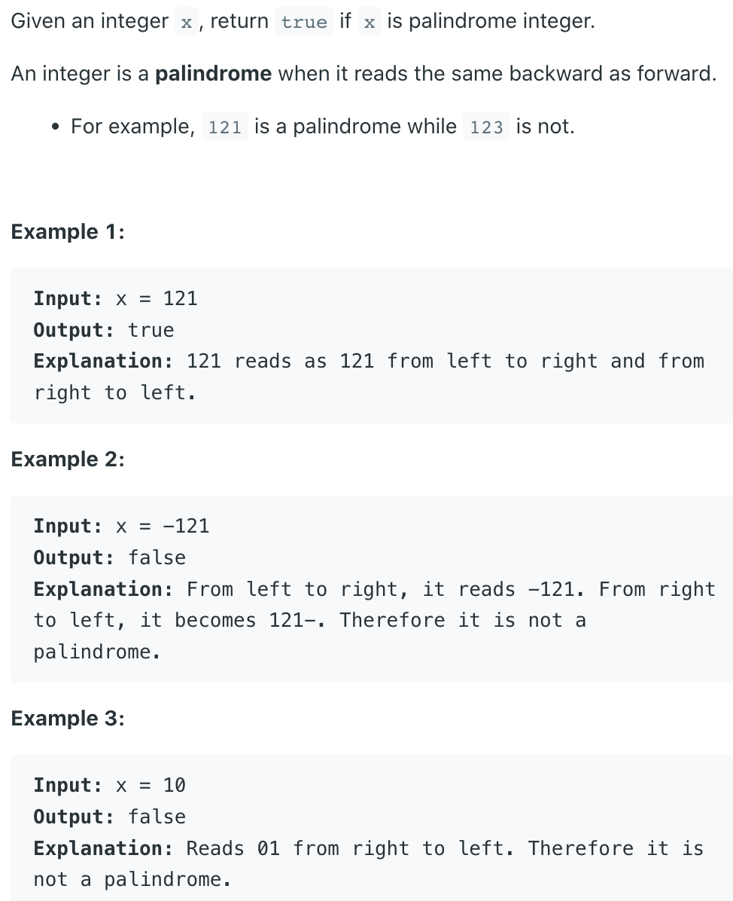

## 9. Palindrome Number


- Brute Force: 
  - convert integer to string and check if it is a palindrome

```java
class palindromeNumber_bruteForce {
    public boolean isPalindrome(int x) {
        if (x < 0) return false;
        
        String str = String.valueOf(x);
        int left = 0, right = str.length() - 1;
        while (left < right) {
            if (str.charAt(left) != str.charAt(right)) {
                return false;
            }
            left++;
            right--;
        }
        return true;
    }
}
```

---

- follow up, without convert to string:

```java
/*
    1 2 1
    
    res : 1
    y : 12
    
    res : 12
    y : 1
    
    res : 121
    y : 0    
*/

class Solution {
    public boolean isPalindrome(int x) {
        if (x < 0) return false;
        
        int y = x;
        int res = 0;
        while (y != 0) {
            res = res * 10 + y % 10;
            y = y / 10;
        }
        return res == x;
    }
}
```