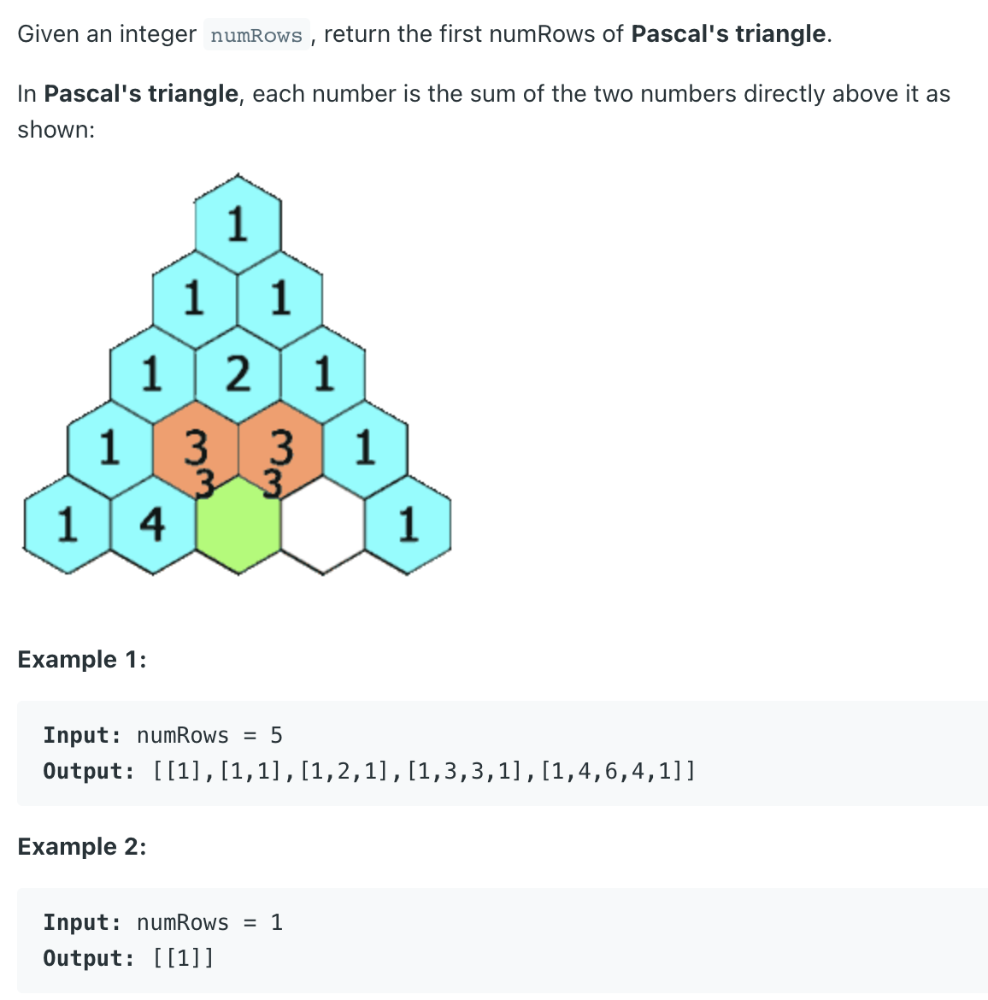
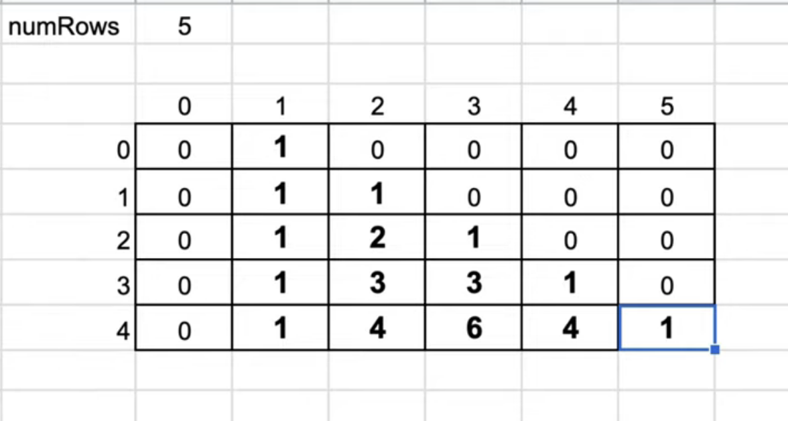

## 118. Pascal's Triangle


---
- [concise solution in Java](https://leetcode.com/problems/pascals-triangle/discuss/38141/My-concise-solution-in-Java)

- [ArrayList set() method in Java with Examples](https://www.geeksforgeeks.org/arraylist-set-method-in-java-with-examples/)
---

- 本体破题点： **就是对照题目的动图，然后compare 自己的codes, 猜想一下 就会发现规律**


```java
class Solution {
    public List<List<Integer>> generate(int numRows) {
        List<List<Integer>> allRows = new ArrayList<>();
        if (numRows == 0) return allRows;
        
        List<Integer> row = new ArrayList<>();
        
        for (int i = 0; i < numRows; i++) {
            row.add(0, 1);
            for (int j = 1; j < row.size() - 1; j++) {
                row.set(j, row.get(j) + row.get(j + 1));
            }
            allRows.add(new ArrayList<>(row));
        }
        return allRows;
    }
}
```


---
### DP

- [youtube DP](https://www.youtube.com/watch?v=9XQ0SCx03zY)



```java
```