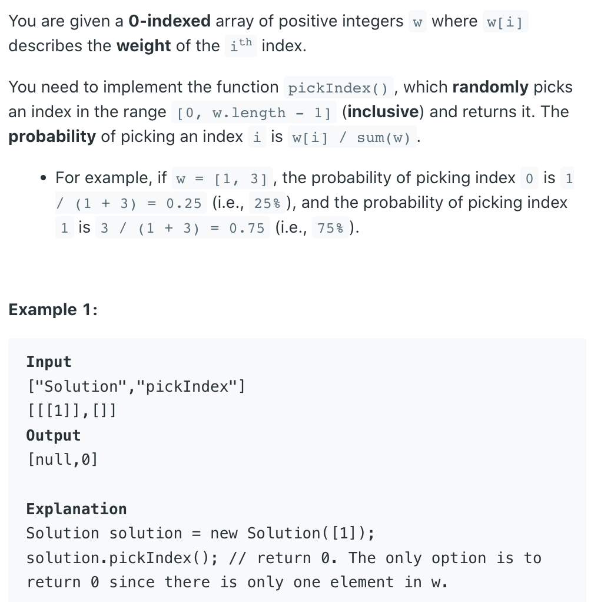
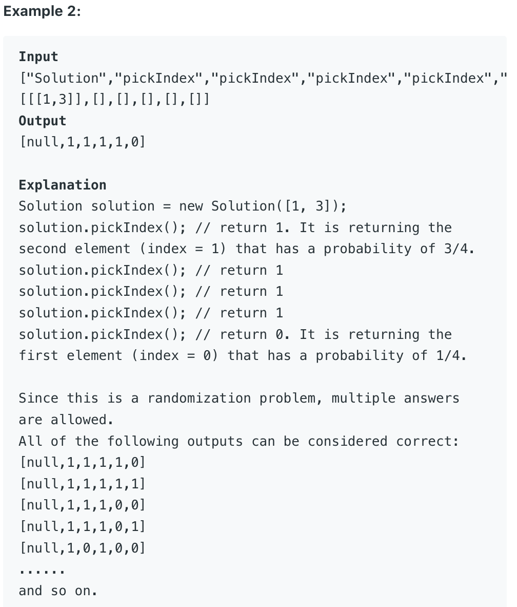

## 528. Random Pick with Weight



- calculate the preSum[]:
  - for example:  
    - `     w = [1, 2, 3, 4]`
    - `preSum = [1, 3, 6, 10]`
    - then get random val random.nextInt(10)+1, since 1 <= w[i] idx is in range [1,10]
    - idx in preSum[1, 1] return 0
    - idx in preSum[2, 3] return 1
    - idx in preSum[4, 6] return 2
    - idx in preSum[7, 10] return 3
- Note: 为什么要用 preSum ? 因为 如果只随机 w[0 ... len-1], 比如len = 4, 那这样机率只有 
  `1/4`, 我们需要计算 **某一权重在总权重中的占比率** 

```java
/* For binearySearch:
 Assume: randomVal (idx) = 5, between [1, 10]
         left = 0, right = 3

1. mid = (0 + 3) / 2 = 1   # preSum[1] = 3 < 5
    left = mid + 1 = 1 + 1 = 2  
2. mid = (2 + 3) / 2 = 2   # preSum[2] = 6 > 5
    right = mid - 1 = 2 - 1 = 1

since left > right, jump to outer of loop:
    return left  => left==2, 5 is between [4, 6] locate at idx = 2
*/
```

```java
class Solution {
    Random random;
    int [] preSum;
    
    public Solution(int[] w) {
        random = new Random();
        
        for (int i = 1; i < w.length; i++) {
            w[i] = w[i] + w[i - 1];
        }
        this.preSum = w;
    }
    
    public int pickIndex() {
        int n = preSum.length;
        int idx = this.random.nextInt(preSum[n - 1] - 0) + 1;  
        int left = 0, right = n - 1;
        while (left <= right) {
            int mid = left + (right - left) / 2;
            if (preSum[mid] == idx) {
                return mid;
            } else if (preSum[mid] < idx) {
                left = mid + 1;
            } else {
                right = mid - 1;
            }
        }
        return left;
    }
}

/**
 * Your Solution object will be instantiated and called as such:
 * Solution obj = new Solution(w);
 * int param_1 = obj.pickIndex();
 */
```