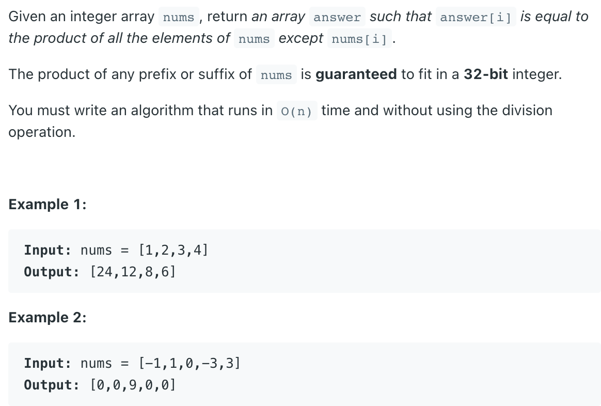

## 238. Product of Array Except Self


```java
public class _238_ProductOfArrayExceptSelf {
    public static int[] productExceptSelf1(int[] nums) {
        int n = nums.length;
        if (nums == null || n == 0) return new int[]{};

        int[] left = new int[n];
        int[] right = new int[n];
        int[] res = new int[n];
        left[0] = 1;
        right[n - 1] = 1;
        for (int i = 1; i < n; i++) {
            left[i] = left[i - 1] * nums[i - 1];
        }
        for (int i = n - 2; i >= 0; i--) {
            right[i] = right[i + 1] * nums[i + 1];
        }
        for (int i = 0; i < n; i++) {
            res[i] = left[i] * right[i];
        }

        return res;
    }

    public int[] productExceptSelf(int[] nums) {
        int n = nums.length;
        if (nums == null || n == 0) return new int[]{};

        // int[] left = new int[n];
        // int[] right = new int[n];
        int[] res = new int[n];
        // left[0] = 1;
        // right[n - 1] = 1;
        int left = 1, right = 1;
        for (int i = 0; i < n; i++) {
            if (i > 0) {
                left = nums[i - 1] * left;
            }
            res[i] = left;
        }

        for (int i = n - 1; i >= 0; i--) {
            if (i < n - 1) {
                right = nums[i + 1] * right;
            }
            res[i] = res[i] * right;
        }

        return res;
    }
}
```