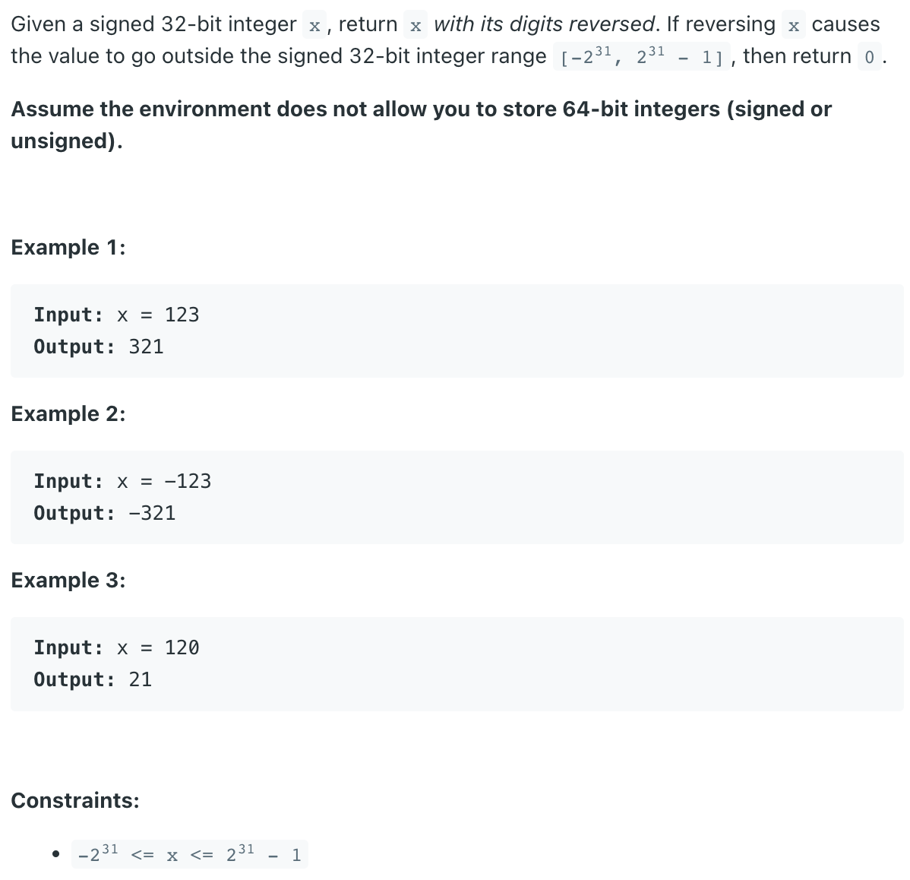
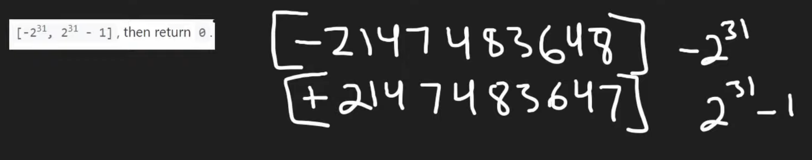
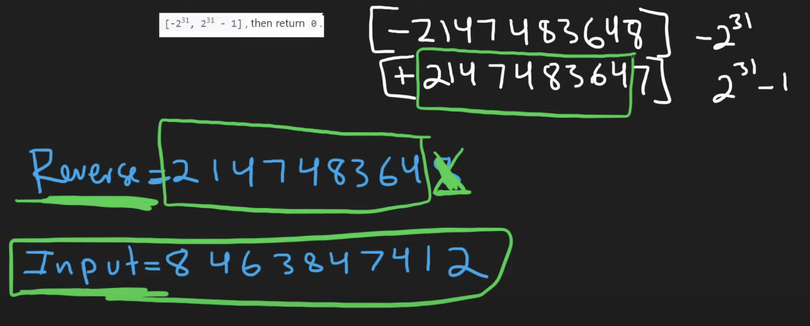

## 7. Reverse Integer


- Note: `Assume the environment does not allow you to store 64-bit integers (signed or unsigned).`
  - Thus, the result we need to cast `long` to `int`, but if it is overflow return `0`
---

- `123` % `10` = `3`,   `123` / `10` = `12`
- `12` % `10` = `2`
- `3` * `10` = `30` + `2` = `32`     

- **32 bits**




---

### Using Long

```java
/*  -456

    0 * 10 = 0
    0 + (-456 % 10) = -6
    -456 / 10 = -45

    -6 * 10 = -60
    -60 + (-45 % 10) = -65
    -45 / 10 = -4

    -65 * 10 = -650
    -650 + (-4 % 10) = -654
    -4 / 10 = 0  [x = 0, loop ends]

*/

public class _7_ReverseInteger {
    public static int reverse(int x) {
        long res = 0; // set to be long type
        while (x != 0) {// x != 0, check if it is a negative number
            res = res * 10;
            res += x % 10; 
            x /= 10;// if x is negative, x / 10 is also negative
        }

        if ((int) res == res) {
            return (int) res;
        } else {
            return 0;
        }
    }

    public static void main(String[] args) {
        int num = 1534236469;
        System.out.println(reverse(num)); // overflow, it returns 0
        num = 456;
        System.out.println(reverse(num));
        num = -1234;
        System.out.println(reverse(num));
    }
}
```

---

### Not using Long

- Note: 

```java
reversed == Integer.MAX_VALUE / 10 && chunk > 7

reversed == Integer.MIN_VALUE / 10 && chunk < -8
```

- cannot change to:

```java
if (reversed > Integer.MAX_VALUE / 10 || reversed < Integer.MIN_VALUE / 10) {
                return 0;
}
```

- because it will **overflow** after you call rev = rev * 10 + pop;

---
```java
class reverseInteger_NotUsing_Long {
    public int reverse(int x) {
        int reversed = 0;
        int digit;

        while (x != 0) {
            digit = x % 10;
            x /= 10;

            if (reversed > Integer.MAX_VALUE / 10 ||
                    reversed == Integer.MAX_VALUE / 10 && digit > 7) {
                return 0;
            }
            if (reversed < Integer.MIN_VALUE / 10 ||
                    reversed == Integer.MIN_VALUE / 10 && digit < -8) {
                return 0;
            }
            
            reversed = (reversed * 10) + digit;
        }
        return reversed;
    }
}
```