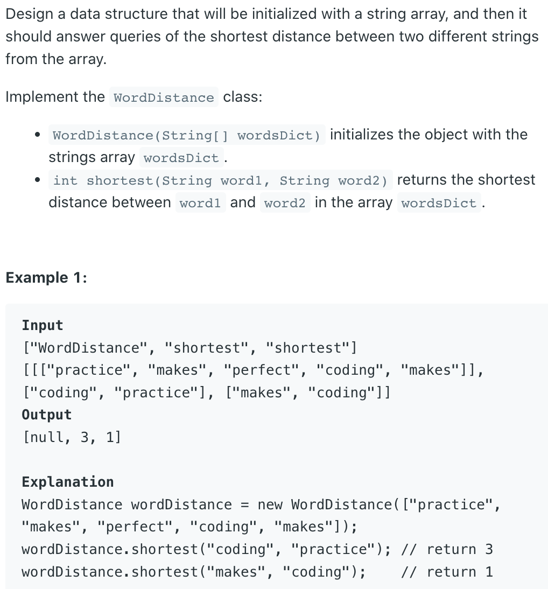

## 244. Shortest Word Distance II


```java
class WordDistance {
    Map<String, List<Integer>> map;

    public WordDistance(String[] wordsDict) {
        map = new HashMap<>();
        for (int i = 0; i < wordsDict.length; i++) {
            if (map.containsKey(wordsDict[i])) {
                map.get(wordsDict[i]).add(i);
            } else {
                List<Integer> list = new ArrayList<>();
                list.add(i);
                map.put(wordsDict[i], list);
            }
        }
    }
    
    public int shortest(String word1, String word2) {
        List<Integer> l1 = map.get(word1);
        List<Integer> l2 = map.get(word2);
        int shortest = Integer.MAX_VALUE;
        int i = 0, j = 0;
        while (i < l1.size() && j < l2.size()) {
            int idx1 = l1.get(i), idx2 = l2.get(j);
            if (idx1 < idx2) {
                shortest = Math.min(shortest, idx2 - idx1);
                i++;
            } else {
                shortest = Math.min(shortest, idx1 - idx2);
                j++;
            }
        }
        return shortest;
    }
}

/**
 * Your WordDistance object will be instantiated and called as such:
 * WordDistance obj = new WordDistance(wordsDict);
 * int param_1 = obj.shortest(word1,word2);
 */
```