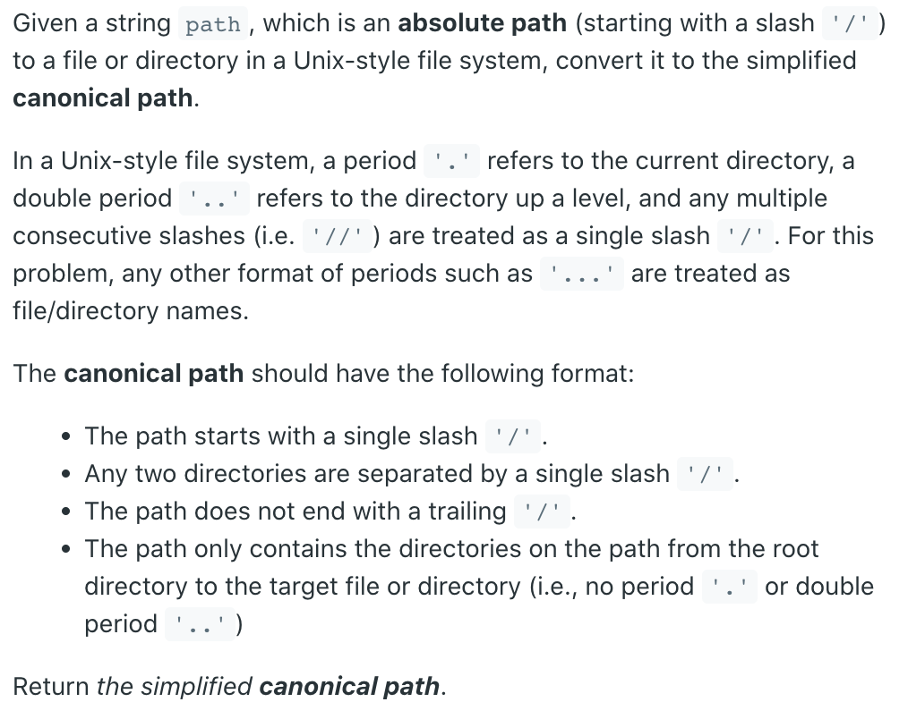
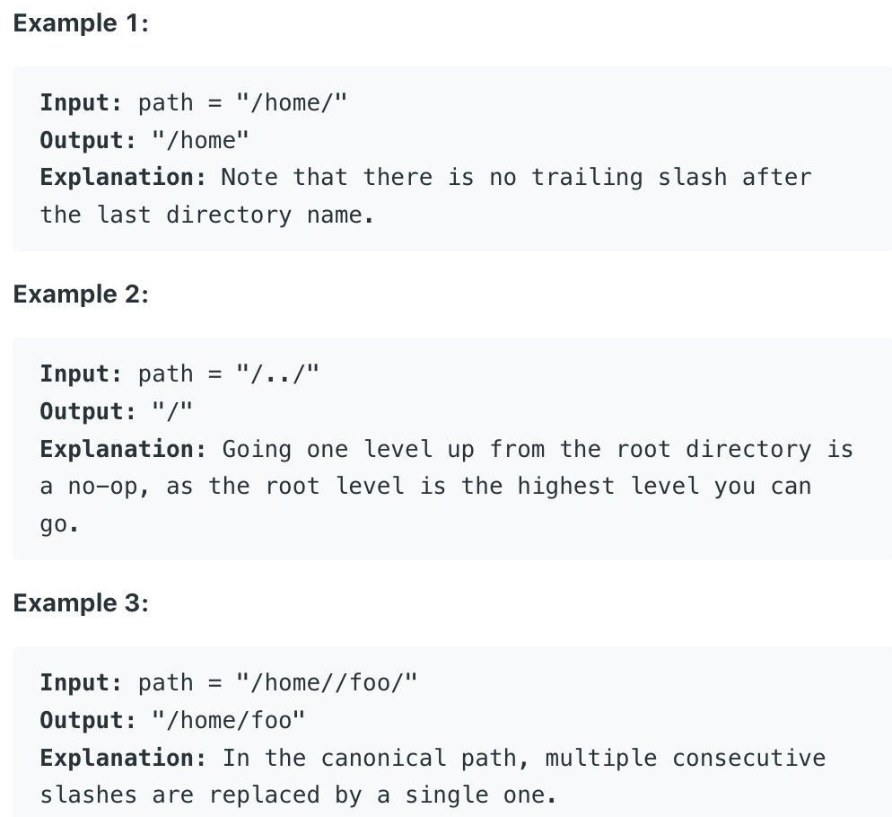
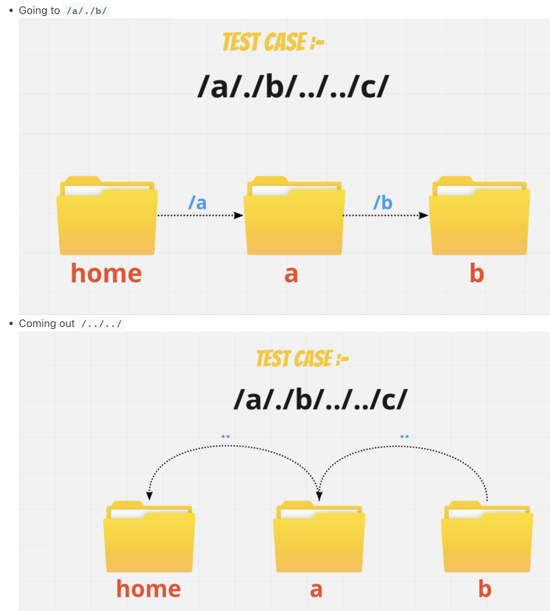
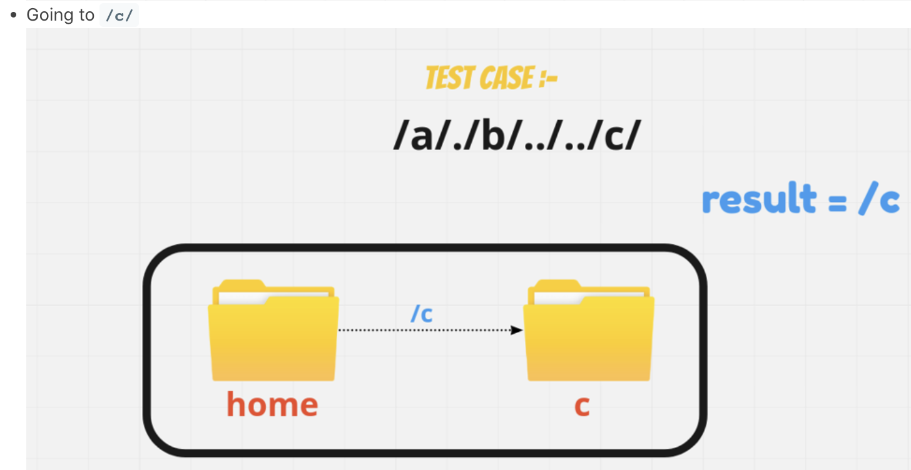

## 71. Simplify Path



 - Alright, so let's understand this problem with an example :-

- Let's understand what this mean's, so basically this seems like you a path of your 
  folder, so generically we use this kind of command's in terminal. I hope u know a 
  bit about that. Anyway's let's move further on.
  - okay, so the first command `/a/` means get into the folder `/a/`
  - The next command is `/./` means stay over there
  - The next command is `/b/` means get into the folder `/b/`
  - The next command is `/../` means come out from the folder `/b/`
  - The next command is `/../` means come out from the folder `/a/`
  - Now we are kind of in home directory
  - The next command is `/c/` means get into the folder `/c/`
  - And in the output we return what command we left with.

- Let's understand it a bit visually.
  - Going to `/a/./b/`




- So, basically what are we doing:-
  **Pushing** and **Popping** directory names based on rules

- And what are the rules :-
  1. **/..** come out from the directory
  2. **/nameOfDirectory** going into directory

- We'll solve this problem using Stack.
  - Alright, back to the problem - So, what we can do is by 
    looking at the rules, split the directrory by the slash`/` given 
    and that will give us in the form of array e.g : `[a, ., b, .., .., c]`

- But remeber when returning we have to go in the form of **reverse order**. 
  Because Stack use **LIFO** order.

- Time Complexity :- `O(N)`
- Space Complexity :- `O(N)`
---
### Deque

```java
class SimplifyPath_Deque {
        public String simplify(String path) {
        Deque<String> deque = new ArrayDeque<>();
        StringBuilder res = new StringBuilder();
        String[] dirs = path.split("/");
        System.out.println(Arrays.toString(dirs));
        // Note: first String is ""
        // [, a, ., b, .., .., c]

        for (int i = 0; i < dirs.length; i++) {
            if (dirs[i].equals(".")) {
                continue;
            }
            if (!dirs[i].equals("") && !dirs[i].equals("..")) {
                deque.addLast(dirs[i]);
            } else if (!deque.isEmpty() && dirs[i].equals("..")) {
                deque.pollLast();
            }
        }

        if (deque.isEmpty()){
            return "/";
        }

        while (!deque.isEmpty()) {
            String top = deque.pollFirst();
            res.append("/").append(top);
        }
        return res.toString();
    }

    public static void main(String[] args) {
        SimplifyPath_Deque sp = new SimplifyPath_Deque();
        String res = sp.simplify("/a/./b/../../c/");
        System.out.println(res); //  /c

        res = sp.simplify("/a/b/c/d/../e");
        System.out.println(res); //   /a/b/c/e
    }
}
```
---
### Stack

```java
public class SimplifyPath_Stack {
    public String simplify(String path) {
        Stack<String> stack = new Stack<>();
        StringBuilder res = new StringBuilder();
        String[] dirs = path.split("/");
        System.out.println(Arrays.toString(dirs));
        // Note: first String is ""
        // [, a, ., b, .., .., c]

        for (int i = 0; i < dirs.length; i++) {
            if (dirs[i].equals(".")) {
                continue;
            }
            if (!dirs[i].equals("") && !dirs[i].equals("..")) {
                stack.push(dirs[i]);
            } else if (!stack.isEmpty() && dirs[i].equals("..")) {
                stack.pop();
            }
        }

        if (stack.isEmpty()){
            return "/";
        }

        while (!stack.isEmpty()) {
            String top = stack.pop();
            res.insert(0, top).insert(0, "/");
        }
        return res.toString();
    }

    public static void main(String[] args) {
        SimplifyPath_Stack sp = new SimplifyPath_Stack();
        String res = sp.simplify("/a/./b/../../c/");
        System.out.println(res); //  /c

        res = sp.simplify("/a/b/c/d/../e");
        System.out.println(res); //   /a/b/c/e
    }
}

```