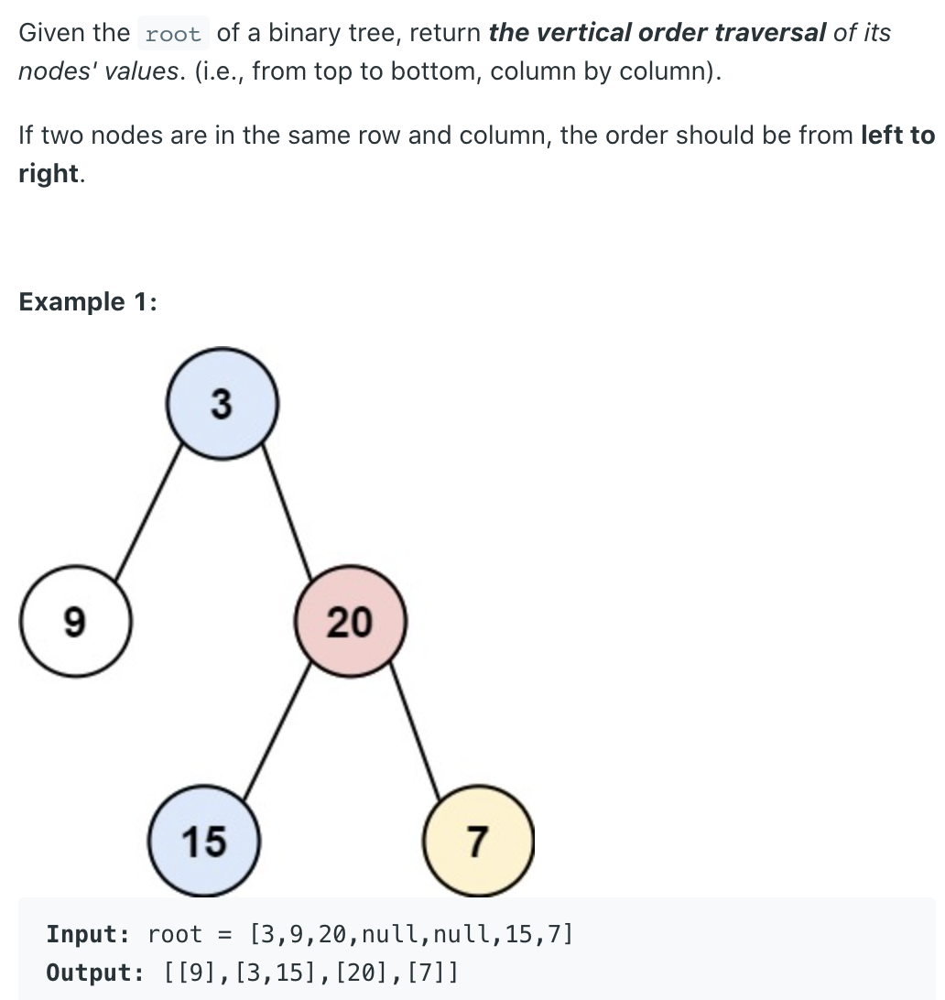
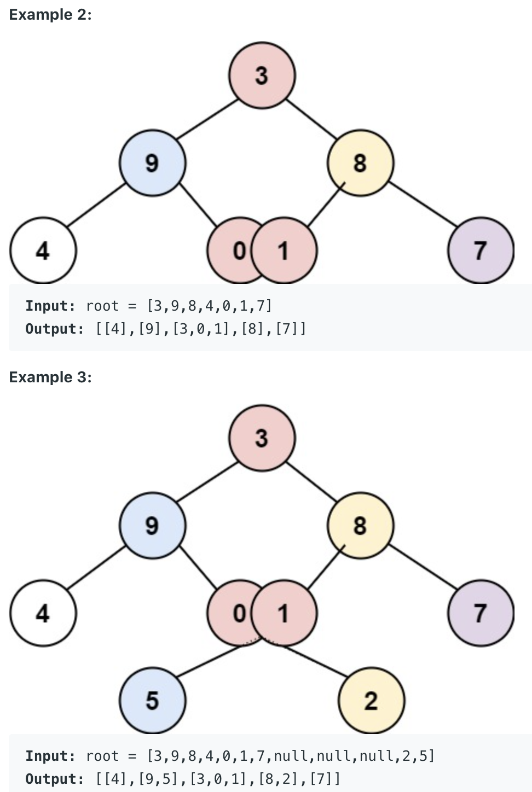
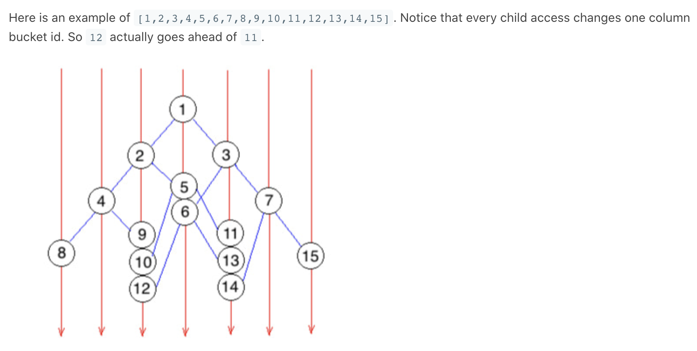

## 314. Binary Tree Vertical Order Traversal




- BFS, put `node`, `col` into `queue` at the same time
- Every left child access `col - 1` while right child `col + 1`
- This maps `node` into different `col` buckets
- Get `col` boundary `min` and `max` on the fly
- Retrieve `result` from cols



```java
/**
 * Definition for a binary tree node.
 * public class TreeNode {
 *     int val;
 *     TreeNode left;
 *     TreeNode right;
 *     TreeNode() {}
 *     TreeNode(int val) { this.val = val; }
 *     TreeNode(int val, TreeNode left, TreeNode right) {
 *         this.val = val;
 *         this.left = left;
 *         this.right = right;
 *     }
 * }
 */
class Solution {
    public List<List<Integer>> verticalOrder(TreeNode root) {
        List<List<Integer>> res = new ArrayList<>();
        if (root == null) { return res;}
        
        Map<Integer, List<Integer>> map = new HashMap<>();
        Queue<TreeNode> q = new LinkedList<>();
        Queue<Integer> cols = new LinkedList<>();
        q.add(root); 
        cols.add(0);

        int min = 0;
        int max = 0;
        
        while (!q.isEmpty()) {
            TreeNode node = q.poll();
            int col = cols.poll();
            
            if (!map.containsKey(col)) {
                map.put(col, new ArrayList<Integer>());
            }
            map.get(col).add(node.val);

            if (node.left != null) {
                q.add(node.left); 
                cols.add(col - 1);
                min = Math.min(min, col - 1);
            }    
            if (node.right != null) {
                q.add(node.right);
                cols.add(col + 1);
                max = Math.max(max, col + 1);
            }
        }
        for (int i = min; i <= max; i++) {
            res.add(map.get(i));
        }
        return res;
    }
}
```