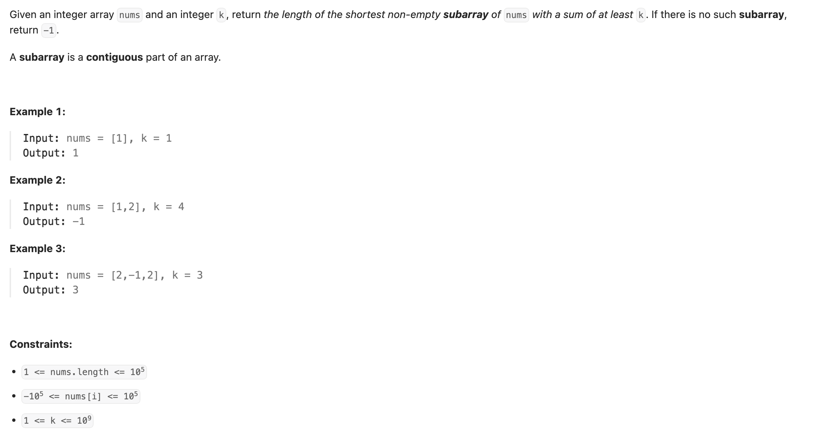
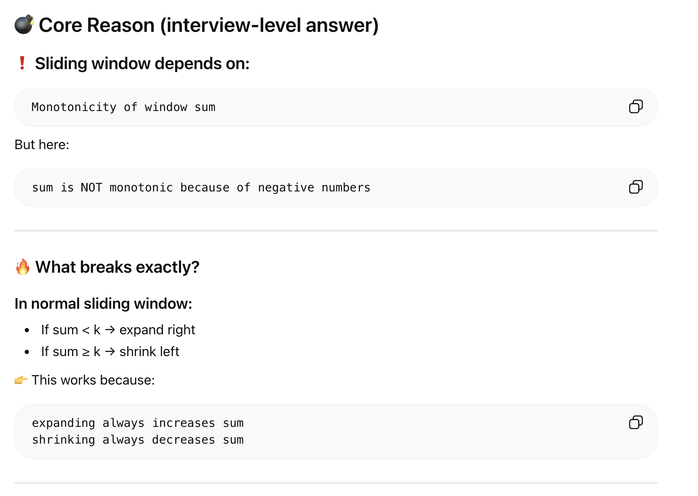
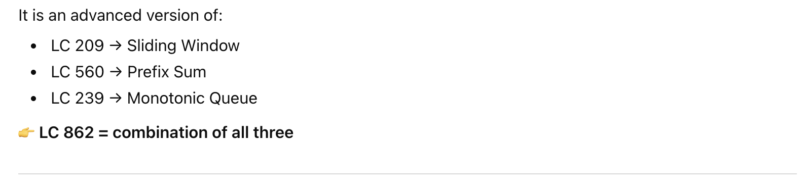
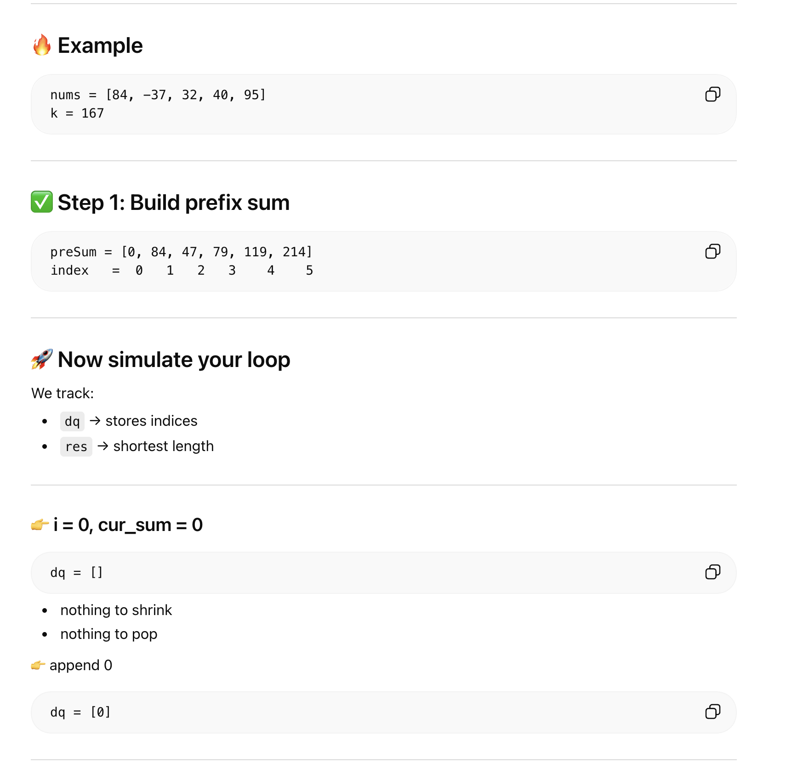
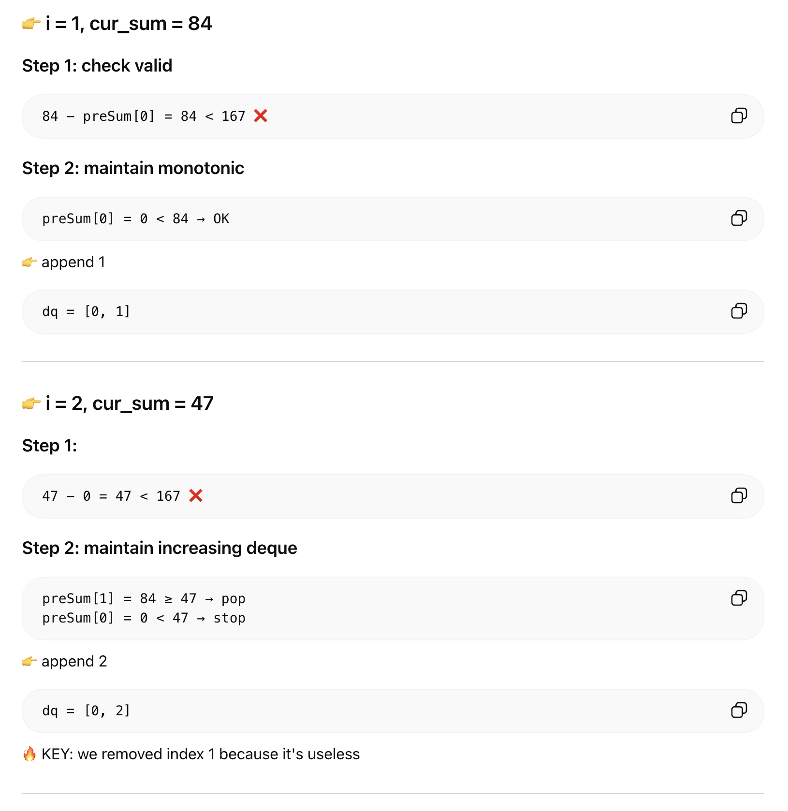
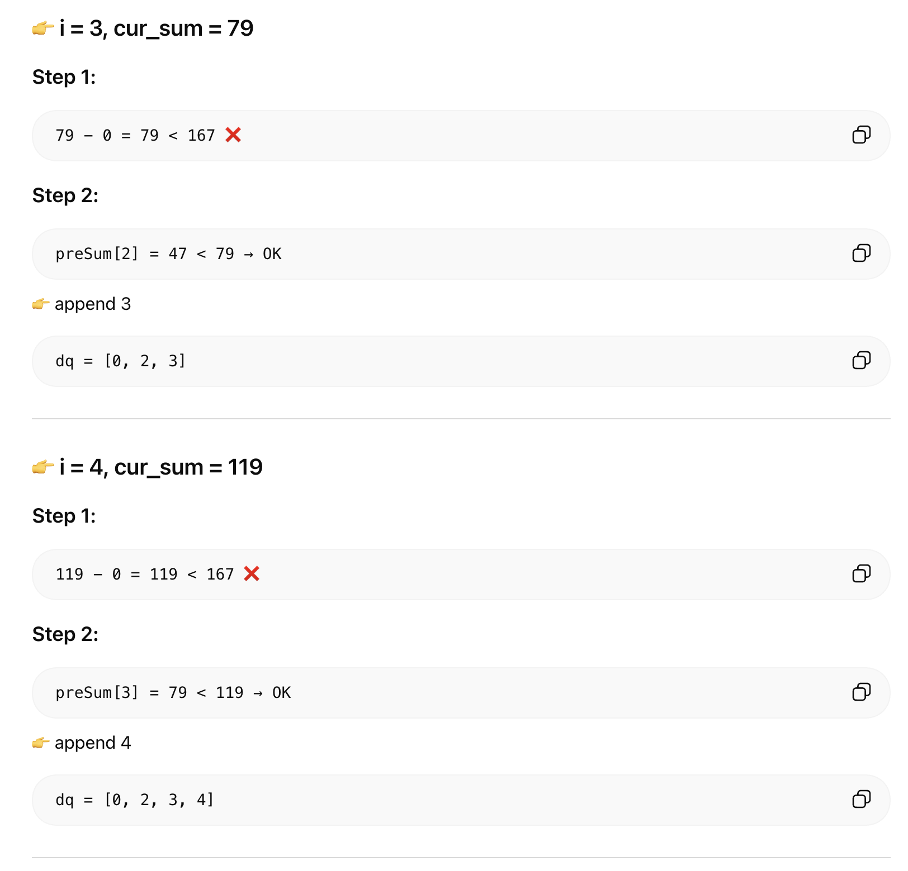
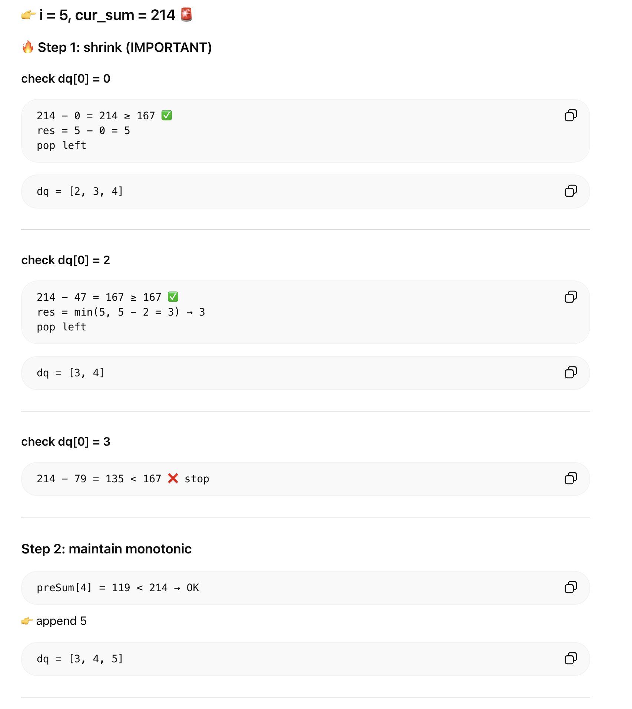
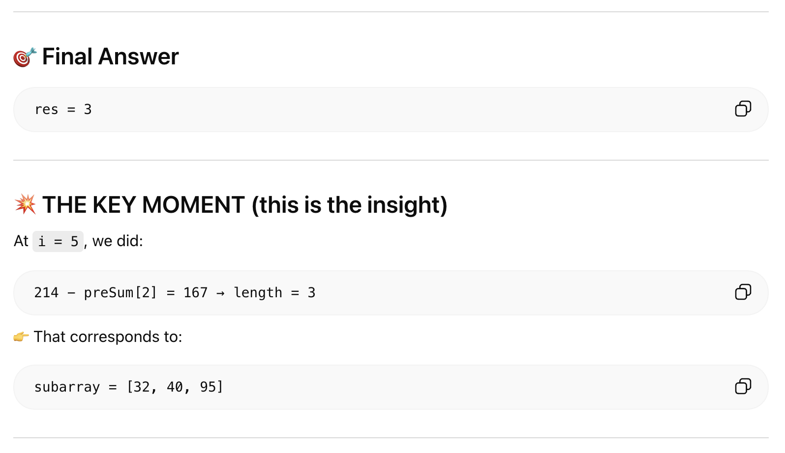

## 862. Shortest Subarray with Sum at Least K

---

### Why Sliding Window Doesn’t Work

- When right pointer moves → window sum increases (monotonic)
- in LC 862, nums can **contain negative numbers**
  - Moving right → sum may **increase** OR **decrease**




---

### Prefix Sum + Monotonic Deque



```py
class Solution:
    def shortestSubarray(self, nums: List[int], k: int) -> int:
        n = len(nums)

        preSum = [0] * (n + 1)
        for i in range(1, n + 1):
            preSum[i] = preSum[i - 1] + nums[i - 1]

        dq = deque() # store indices, preSum is increasing
        res = float('inf')

        for i, cur_sum in enumerate(preSum):
            # 1. Try to find valid subarray (shrink from left)
            # If current prefix - smallest prefix >= k → valid
            while dq and cur_sum - preSum[dq[0]] >= k:
                res = min(res, i - dq.popleft())

            # 2. Maintain increasing deque
            # Remove all larger prefix sums (they are worse candidates)
            while dq and preSum[dq[-1]] >= cur_sum:
                dq.pop()

            # Add current index
            dq.append(i)

        return -1 if res == float('inf') else res

```
---









