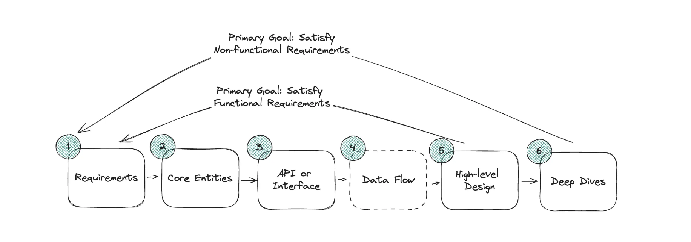
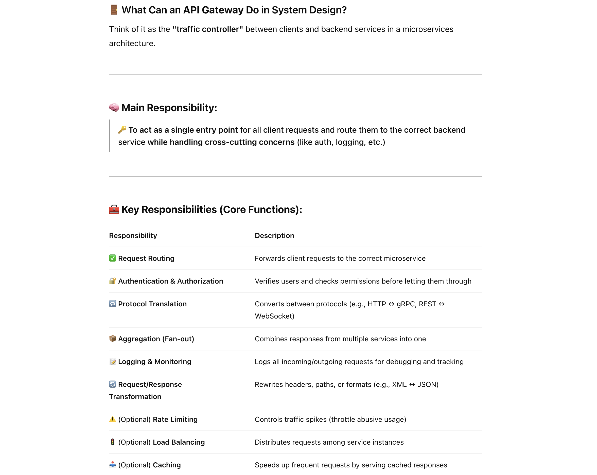

## API Gateway

- The API Gateway acts as a **single entry point** for clients and routes requests to appropriate services. 
  It handles **authentication**, logging, and request transformation, which simplifies the client-side logic and secures backend services. 
  It also supports protocol translation and fan-out for aggregating multiple service responses.”

---

