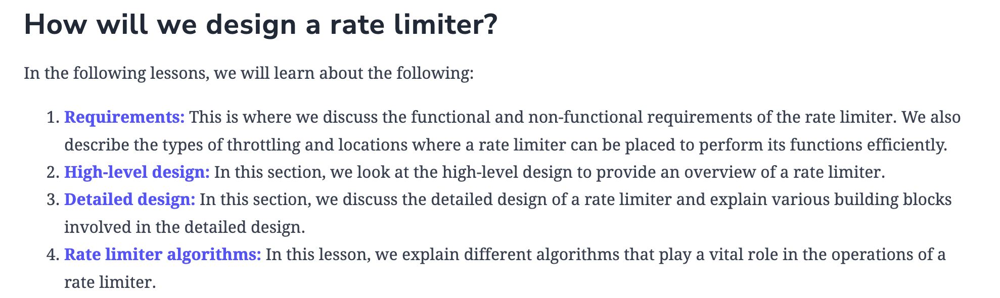

## System Design: The Rate Limiter

### What is a rate limiter?

- A **rate limiter**, puts a limit on the number of requests a service fulfills. It throttles requests that cross the predefined limit. For 
  example, a client using a particular service’s API that is configured to allow 500 requests per minute would block further incoming 
  requests for the client if the number of requests the client makes exceeds that limit.

### Why do we need a rate limiter?#

- A rate limiter helps protect services from being overused, whether on purpose or by accident. It also acts as a safeguard against harmful 
  activities like denial-of-service (DoS) attacks and brute-force password attempts.

### Functional requirements
- To limit the number of requests a client can send to an API within a time window.
- To make the limit of requests per window configurable.
- To ensure the client receives a message—whether it's an error or a notification—whenever the set limit is exceeded on a single server or 
  across multiple servers."

### Non-functional requirements
